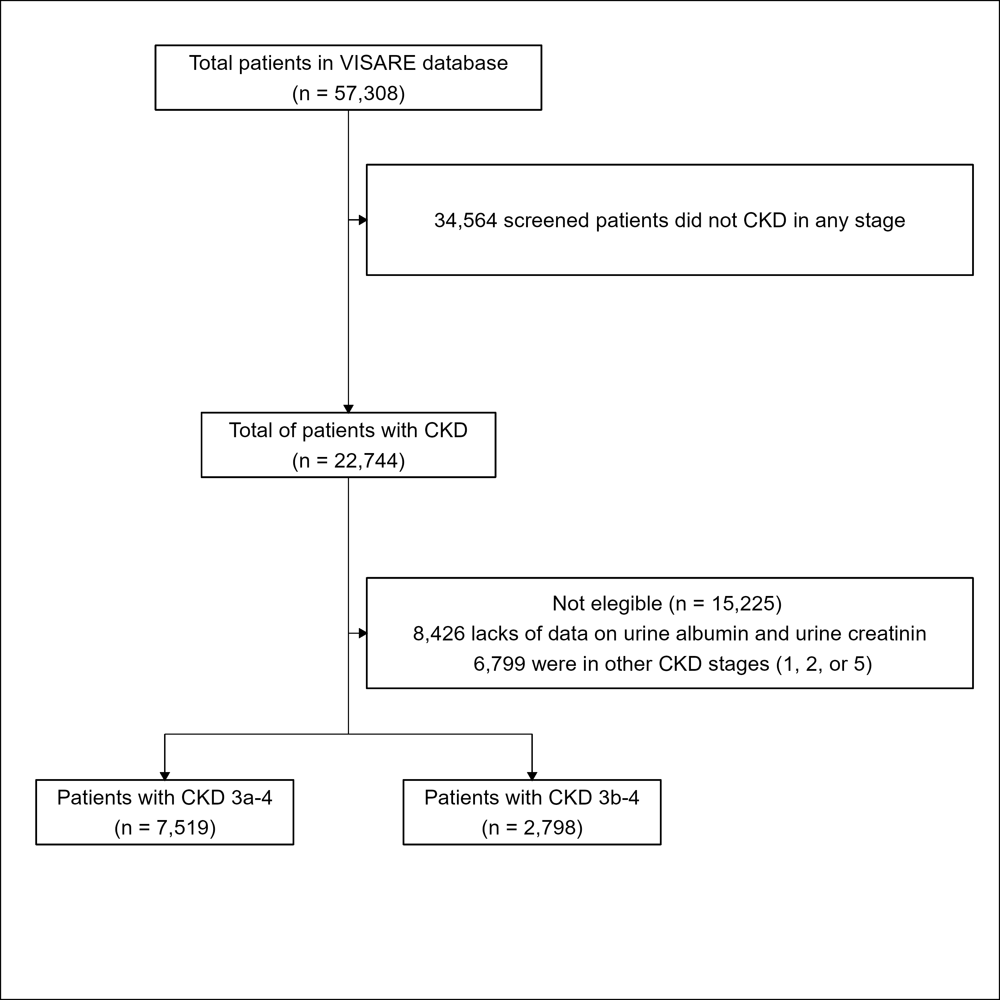
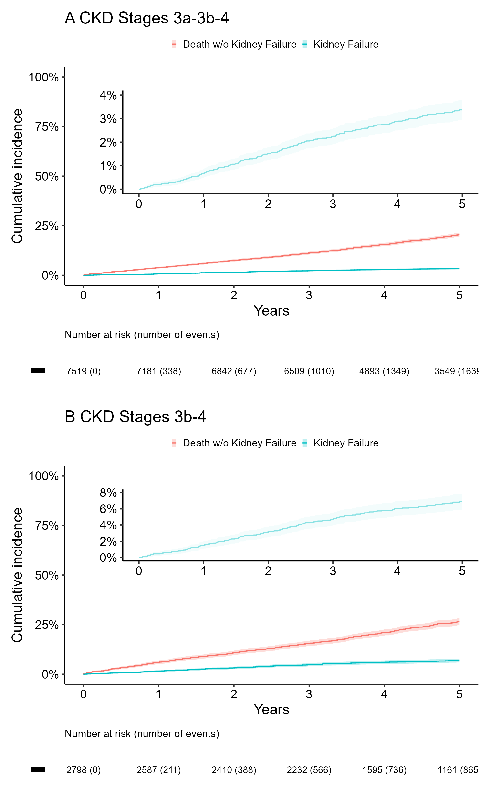
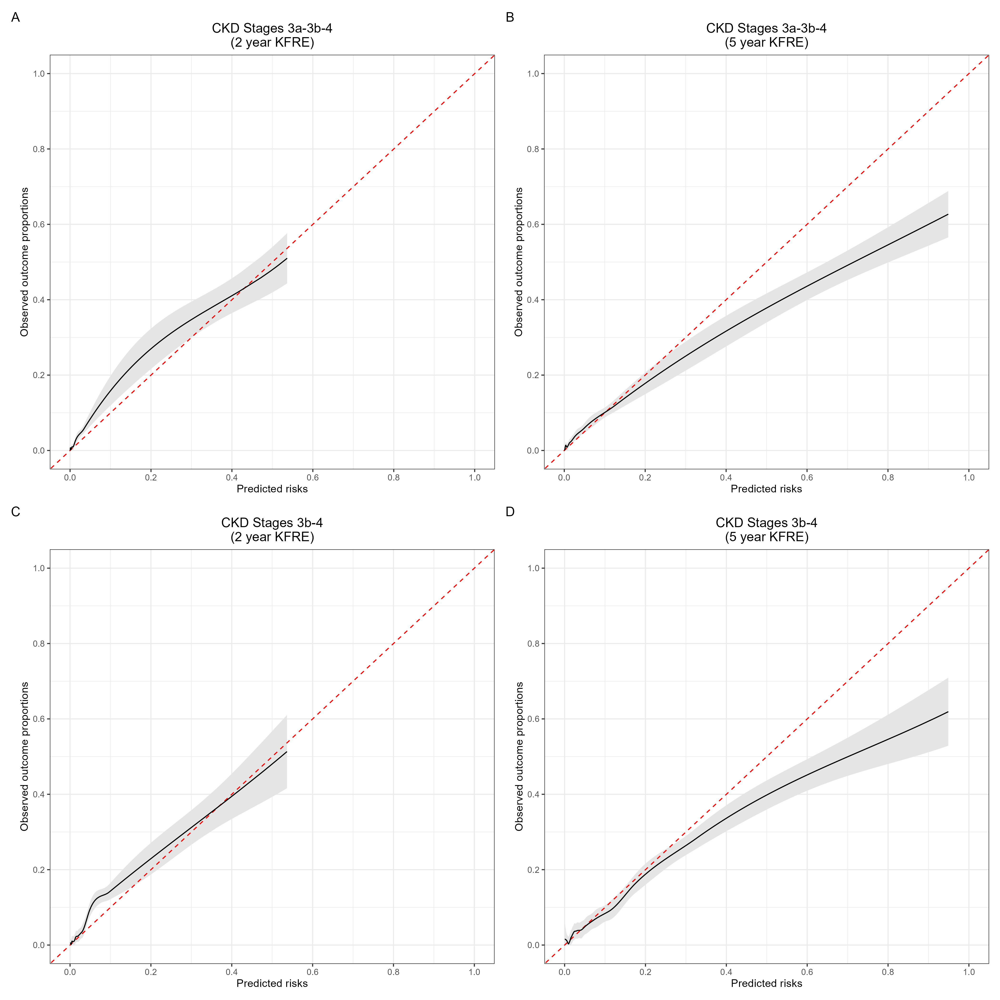

1 - Main analysis
================
Percy Soto-Becerra
5/7/23

<script src="1_Analysis_Code_Minimal_Results_files/libs/kePrint-0.0.1/kePrint.js"></script>
<link href="1_Analysis_Code_Minimal_Results_files/libs/lightable-0.0.1/lightable.css" rel="stylesheet" />


- <a
  href="#code-to-reproduce-results-of-the-manuscript-kidney-failure-prediction-multicenter-external-validation-of-the-kfre-model-in-patients-with-ckd-stages-3-4-in-peru"
  id="toc-code-to-reproduce-results-of-the-manuscript-kidney-failure-prediction-multicenter-external-validation-of-the-kfre-model-in-patients-with-ckd-stages-3-4-in-peru"><span
  class="toc-section-number">1</span> Code to reproduce results of the
  manuscript ‘Kidney Failure Prediction: Multicenter External Validation
  of the KFRE Model in Patients with CKD Stages 3-4 in Peru’</a>
  - <a href="#introduction" id="toc-introduction"><span
    class="toc-section-number">1.1</span> Introduction</a>
  - <a href="#setup" id="toc-setup"><span
    class="toc-section-number">1.2</span> Setup</a>
  - <a href="#descriptive-analysis" id="toc-descriptive-analysis"><span
    class="toc-section-number">1.3</span> Descriptive analysis</a>
    - <a href="#fig-1" id="toc-fig-1"><span
      class="toc-section-number">1.3.1</span> Fig 1</a>
    - <a href="#table-1" id="toc-table-1"><span
      class="toc-section-number">1.3.2</span> Table 1</a>
  - <a href="#cumulative-incidence-function-for-competing-risks-data"
    id="toc-cumulative-incidence-function-for-competing-risks-data"><span
    class="toc-section-number">1.4</span> Cumulative incidence function for
    competing risks data</a>
    - <a href="#fig-2" id="toc-fig-2"><span
      class="toc-section-number">1.4.1</span> Fig 2</a>
  - <a href="#predictive-performance" id="toc-predictive-performance"><span
    class="toc-section-number">1.5</span> Predictive Performance</a>
    - <a href="#calibration" id="toc-calibration"><span
      class="toc-section-number">1.5.1</span> Calibration</a>
      - <a href="#mean-calibration-oe-ratio"
        id="toc-mean-calibration-oe-ratio"><span
        class="toc-section-number">1.5.1.1</span> Mean calibration: OE ratio</a>
      - <a href="#weak-calibration-calibration-intercept-and-calibration-slope"
        id="toc-weak-calibration-calibration-intercept-and-calibration-slope"><span
        class="toc-section-number">1.5.1.2</span> Weak calibration: Calibration
        intercept and Calibration slope</a>
      - <a
        href="#moderate-calibration-calibration-curves-lowess-based-on-pseudovalues"
        id="toc-moderate-calibration-calibration-curves-lowess-based-on-pseudovalues"><span
        class="toc-section-number">1.5.1.3</span> Moderate calibration:
        Calibration curves lowess based on pseudovalues</a>
    - <a href="#fig-3" id="toc-fig-3"><span
      class="toc-section-number">1.5.2</span> Fig 3</a>
    - <a href="#discrimination" id="toc-discrimination"><span
      class="toc-section-number">1.5.3</span> Discrimination</a>
      - <a href="#c-index-and-time-dependent-cd-auc"
        id="toc-c-index-and-time-dependent-cd-auc"><span
        class="toc-section-number">1.5.3.1</span> C-index and time-dependent C/D
        AUC</a>
    - <a href="#sec-table2" id="toc-sec-table2"><span
      class="toc-section-number">1.5.4</span> Table 2</a>
  - <a href="#supplementary-tables" id="toc-supplementary-tables"><span
    class="toc-section-number">1.6</span> Supplementary tables</a>
    - <a href="#sec-tableS1" id="toc-sec-tableS1"><span
      class="toc-section-number">1.6.1</span> Table S1</a>
    - <a href="#sec-tableS2" id="toc-sec-tableS2"><span
      class="toc-section-number">1.6.2</span> Table S2</a>
    - <a href="#sec-tableS3" id="toc-sec-tableS3"><span
      class="toc-section-number">1.6.3</span> Table S3</a>
    - <a href="#sec-tableS4" id="toc-sec-tableS4"><span
      class="toc-section-number">1.6.4</span> Table S4</a>
    - <a href="#sec-tableS5" id="toc-sec-tableS5"><span
      class="toc-section-number">1.6.5</span> Table S5</a>
    - <a href="#sec-tableS6" id="toc-sec-tableS6"><span
      class="toc-section-number">1.6.6</span> Table S6</a>
    - <a href="#sec-tableS7" id="toc-sec-tableS7"><span
      class="toc-section-number">1.6.7</span> Table S7</a>
    - <a href="#sec-tableS8" id="toc-sec-tableS8"><span
      class="toc-section-number">1.6.8</span> Table S8</a>
    - <a href="#sec-tableS9" id="toc-sec-tableS9"><span
      class="toc-section-number">1.6.9</span> Tabla S9</a>
    - <a href="#fig-s1" id="toc-fig-s1"><span
      class="toc-section-number">1.6.10</span> Fig S1</a>
    - <a href="#fig-s2" id="toc-fig-s2"><span
      class="toc-section-number">1.6.11</span> Fig S2</a>
    - <a href="#table-s13" id="toc-table-s13"><span
      class="toc-section-number">1.6.12</span> Table S13</a>
  - <a href="#ticket-de-reprocubilidad"
    id="toc-ticket-de-reprocubilidad"><span
    class="toc-section-number">1.7</span> Ticket de Reprocubilidad</a>

# Code to reproduce results of the manuscript ‘Kidney Failure Prediction: Multicenter External Validation of the KFRE Model in Patients with CKD Stages 3-4 in Peru’

## Introduction

This document presents the code and results of the main analysis shown
in the article.

## Setup

``` r
rm(list = ls())

# Use pacman to check whether packages are installed, if not load
if (!require("pacman")) install.packages("pacman")
library(pacman)

# Unload all package to begin in a session with only base packages
pacman::p_unload("all")

# Install packages
pacman::p_load(
  here, 
  skimr, 
  survival,
  rms,
  cmprsk,
  riskRegression,
  mstate,
  pseudo,
  pec,
  riskRegression,
  plotrix,
  knitr,
  splines,
  kableExtra,
  flextable,
  gtsummary,
  boot,
  tidyverse,
  rsample,
  gridExtra,
  webshot, 
  patchwork,
  survival, 
  cmprsk, 
  survminer, 
  ggsci, 
  cowplot, 
  scales, 
  patchwork, 
  labelled, 
  glue, 
  dcurves, 
  broom, 
  downlit, 
  xml2, 
  gghalves, 
  devtools, 
  htmltools, 
  gghalves, 
  ggtext, 
  DiagrammeR, 
  gt, 
  janitor
)

if (!require("smplot2")) devtools::install_github('smin95/smplot2', force = TRUE)

# Import data
data <- readRDS(here::here("Data/Derived/data_derived.rds")) 

# Subset patients with CKD Stages 3a-3b-4
data %>%  
  filter(ckd_stage == "Stages 3-4") -> dataA

# Subset patients with CKD Stages 3b-4
data %>%  
  filter(ckd_stage2 == "Stages 3b-4") -> dataB
```

## Descriptive analysis

In total, 7519 patients were included in the analysis of the group with
stages 3a-4 CKD, and 2798 in the group with stages 3b-4. All patients
had outcome data. The number of events was greater than 100 in all
populations and outcomes, except for renal failure at 2 years in the
population with stages 3b-4 (n = 88), so estimates in this group should
be interpreted with more caution. Specifically, in the 3a-3b-4 group,
114 (1.5%) patients developed renal failure at 2 years and 239 (3.2%) at
5 years. Many more patients died without experiencing renal failure: 563
(7.5%) at 2 years and 1400 (18.6%) at 5 years.

Regarding the group restricted to stages 3b-4, 88 (3.1%) patients
developed renal failure at 2 years and 182 (6.5%) at 5 years. Similarly,
many more patients died without experiencing renal failure: 300 (10.7%)
at 2 years and 683 (24.4%) at 5 years.

The median observation time was 4.9 years and the maximum follow-up was
7.8 years in the 3a-4 group. The median and maximum observation times
were similar in the 3b-4 group, at 4.9 and 7.8 years, respectively.

### Fig 1

``` r
# Create grid of 100 x 100----
data_flow <- tibble(x = 1:100, y = 1:100)

data_flow  %>% 
  ggplot(aes(x, y)) + 
  scale_x_continuous(minor_breaks = seq(1, 100, 1)) + 
  scale_y_continuous(minor_breaks = seq(1, 100, 1)) + 
  theme_linedraw() -> p

# Create boxes----
# 

box_xmin <- 33 - 20
box_xmax <- 75 - 20
box_ymin <- 94
box_ymax <- 99
box_size <- 0.25

text_param <- function(box_min, box_max) {
  mean(c(box_min, box_max))
}

text_size <- 2.5


p + 
  # Col 0----
  ## Level 1----
  geom_rect(xmin = box_xmin, xmax = box_xmax, 
            ymin = box_ymin - 1, ymax = box_ymax + 1, 
            color = "black", fill = "white", 
            size = box_size) + 
  annotate('text', 
           x = text_param(box_xmin, box_xmax), 
           y = text_param(box_ymin - 1, box_ymax + 1), 
           label = 'Total patients in VISARE database\n(n = 57,308)', 
           size = text_size ) + 
  ## Level 2----
  geom_rect(xmin = box_xmin + 5, xmax = box_xmax - 5, 
            ymin = box_ymin - 41, ymax = box_ymax - 39, 
            color = "black", fill = "white", 
            size = box_size) + 
  annotate('text', 
           x = text_param(box_xmin + 5, box_xmax - 5), 
           y = text_param(box_ymin - 41, box_ymax - 39), 
           label = 'Total of patients with CKD\n(n = 22,744)', 
           size = text_size ) +   
  # Col -1----
  geom_rect(xmin = box_xmin - 13, xmax = box_xmax - 27, 
            ymin = box_ymin - 81, ymax = box_ymax - 79, 
            color = "black", fill = "white", 
            size = box_size) + 
  annotate('text', 
           x = text_param(box_xmin - 13, box_xmax - 27), 
           y = text_param(box_ymin - 81, box_ymax - 79), 
           label = 'Patients with CKD 3a-4\n(n = 7,519)', 
           size = text_size ) + 
  # Col +1----
  ## Level 1----
  geom_rect(xmin = box_xmin + 23, xmax = box_xmax + 47, 
            ymin = box_ymin - 19, ymax = box_ymax - 12, 
            color = "black", fill = "white", 
            size = box_size) + 
  annotate('text', 
           x = text_param(box_xmin + 23, box_xmax + 47), 
           y = text_param(box_ymin - 19, box_ymax - 12), 
           label = '34,564 screened patients did not CKD in any stage', 
           size = text_size )  + 
  ## Level 2----
  geom_rect(xmin = box_xmin + 23, xmax = box_xmax + 47, 
            ymin = box_ymin - 19 - 45, ymax = box_ymax - 12 - 45, 
            color = "black", fill = "white", 
            size = box_size) + 
  annotate('text', 
           x = text_param(box_xmin + 23, box_xmax + 47), 
           y = text_param(box_ymin - 19 - 45, box_ymax - 12 - 45), 
           label = 'Not elegible (n = 15,225) \n 8,426 lacks of data on urine albumin and urine creatinin \n 6,799 were in other CKD stages (1, 2, or 5)', 
           size = text_size )  + 
  ## Level 3----
  geom_rect(xmin = box_xmin + 27, xmax = box_xmax + 13, 
            ymin = box_ymin - 81 , ymax = box_ymax - 79, 
            color = "black", fill = "white", 
            size = box_size) + 
  annotate('text', 
           x = text_param(box_xmin + 27, box_xmax + 13), 
           y = text_param(box_ymin - 81, box_ymax - 79), 
           label = 'Patients with CKD 3b-4\n(n = 2,798)', 
           size = text_size )  + 
  # vertical arrow
  geom_segment(x = text_param(box_xmin, box_xmax), xend = text_param(box_xmin, box_xmax), 
               y = box_ymin - 1, yend = box_ymax - 39, 
               size = 0.15, 
               linejoin = "mitre", 
               lineend = "butt",
               arrow = arrow(length = unit(1, "mm"), type = "closed")) +  
  geom_segment(x = text_param(box_xmin, box_xmax), xend = text_param(box_xmin, box_xmax), 
               y = box_ymin - 41, yend = 25, 
               size = 0.15, 
               linejoin = "mitre", 
               lineend = "butt") + 
  # horizontal arrow 1-->
  geom_segment(x = text_param(box_xmin, box_xmax), xend = box_xmin + 23, 
               y = text_param(box_ymin - 19, box_ymax - 12), yend = text_param(box_ymin - 19, box_ymax - 12), 
               size = 0.15, 
               linejoin = "mitre", 
               lineend = "butt", 
               arrow = arrow(length = unit(1, "mm"), type = "closed")) + 
  # horizontal arrow 2-->
  geom_segment(x = text_param(box_xmin, box_xmax), xend = box_xmin + 23, 
               y = text_param(box_ymin - 19 - 45, box_ymax - 12 - 45), yend = text_param(box_ymin - 19 - 45, box_ymax - 12 - 45), 
               size = 0.15, 
               linejoin = "mitre", 
               lineend = "butt", 
               arrow = arrow(length = unit(1, "mm"), type = "closed")) + 
  # horizontal segment --
  geom_segment(x = text_param(box_xmin - 13, box_xmax - 27), xend = text_param(box_xmin + 27, box_xmax + 13), 
               y = 25, yend = 25, 
               size = 0.15, 
               linejoin = "mitre", 
               lineend = "butt") + 
  # vertical arrow -->
  geom_segment(x = text_param(box_xmin - 13, box_xmax - 27), xend = text_param(box_xmin - 13, box_xmax - 27), 
               y = 25, yend = box_ymax - 79, 
               size = 0.15, 
               linejoin = "mitre", 
               lineend = "butt", 
               arrow = arrow(length = unit(1, "mm"), type = "closed")) + 
  # vertical arrow -->
  geom_segment(x = text_param(box_xmin + 27, box_xmax + 13), xend = text_param(box_xmin + 27, box_xmax + 13), 
               y = 25, yend = box_ymax - 79, 
               size = 0.15, 
               linejoin = "mitre", 
               lineend = "butt", 
               arrow = arrow(length = unit(1, "mm"), type = "closed")) + 
  theme_void() + 
  theme(plot.background = element_rect(fill = "white")) -> plot_flowchart

ggsave(filename = "plot_flowchart.png", 
       plot = plot_flowchart, 
       device = "png", 
       path = here("Figures"), 
       scale = 1, 
       width = 12, 
       height = 12, 
       units = "cm", 
       dpi = 600)
```

``` r
knitr::include_graphics(here("Figures/plot_flowchart.png"))
```

<figure>

<figcaption aria-hidden="true">Figure 1: Study flowchart</figcaption>
</figure>

### Table 1

Table 1 provides a description of the study population. Table S1 (see
section “tableS1”) details the characteristics of the study population
with stages 3a-3b-4 according to the occurrence of the outcome of
interest, renal failure at 2 and 5 years. The number of events of
interest at 2 years was reported, and Table S2 (see section “tableS2”)
shows the same information for the 3b-4 population. Table S3 (see
section “tableS3”) describes the characteristics according to stages 3a,
3b, and 4 separately. With this stratification, the numbers of cases of
renal failure at 2 years were very low for the subpopulations with
stages 3a (n = 26), 3b (n = 36), and 4 (n = 52). Likewise, the numbers
of cases at 5 years were very low for the subpopulations with stages 3a
(n = 57), 3b (n = 81), and 4 (n = 101). Therefore, it was not reliable
to perform predictive performance evaluation in these subgroups.

``` r
dataA %>% 
  dplyr::select(sex, age, hta, dm, acr_cat, grf_cat, ckd_class, crea,
                eGFR_ckdepi, acr, urine_album, urine_crea,  death2y, 
                eventd2ylab, death5y, eventd5ylab) %>% 
  gtsummary::tbl_summary(
  type = all_continuous() ~ "continuous2",
  statistic = all_continuous() ~ c(
    "{mean} ({sd})",
    "{median} ({p25} - {p75})", 
    "{min} - {max}"
  ),
  digits = list(all_continuous() ~ c(1, 1, 1, 1), 
                all_categorical() ~ c(0, 1)), 
  missing_text = "Missing"
  ) %>% 
  # add_p() %>% 
  bold_labels() -> tab1a

dataB %>% 
  mutate(
    grf_cat = droplevels(grf_cat), 
    ckd_class = droplevels(ckd_class)
  ) %>% 
  set_variable_labels(
    grf_cat = "GFR categories", 
    ckd_class = "CKD KDIGO classification"
  ) %>% 
  dplyr::select(sex, age, hta, dm, acr_cat, grf_cat, ckd_class, crea,
                eGFR_ckdepi, acr, urine_album, urine_crea,  death2y, 
                eventd2ylab, death5y, eventd5ylab) %>% 
  gtsummary::tbl_summary(
  type = all_continuous() ~ "continuous2",
  statistic = all_continuous() ~ c(
    "{mean} ({sd})",
    "{median} ({p25} - {p75})", 
    "{min} - {max}"
  ),
  digits = list(all_continuous() ~ c(1, 1, 1, 1), 
                all_categorical() ~ c(0, 1)), 
  missing_text = "Missing"
  ) %>% 
  # add_p() %>% 
  bold_labels() -> tab1b

tbl_merge(list(tab1a, tab1b), 
          tab_spanner = c("**CKD Stages 3a-3b-4**", "**CKD Stages 3b-4**")) %>% 
  modify_caption("Table 1. Baseline characteristics of the study population according CKD Stages") %>% 
  bold_labels() -> tab1

tab1 %>% 
  as_flex_table() %>% 
  flextable::save_as_docx(path = here("Tables/Table1.docx"))

tab1 %>% 
  gtsummary::as_kable_extra() %>%
  kableExtra::kable_styling("striped")
```

<table style="NAborder-bottom: 0; margin-left: auto; margin-right: auto;" class="table table-striped">
<caption>Table 1. Baseline characteristics of the study population according CKD Stages</caption>
 <thead>
<tr>
<th style="empty-cells: hide;border-bottom:hidden;" colspan="1"></th>
<th style="border-bottom:hidden;padding-bottom:0; padding-left:3px;padding-right:3px;text-align: center; " colspan="1"><div style="border-bottom: 1px solid #ddd; padding-bottom: 5px; ">CKD Stages 3a-3b-4</div></th>
<th style="border-bottom:hidden;padding-bottom:0; padding-left:3px;padding-right:3px;text-align: center; " colspan="1"><div style="border-bottom: 1px solid #ddd; padding-bottom: 5px; ">CKD Stages 3b-4</div></th>
</tr>
  <tr>
   <th style="text-align:left;"> Characteristic </th>
   <th style="text-align:center;"> N = 7,519 </th>
   <th style="text-align:center;"> N = 2,798 </th>
  </tr>
 </thead>
<tbody>
  <tr>
   <td style="text-align:left;"> <span style=" font-weight: bold;    ">Sex</span> </td>
   <td style="text-align:center;">  </td>
   <td style="text-align:center;">  </td>
  </tr>
  <tr>
   <td style="text-align:left;padding-left: 2em;" indentlevel="1"> Female </td>
   <td style="text-align:center;"> 4,107 (54.6%) </td>
   <td style="text-align:center;"> 1,398 (50.0%) </td>
  </tr>
  <tr>
   <td style="text-align:left;padding-left: 2em;" indentlevel="1"> Male </td>
   <td style="text-align:center;"> 3,412 (45.4%) </td>
   <td style="text-align:center;"> 1,400 (50.0%) </td>
  </tr>
  <tr>
   <td style="text-align:left;"> <span style=" font-weight: bold;    ">Age (years)</span> </td>
   <td style="text-align:center;">  </td>
   <td style="text-align:center;">  </td>
  </tr>
  <tr>
   <td style="text-align:left;padding-left: 2em;" indentlevel="1"> Mean (SD) </td>
   <td style="text-align:center;"> 74.0 (10.2) </td>
   <td style="text-align:center;"> 75.6 (10.6) </td>
  </tr>
  <tr>
   <td style="text-align:left;padding-left: 2em;" indentlevel="1"> Median (IQR) </td>
   <td style="text-align:center;"> 75.0 (68.0 - 81.0) </td>
   <td style="text-align:center;"> 77.0 (70.0 - 83.0) </td>
  </tr>
  <tr>
   <td style="text-align:left;padding-left: 2em;" indentlevel="1"> Range </td>
   <td style="text-align:center;"> 23.0 - 97.0 </td>
   <td style="text-align:center;"> 23.0 - 97.0 </td>
  </tr>
  <tr>
   <td style="text-align:left;"> <span style=" font-weight: bold;    ">Hypertension</span> </td>
   <td style="text-align:center;"> 4,486 (59.7%) </td>
   <td style="text-align:center;"> 1,636 (58.5%) </td>
  </tr>
  <tr>
   <td style="text-align:left;"> <span style=" font-weight: bold;    ">Diabetes Mellitus</span> </td>
   <td style="text-align:center;"> 1,845 (24.5%) </td>
   <td style="text-align:center;"> 674 (24.1%) </td>
  </tr>
  <tr>
   <td style="text-align:left;"> <span style=" font-weight: bold;    ">Persistent albuminuria categories</span> </td>
   <td style="text-align:center;">  </td>
   <td style="text-align:center;">  </td>
  </tr>
  <tr>
   <td style="text-align:left;padding-left: 2em;" indentlevel="1"> A1 </td>
   <td style="text-align:center;"> 4,772 (63.5%) </td>
   <td style="text-align:center;"> 1,494 (53.4%) </td>
  </tr>
  <tr>
   <td style="text-align:left;padding-left: 2em;" indentlevel="1"> A2 </td>
   <td style="text-align:center;"> 2,018 (26.8%) </td>
   <td style="text-align:center;"> 860 (30.7%) </td>
  </tr>
  <tr>
   <td style="text-align:left;padding-left: 2em;" indentlevel="1"> A3 </td>
   <td style="text-align:center;"> 729 (9.7%) </td>
   <td style="text-align:center;"> 444 (15.9%) </td>
  </tr>
  <tr>
   <td style="text-align:left;"> <span style=" font-weight: bold;    ">GFR categories</span> </td>
   <td style="text-align:center;">  </td>
   <td style="text-align:center;">  </td>
  </tr>
  <tr>
   <td style="text-align:left;padding-left: 2em;" indentlevel="1"> G3a </td>
   <td style="text-align:center;"> 4,721 (62.8%) </td>
   <td style="text-align:center;">  </td>
  </tr>
  <tr>
   <td style="text-align:left;padding-left: 2em;" indentlevel="1"> G3b </td>
   <td style="text-align:center;"> 2,207 (29.4%) </td>
   <td style="text-align:center;"> 2,207 (78.9%) </td>
  </tr>
  <tr>
   <td style="text-align:left;padding-left: 2em;" indentlevel="1"> G4 </td>
   <td style="text-align:center;"> 591 (7.9%) </td>
   <td style="text-align:center;"> 591 (21.1%) </td>
  </tr>
  <tr>
   <td style="text-align:left;"> <span style=" font-weight: bold;    ">CKD KDIGO classification</span> </td>
   <td style="text-align:center;">  </td>
   <td style="text-align:center;">  </td>
  </tr>
  <tr>
   <td style="text-align:left;padding-left: 2em;" indentlevel="1"> Moderately increased risk </td>
   <td style="text-align:center;"> 3,278 (43.6%) </td>
   <td style="text-align:center;">  </td>
  </tr>
  <tr>
   <td style="text-align:left;padding-left: 2em;" indentlevel="1"> High risk </td>
   <td style="text-align:center;"> 2,460 (32.7%) </td>
   <td style="text-align:center;"> 1,302 (46.5%) </td>
  </tr>
  <tr>
   <td style="text-align:left;padding-left: 2em;" indentlevel="1"> Very high risk </td>
   <td style="text-align:center;"> 1,781 (23.7%) </td>
   <td style="text-align:center;"> 1,496 (53.5%) </td>
  </tr>
  <tr>
   <td style="text-align:left;"> <span style=" font-weight: bold;    ">Serum Creatinine (mg/dL)</span> </td>
   <td style="text-align:center;">  </td>
   <td style="text-align:center;">  </td>
  </tr>
  <tr>
   <td style="text-align:left;padding-left: 2em;" indentlevel="1"> Mean (SD) </td>
   <td style="text-align:center;"> 1.4 (0.4) </td>
   <td style="text-align:center;"> 1.7 (0.5) </td>
  </tr>
  <tr>
   <td style="text-align:left;padding-left: 2em;" indentlevel="1"> Median (IQR) </td>
   <td style="text-align:center;"> 1.3 (1.1 - 1.5) </td>
   <td style="text-align:center;"> 1.6 (1.4 - 1.9) </td>
  </tr>
  <tr>
   <td style="text-align:left;padding-left: 2em;" indentlevel="1"> Range </td>
   <td style="text-align:center;"> 0.8 - 3.9 </td>
   <td style="text-align:center;"> 1.1 - 3.9 </td>
  </tr>
  <tr>
   <td style="text-align:left;"> <span style=" font-weight: bold;    ">eGFR using CKD-EPI, ml/min/1.73m2</span> </td>
   <td style="text-align:center;">  </td>
   <td style="text-align:center;">  </td>
  </tr>
  <tr>
   <td style="text-align:left;padding-left: 2em;" indentlevel="1"> Mean (SD) </td>
   <td style="text-align:center;"> 46.2 (9.8) </td>
   <td style="text-align:center;"> 35.7 (7.3) </td>
  </tr>
  <tr>
   <td style="text-align:left;padding-left: 2em;" indentlevel="1"> Median (IQR) </td>
   <td style="text-align:center;"> 48.7 (40.4 - 53.8) </td>
   <td style="text-align:center;"> 37.3 (31.4 - 41.7) </td>
  </tr>
  <tr>
   <td style="text-align:left;padding-left: 2em;" indentlevel="1"> Range </td>
   <td style="text-align:center;"> 15.0 - 60.0 </td>
   <td style="text-align:center;"> 15.0 - 45.0 </td>
  </tr>
  <tr>
   <td style="text-align:left;"> <span style=" font-weight: bold;    ">Albumin-to-creatinine ratio, mg/g</span> </td>
   <td style="text-align:center;">  </td>
   <td style="text-align:center;">  </td>
  </tr>
  <tr>
   <td style="text-align:left;padding-left: 2em;" indentlevel="1"> Mean (SD) </td>
   <td style="text-align:center;"> 248.6 (3,044.4) </td>
   <td style="text-align:center;"> 334.1 (3,050.8) </td>
  </tr>
  <tr>
   <td style="text-align:left;padding-left: 2em;" indentlevel="1"> Median (IQR) </td>
   <td style="text-align:center;"> 14.6 (4.5 - 66.1) </td>
   <td style="text-align:center;"> 26.0 (6.5 - 153.8) </td>
  </tr>
  <tr>
   <td style="text-align:left;padding-left: 2em;" indentlevel="1"> Range </td>
   <td style="text-align:center;"> 0.0 - 144,870.6 </td>
   <td style="text-align:center;"> 0.0 - 144,870.6 </td>
  </tr>
  <tr>
   <td style="text-align:left;"> <span style=" font-weight: bold;    ">Urine Albumin (mg/ml)</span> </td>
   <td style="text-align:center;">  </td>
   <td style="text-align:center;">  </td>
  </tr>
  <tr>
   <td style="text-align:left;padding-left: 2em;" indentlevel="1"> Mean (SD) </td>
   <td style="text-align:center;"> 8.3 (28.3) </td>
   <td style="text-align:center;"> 13.1 (36.3) </td>
  </tr>
  <tr>
   <td style="text-align:left;padding-left: 2em;" indentlevel="1"> Median (IQR) </td>
   <td style="text-align:center;"> 1.0 (0.3 - 4.0) </td>
   <td style="text-align:center;"> 1.7 (0.4 - 10.1) </td>
  </tr>
  <tr>
   <td style="text-align:left;padding-left: 2em;" indentlevel="1"> Range </td>
   <td style="text-align:center;"> 0.0 - 658.0 </td>
   <td style="text-align:center;"> 0.0 - 658.0 </td>
  </tr>
  <tr>
   <td style="text-align:left;"> <span style=" font-weight: bold;    ">Urine Creatinine (mg/dl)</span> </td>
   <td style="text-align:center;">  </td>
   <td style="text-align:center;">  </td>
  </tr>
  <tr>
   <td style="text-align:left;padding-left: 2em;" indentlevel="1"> Mean (SD) </td>
   <td style="text-align:center;"> 72.4 (47.5) </td>
   <td style="text-align:center;"> 71.4 (47.0) </td>
  </tr>
  <tr>
   <td style="text-align:left;padding-left: 2em;" indentlevel="1"> Median (IQR) </td>
   <td style="text-align:center;"> 63.3 (41.3 - 86.0) </td>
   <td style="text-align:center;"> 64.9 (43.3 - 85.0) </td>
  </tr>
  <tr>
   <td style="text-align:left;padding-left: 2em;" indentlevel="1"> Range </td>
   <td style="text-align:center;"> 0.1 - 722.1 </td>
   <td style="text-align:center;"> 0.7 - 722.1 </td>
  </tr>
  <tr>
   <td style="text-align:left;"> <span style=" font-weight: bold;    ">Death at 2 years</span> </td>
   <td style="text-align:center;"> 640 (8.5%) </td>
   <td style="text-align:center;"> 358 (12.8%) </td>
  </tr>
  <tr>
   <td style="text-align:left;"> <span style=" font-weight: bold;    ">Outcome at 2 years</span> </td>
   <td style="text-align:center;">  </td>
   <td style="text-align:center;">  </td>
  </tr>
  <tr>
   <td style="text-align:left;padding-left: 2em;" indentlevel="1"> Alive w/o Kidney Failure </td>
   <td style="text-align:center;"> 6,842 (91.0%) </td>
   <td style="text-align:center;"> 2,410 (86.1%) </td>
  </tr>
  <tr>
   <td style="text-align:left;padding-left: 2em;" indentlevel="1"> Death w/o Kidney Failure </td>
   <td style="text-align:center;"> 563 (7.5%) </td>
   <td style="text-align:center;"> 300 (10.7%) </td>
  </tr>
  <tr>
   <td style="text-align:left;padding-left: 2em;" indentlevel="1"> Kidney Failure </td>
   <td style="text-align:center;"> 114 (1.5%) </td>
   <td style="text-align:center;"> 88 (3.1%) </td>
  </tr>
  <tr>
   <td style="text-align:left;"> <span style=" font-weight: bold;    ">Death at 5 years</span> </td>
   <td style="text-align:center;"> 1,539 (20.5%) </td>
   <td style="text-align:center;"> 784 (28.0%) </td>
  </tr>
  <tr>
   <td style="text-align:left;"> <span style=" font-weight: bold;    ">Outcome at 5 years</span> </td>
   <td style="text-align:center;">  </td>
   <td style="text-align:center;">  </td>
  </tr>
  <tr>
   <td style="text-align:left;padding-left: 2em;" indentlevel="1"> Alive w/o Kidney Failure </td>
   <td style="text-align:center;"> 5,880 (78.2%) </td>
   <td style="text-align:center;"> 1,933 (69.1%) </td>
  </tr>
  <tr>
   <td style="text-align:left;padding-left: 2em;" indentlevel="1"> Death w/o Kidney Failure </td>
   <td style="text-align:center;"> 1,400 (18.6%) </td>
   <td style="text-align:center;"> 683 (24.4%) </td>
  </tr>
  <tr>
   <td style="text-align:left;padding-left: 2em;" indentlevel="1"> Kidney Failure </td>
   <td style="text-align:center;"> 239 (3.2%) </td>
   <td style="text-align:center;"> 182 (6.5%) </td>
  </tr>
</tbody>
<tfoot><tr><td style="padding: 0; " colspan="100%">
<sup>1</sup> n (%)</td></tr></tfoot>
</table>

## Cumulative incidence function for competing risks data

Figure [Figure 2](#fig-cif) shows the cumulative incidence curves of
renal failure and pre-renal failure death in the study patients.

``` r
# Seleccion del grupo 3a-4----
cuminc(ftime = dataA$time5y, 
       fstatus = dataA$eventd5ylab, 
       cencode = "Alive w/o Kidney Failure") -> cif

ciplotdat <- 
  cif %>% 
  list_modify("Tests" = NULL) %>% 
  map_df(`[`, c("time", "est", "var"), .id = "id") %>% 
  mutate(id = recode(
    id, 
    "1 Death w/o Kidney Failure" = "Death w/o Kidney Failure", 
    "1 Kidney Failure" = "Kidney Failure"), 
    ll = est - 1.96 * sqrt(var), 
    ul = est + 1.96 * sqrt(var)
    ) %>% 
  rename(
    event = id
  )

ciplotdat %>% 
  ggplot(aes(x = time, y = est)) +
  geom_ribbon(aes(ymin = ll, ymax = ul, fill = event), 
              alpha = 0.25, linetype = 0) + 
  geom_step(lwd = 0.5, aes(color = event)) +
  theme_survminer() +
  scale_y_continuous(labels = scales::percent, limits = c(0, 1)) + 
  labs(x = "Years", 
       y = "Cumulative incidence",
       title = "A CKD Stages 3a-3b-4") + 
  theme(legend.position = "top",
        legend.title = element_blank(), 
        legend.background = element_rect(fill = "white"), 
        legend.key.size = unit(0.2, "cm")) -> g1

ciplotdat %>% 
  filter(event == "Kidney Failure") %>%
  ggplot(aes(x = time, y = est)) +
  geom_ribbon(aes(ymin = ll, ymax = ul), fill = "#89E1E3", 
              alpha = 0.1, linetype = 0) + 
  geom_step(lwd = 0.5, color = "#89E1E3") +
  theme_survminer() +
  ylim(c(0, 0.025)) +
  scale_y_continuous(labels = scales::percent, limits = c(0, 0.04)) + 
  labs(x = "", 
       y = "",
       title = "") -> g2

kf_fit <- survfit(
  Surv(time5y, ifelse(eventd5y != 0, 1, 0)) ~ 1, 
  data = dataA
)

num <- ggsurvplot(
  fit = kf_fit, 
  risk.table = "nrisk_cumevents", 
  risk.table.y.text = FALSE,
  risk.table.y.text.col = FALSE, 
  tables.y.text = FALSE, 
  tables.y.text.col = FALSE, 
  ylab = "Years",
  risk.table.fontsize = 3.2,
  tables.theme = theme_survminer(font.main = 10)
  )

cowplot::plot_grid(
  g1, 
  num$table + theme_cleantable(), 
  nrow = 2, 
  rel_heights = c(4, 1), 
  align = "v", 
  axis = "b"
  ) -> g3
  
g3 + inset_element(g2, 0.15, 0.43, 1, 0.856,  align_to = 'full',  
                   ignore_tag = TRUE) -> plot_cif_mh
 
# Seleccion del grupo 3b-4----

cuminc(ftime = dataB$time5y, 
       fstatus = dataB$eventd5ylab, 
       cencode = "Alive w/o Kidney Failure") -> cif

ciplotdat <- 
  cif %>% 
  list_modify("Tests" = NULL) %>% 
  map_df(`[`, c("time", "est", "var"), .id = "id") %>% 
  mutate(id = recode(
    id, 
    "1 Death w/o Kidney Failure" = "Death w/o Kidney Failure", 
    "1 Kidney Failure" = "Kidney Failure"), 
    ll = est - 1.96 * sqrt(var), 
    ul = est + 1.96 * sqrt(var)
    ) %>% 
  rename(
    event = id
  )

ciplotdat %>% 
  ggplot(aes(x = time, y = est)) +
  geom_ribbon(aes(ymin = ll, ymax = ul, fill = event), 
              alpha = 0.25, linetype = 0) + 
  geom_step(lwd = 0.5, aes(color = event)) +
  theme_survminer() +
  scale_y_continuous(labels = scales::percent, limits = c(0, 1)) + 
  labs(x = "Years", 
       y = "Cumulative incidence",
       title = "B CKD Stages 3b-4") + 
  theme(legend.position = "top",
        legend.title = element_blank(), 
        legend.background = element_rect(fill = "white"), 
        legend.key.size = unit(0.2, "cm")) -> g1

ciplotdat %>% 
  filter(event == "Kidney Failure") %>%
  ggplot(aes(x = time, y = est)) +
  geom_ribbon(aes(ymin = ll, ymax = ul), fill = "#89E1E3", 
              alpha = 0.1, linetype = 0) + 
  geom_step(lwd = 0.5, color = "#89E1E3") +
  theme_survminer() +
  ylim(c(0, 0.15)) +
  scale_y_continuous(labels = scales::percent, limits = c(0, 0.08)) + 
  labs(x = "", 
       y = "",
       title = "") -> g2

kf_fit <- survfit(
  Surv(time5y, ifelse(eventd5y != 0, 1, 0)) ~ 1, 
  data = dataB
)

num <- ggsurvplot(
  fit = kf_fit, 
  risk.table = "nrisk_cumevents", 
  risk.table.y.text = FALSE,
  risk.table.y.text.col = FALSE, 
  tables.y.text = FALSE, 
  tables.y.text.col = FALSE, 
  ylab = "Years",
  risk.table.fontsize = 3.2,
  tables.theme = theme_survminer(font.main = 10)
  )

cowplot::plot_grid(
  g1, 
  num$table + theme_cleantable(), 
  nrow = 2, 
  rel_heights = c(4, 1), 
  align = "v", 
  axis = "b"
  ) -> g3

g3 + inset_element(g2, 0.15, 0.51, 1, 0.856,  align_to = 'full',  
                   ignore_tag = TRUE) -> plot_cif_vh

(plot_cif_mh / plot_cif_vh) + 
  plot_annotation(tag_levels = 'A') -> plot_cif

ggsave(filename = "Plot_CIF.png", 
      plot = plot_cif, 
      device = "png", 
      path = here("Figures"), 
      dpi = 300, 
      scale = 2, 
      width = 8.5,
      height = 14, 
      units = "cm", 
      bg = "white")
```

### Fig 2

``` r
knitr::include_graphics(here("Figures", "Plot_CIF.png"))
```

<figure>

<figcaption aria-hidden="true">Figure 2: Cumulative incidence function
curves for kidney failure (sky-blue line) and death before kidney
failure (red line) in patients with (A) CKD stages 3a-3b-4 and (B) CKD
stages 3b-4</figcaption>
</figure>

## Predictive Performance

### Calibration

#### Mean calibration: OE ratio

``` r
# Calibration (O/E) -------------------------------------------------------

# Seleccion del grupo: Stages 3-4----
vdata <- dataA %>% 
  select(id, risk2y, risk5y, time5y, eventd5y, time, eventd) %>%  
  drop_na() %>%  
  mutate(status = factor(eventd5y, 
                         levels = c(0, 1, 2), 
                         labels = c("Alive w/o Kidney Failure", 
                                    "Kidney Failure", 
                                    "Death w/o Kidney Failure")))
primary_event <- 1

# A 2 años----
horizon <- 2

vdata$pred <- vdata$risk2y

# First calculate Aalen-Johansen estimate (as 'observed')
obj <- summary(survfit(Surv(time5y, status) ~ 1, 
                        data = vdata), 
                times = horizon)

aj <- list(
  "obs" = obj$pstate[, primary_event + 1],
  "se" = obj$std.err[, primary_event + 1]
)


# Calculate O/E
OE <- aj$obs / mean(vdata$pred)

# For the confidence interval we use method proposed in Debray et al. (2017) doi:10.1136/bmj.i6460
k <- 2
alpha <- 0.05
OE_summary <- cbind(
  "OE" = OE,
  "Lower .95" = exp(log(OE - qnorm(1 - alpha / 2) * aj$se / aj$obs)),
  "Upper .95" = exp(log(OE + qnorm(1 - alpha / 2) * aj$se / aj$obs))
)

OE_summary2a <- round(OE_summary, k)

avg_obs <- cbind(
  "avg_obs" = aj$obs * 100,
  "Lower .95" = 100 * (aj$obs - qnorm(1 - alpha / 2) * aj$se),
  "Upper .95" = 100 * (aj$obs + qnorm(1 - alpha / 2) * aj$se)
)

avg_pred <- cbind(
  "avg_pred" = mean(vdata$pred) * 100
)

avg_obs2a <- round(avg_obs, k)
avg_pred2a <- round(avg_pred, k)

# A 5 años----
horizon <- 5

# Add estimated risk and complementary log-log of it to dataset
vdata$pred <- vdata$risk5y

# First calculate Aalen-Johansen estimate (as 'observed')
obj <- summary(survfit(Surv(time5y, status) ~ 1, 
                        data = vdata), 
                times = horizon)

aj <- list(
  "obs" = obj$pstate[, primary_event + 1],
  "se" = obj$std.err[, primary_event + 1]
)


# Calculate O/E
OE <- aj$obs / mean(vdata$pred)

# For the confidence interval we use method proposed in Debray et al. (2017) doi:10.1136/bmj.i6460
k <- 2
alpha <- 0.05
OE_summary <- cbind(
  "OE" = OE,
  "Lower .95" = exp(log(OE - qnorm(1 - alpha / 2) * aj$se / aj$obs)),
  "Upper .95" = exp(log(OE + qnorm(1 - alpha / 2) * aj$se / aj$obs))
)

OE_summary5a <- round(OE_summary, k)

avg_obs <- cbind(
  "avg_obs" = aj$obs * 100,
  "Lower .95" = 100 * (aj$obs - qnorm(1 - alpha / 2) * aj$se),
  "Upper .95" = 100 * (aj$obs + qnorm(1 - alpha / 2) * aj$se)
)

avg_pred <- cbind(
  "avg_pred" = mean(vdata$pred) * 100
)

avg_obs5a <- round(avg_obs, k)
avg_pred5a <- round(avg_pred, k)

# Seleccion del grupo: Stages 3b-4----
vdata <- dataB %>% 
  select(id, risk2y, risk5y, time5y, eventd5y, eventd, time) %>%  
  drop_na() %>%  
  mutate(status = factor(eventd5y, 
                         levels = c(0, 1, 2), 
                         labels = c("Alive w/o Kidney Failure", 
                                    "Kidney Failure", 
                                    "Death w/o Kidney Failure")))
primary_event <- 1

# A 2 años----
horizon <- 2

# Add estimated risk and complementary log-log of it to dataset
vdata$pred <- vdata$risk2y


# First calculate Aalen-Johansen estimate (as 'observed')
obj <- summary(survfit(Surv(time5y, status) ~ 1, 
                        data = vdata), 
                times = horizon)

aj <- list(
  "obs" = obj$pstate[, primary_event + 1],
  "se" = obj$std.err[, primary_event + 1]
)

# Calculate O/E
OE <- aj$obs / mean(vdata$pred)

# For the confidence interval we use method proposed in Debray et al. (2017) doi:10.1136/bmj.i6460
k <- 2
alpha <- 0.05
OE_summary <- cbind(
  "OE" = OE,
  "Lower .95" = exp(log(OE - qnorm(1 - alpha / 2) * aj$se / aj$obs)),
  "Upper .95" = exp(log(OE + qnorm(1 - alpha / 2) * aj$se / aj$obs))
)

OE_summary2b <- round(OE_summary, k)

avg_obs <- cbind(
  "avg_obs" = aj$obs * 100,
  "Lower .95" = 100 * (aj$obs - qnorm(1 - alpha / 2) * aj$se),
  "Upper .95" = 100 * (aj$obs + qnorm(1 - alpha / 2) * aj$se)
)

avg_pred <- cbind(
  "avg_pred" = mean(vdata$pred) * 100
)

avg_obs2b <- round(avg_obs, k)
avg_pred2b <- round(avg_pred, k)

# A 5 años----
horizon <- 5

# Add estimated risk and complementary log-log of it to dataset
vdata$pred <- vdata$risk5y


# First calculate Aalen-Johansen estimate (as 'observed')
obj <- summary(survfit(Surv(time5y, status) ~ 1, 
                        data = vdata), 
                times = horizon)

aj <- list(
  "obs" = obj$pstate[, primary_event + 1],
  "se" = obj$std.err[, primary_event + 1]
)


# Calculate O/E
OE <- aj$obs / mean(vdata$pred)

# For the confidence interval we use method proposed in Debray et al. (2017) doi:10.1136/bmj.i6460
k <- 2
alpha <- 0.05
OE_summary <- cbind(
  "OE" = OE,
  "Lower .95" = exp(log(OE - qnorm(1 - alpha / 2) * aj$se / aj$obs)),
  "Upper .95" = exp(log(OE + qnorm(1 - alpha / 2) * aj$se / aj$obs))
)

OE_summary5b <- round(OE_summary, k)

avg_obs <- cbind(
  "avg_obs" = aj$obs * 100,
  "Lower .95" = 100 * (aj$obs - qnorm(1 - alpha / 2) * aj$se),
  "Upper .95" = 100 * (aj$obs + qnorm(1 - alpha / 2) * aj$se)
)

avg_pred <- cbind(
  "avg_pred" = mean(vdata$pred) * 100
)

avg_obs5b <- round(avg_obs, k)
avg_pred5b <- round(avg_pred, k)
```

#### Weak calibration: Calibration intercept and Calibration slope

``` r
# Seleccion del grupo: Stages 3-4----
vdata <- dataA %>% 
  select(id, risk2y, risk5y, time5y, eventd5y, eventd, time) %>%  
  drop_na() %>%  
  mutate(status = factor(eventd5y, 
                         levels = c(0, 1, 2), 
                         labels = c("Alive w/o Kidney Failure", 
                                    "Kidney Failure", 
                                    "Death w/o Kidney Failure")))
primary_event <- 1

# A 2 años----
horizon <- 2

# Add estimated risk and complementary log-log of it to dataset
vdata$pred <- vdata$risk2y

# First compute riskRegression::Score()
score_vdata <- Score(
  list("csh_validation" = vdata$pred),
  formula = Hist(time, eventd) ~ 1,
  cens.model = "km",
  data = vdata,
  conf.int = TRUE,
  times = horizon,
  #  metrics = c("auc", "brier"),
  summary = c("ipa"),
  cause = primary_event,
  plots = "calibration"
)

# Use pseudo-observations calculated by Score() (can alternatively use pseudo::pseudoci)
pseudos <- data.frame(score_vdata$Calibration$plotframe)

# Note:
# - 'pseudos' is the data.frame with ACTUAL pseudo-observations, not the smoothed ones
# - Column ID is not the id in vdata; it is just a number assigned to each row of
# the original validation data sorted by time and event indicator
pseudos$cll_pred <- log(-log(1 - pseudos$risk)) # add the cloglog risk ests

# Fit model for calibration intercept
fit_cal_int <- geese(
  pseudovalue ~ offset(cll_pred),
  data = pseudos,
  id = ID,
  scale.fix = TRUE,
  family = gaussian,
  mean.link = "cloglog",
  corstr = "independence",
  jack = TRUE
)

# Fit model for calibration slope
fit_cal_slope <- geese(
  pseudovalue ~ offset(cll_pred) + cll_pred,
  data = pseudos,
  id = ID,
  scale.fix = TRUE,
  family = gaussian,
  mean.link = "cloglog",
  corstr = "independence",
  jack = TRUE
)

# Perform joint test on intercept and slope
betas <- fit_cal_slope$beta
vcov_mat <- fit_cal_slope$vbeta
wald <- drop(betas %*% solve(vcov_mat) %*% betas)
# pchisq(wald, df = 2, lower.tail = FALSE)

k <- 2
res_cal <- rbind(

  # Value, confidence interval and test for calibration intercept
  "Intercept, Stages 3-4, 2 year" = with(
    summary(fit_cal_int)$mean,
    c(
      "estimate" = estimate,
      `2.5 %` = estimate - qnorm(0.975) * san.se,
      `97.5 %` = estimate + qnorm(0.975) * san.se
    )
  ),

  # Value, confidence interval and test for calibration slope
  "Slope, Stages 3-4, 2 year" = with(
    summary(fit_cal_slope)$mean["cll_pred", ],
    c(
      "estimate" = 1 + estimate,
      `2.5 %` = 1 + (estimate - qnorm(0.975) * san.se),
      `97.5 %` = 1 + (estimate + qnorm(0.975) * san.se)
    )
  )
)

res_cal2a <- round(res_cal, k)

# A 5 años----
horizon <- 5

# Add estimated risk and complementary log-log of it to dataset
vdata$pred <- vdata$risk5y

# First compute riskRegression::Score()
score_vdata <- Score(
  list("csh_validation" = vdata$pred),
  formula = Hist(time, eventd) ~ 1,
  cens.model = "km",
  data = vdata,
  conf.int = TRUE,
  times = horizon,
  #  metrics = c("auc", "brier"),
  summary = c("ipa"),
  cause = primary_event,
  plots = "calibration"
)

# Use pseudo-observations calculated by Score() (can alternatively use pseudo::pseudoci)
pseudos <- data.frame(score_vdata$Calibration$plotframe)

# Note:
# - 'pseudos' is the data.frame with ACTUAL pseudo-observations, not the smoothed ones
# - Column ID is not the id in vdata; it is just a number assigned to each row of
# the original validation data sorted by time and event indicator
pseudos$cll_pred <- log(-log(1 - pseudos$risk)) # add the cloglog risk ests

# Fit model for calibration intercept
fit_cal_int <- geese(
  pseudovalue ~ offset(cll_pred),
  data = pseudos,
  id = ID,
  scale.fix = TRUE,
  family = gaussian,
  mean.link = "cloglog",
  corstr = "independence",
  jack = TRUE
)

# Fit model for calibration slope
fit_cal_slope <- geese(
  pseudovalue ~ offset(cll_pred) + cll_pred,
  data = pseudos,
  id = ID,
  scale.fix = TRUE,
  family = gaussian,
  mean.link = "cloglog",
  corstr = "independence",
  jack = TRUE
)

# Perform joint test on intercept and slope
betas <- fit_cal_slope$beta
vcov_mat <- fit_cal_slope$vbeta
wald <- drop(betas %*% solve(vcov_mat) %*% betas)
# pchisq(wald, df = 2, lower.tail = FALSE)

k <- 2
res_cal <- rbind(

  # Value, confidence interval and test for calibration intercept
  "Intercept, Stages 3-4, 5 year" = with(
    summary(fit_cal_int)$mean,
    c(
      "estimate" = estimate,
      `2.5 %` = estimate - qnorm(0.975) * san.se,
      `97.5 %` = estimate + qnorm(0.975) * san.se
    )
  ),

  # Value, confidence interval and test for calibration slope
  "Slope, Stages 3-4, 5 year" = with(
    summary(fit_cal_slope)$mean["cll_pred", ],
    c(
      "estimate" = 1 + estimate,
      `2.5 %` = 1 + (estimate - qnorm(0.975) * san.se),
      `97.5 %` = 1 + (estimate + qnorm(0.975) * san.se)
    )
  )
)

res_cal5a <- round(res_cal, k)

# Seleccion del grupo: Stages 3b-4----

vdata <- dataB %>% 
  select(id, risk2y, risk5y, time5y, eventd5y, time, eventd) %>%  
  drop_na() %>%  
  mutate(status = factor(eventd5y, 
                         levels = c(0, 1, 2), 
                         labels = c("Alive w/o Kidney Failure", 
                                    "Kidney Failure", 
                                    "Death w/o Kidney Failure")))
primary_event <- 1

# A 2 años----
horizon <- 2

# Add estimated risk and complementary log-log of it to dataset
vdata$pred <- vdata$risk2y

# First compute riskRegression::Score()
score_vdata <- Score(
  list("csh_validation" = vdata$pred),
  formula = Hist(time, eventd) ~ 1,
  cens.model = "km",
  data = vdata,
  conf.int = TRUE,
  times = horizon,
  #  metrics = c("auc", "brier"),
  summary = c("ipa"),
  cause = primary_event,
  plots = "calibration"
)

# Use pseudo-observations calculated by Score() (can alternatively use pseudo::pseudoci)
pseudos <- data.frame(score_vdata$Calibration$plotframe)

# Note:
# - 'pseudos' is the data.frame with ACTUAL pseudo-observations, not the smoothed ones
# - Column ID is not the id in vdata; it is just a number assigned to each row of
# the original validation data sorted by time and event indicator
pseudos$cll_pred <- log(-log(1 - pseudos$risk)) # add the cloglog risk ests

# Fit model for calibration intercept
fit_cal_int <- geese(
  pseudovalue ~ offset(cll_pred),
  data = pseudos,
  id = ID,
  scale.fix = TRUE,
  family = gaussian,
  mean.link = "cloglog",
  corstr = "independence",
  jack = TRUE
)

# Fit model for calibration slope
fit_cal_slope <- geese(
  pseudovalue ~ offset(cll_pred) + cll_pred,
  data = pseudos,
  id = ID,
  scale.fix = TRUE,
  family = gaussian,
  mean.link = "cloglog",
  corstr = "independence",
  jack = TRUE
)

# Perform joint test on intercept and slope
betas <- fit_cal_slope$beta
vcov_mat <- fit_cal_slope$vbeta
wald <- drop(betas %*% solve(vcov_mat) %*% betas)
# pchisq(wald, df = 2, lower.tail = FALSE)

k <- 2
res_cal <- rbind(

  # Value, confidence interval and test for calibration intercept
  "Intercept, Stages 3b-4, 2 year" = with(
    summary(fit_cal_int)$mean,
    c(
      "estimate" = estimate,
      `2.5 %` = estimate - qnorm(0.975) * san.se,
      `97.5 %` = estimate + qnorm(0.975) * san.se
    )
  ),

  # Value, confidence interval and test for calibration slope
  "Slope, Stages 3b-4, 2 year" = with(
    summary(fit_cal_slope)$mean["cll_pred", ],
    c(
      "estimate" = 1 + estimate,
      `2.5 %` = 1 + (estimate - qnorm(0.975) * san.se),
      `97.5 %` = 1 + (estimate + qnorm(0.975) * san.se)
    )
  )
)

res_cal2b <- round(res_cal, k)

# A 5 años----
horizon <- 5
vdata$pred <- vdata$risk5y

# First compute riskRegression::Score()
score_vdata <- Score(
  list("csh_validation" = vdata$pred),
  formula = Hist(time, eventd) ~ 1,
  cens.model = "km",
  data = vdata,
  conf.int = TRUE,
  times = horizon,
  #  metrics = c("auc", "brier"),
  summary = c("ipa"),
  cause = primary_event,
  plots = "calibration"
)

# Use pseudo-observations calculated by Score() (can alternatively use pseudo::pseudoci)
pseudos <- data.frame(score_vdata$Calibration$plotframe)

# Note:
# - 'pseudos' is the data.frame with ACTUAL pseudo-observations, not the smoothed ones
# - Column ID is not the id in vdata; it is just a number assigned to each row of
# the original validation data sorted by time and event indicator
pseudos$cll_pred <- log(-log(1 - pseudos$risk)) # add the cloglog risk ests

# Fit model for calibration intercept
fit_cal_int <- geese(
  pseudovalue ~ offset(cll_pred),
  data = pseudos,
  id = ID,
  scale.fix = TRUE,
  family = gaussian,
  mean.link = "cloglog",
  corstr = "independence",
  jack = TRUE
)

# Fit model for calibration slope
fit_cal_slope <- geese(
  pseudovalue ~ offset(cll_pred) + cll_pred,
  data = pseudos,
  id = ID,
  scale.fix = TRUE,
  family = gaussian,
  mean.link = "cloglog",
  corstr = "independence",
  jack = TRUE
)

# Perform joint test on intercept and slope
betas <- fit_cal_slope$beta
vcov_mat <- fit_cal_slope$vbeta
wald <- drop(betas %*% solve(vcov_mat) %*% betas)
# pchisq(wald, df = 2, lower.tail = FALSE)

k <- 2
res_cal <- rbind(

  # Value, confidence interval and test for calibration intercept
  "Intercept, Stages 3b-4, 5 year" = with(
    summary(fit_cal_int)$mean,
    c(
      "estimate" = estimate,
      `2.5 %` = estimate - qnorm(0.975) * san.se,
      `97.5 %` = estimate + qnorm(0.975) * san.se
    )
  ),

  # Value, confidence interval and test for calibration slope
  "Slope, Stages 3b-4, 5 year" = with(
    summary(fit_cal_slope)$mean["cll_pred", ],
    c(
      "estimate" = 1 + estimate,
      `2.5 %` = 1 + (estimate - qnorm(0.975) * san.se),
      `97.5 %` = 1 + (estimate + qnorm(0.975) * san.se)
    )
  )
)

res_cal5b <- round(res_cal, k)
```

#### Moderate calibration: Calibration curves lowess based on pseudovalues

``` r
# Seleccion del grupo: Stages 3-4----
vdata <- dataA %>% 
  select(id, risk2y, risk5y, time5y, eventd5y, time, eventd) %>%  
  drop_na()

primary_event <- 1

# A 2 años----
horizon <- 2

# Add estimated risk and complementary log-log of it to dataset
vdata$pred <- vdata$risk2y
pred <- as.matrix(vdata$pred)

# Calibration plot (pseudo-obs approach) ----------------------------------
# First compute riskRegression::Score()
score_vdata <- Score(
  list("csh_validation" = pred),
  formula = Hist(time, eventd) ~ 1,
  cens.model = "km",
  data = vdata,
  conf.int = TRUE,
  times = horizon,
  #  metrics = c("auc", "brier"),
  summary = c("ipa"),
  cause = primary_event,
  plots = "calibration"
)

# Use pseudo-observations calculated by Score() (can alternatively use pseudo::pseudoci)
pseudos <- data.frame(score_vdata$Calibration$plotframe)
pseudos <- pseudos[order(pseudos$risk), ]

# Use linear loess (weighted local regression with polynomial degree = 1) smoothing
smooth_pseudos <- predict(
  stats::loess(pseudovalue ~ risk, data = pseudos, degree = 1, span = 0.33), 
  se = TRUE
)

pseudo_vals <- data.frame(
  obs = smooth_pseudos$fit, 
  risk = pseudos$risk, 
  se = smooth_pseudos$se, 
  df = smooth_pseudos$df
  ) %>% 
  mutate(
    ll = pmax(obs - qt(0.975, df) * se, 0), 
    ul = obs + qt(0.975, df) * se
  )

pseudo_vals %>% 
  ggplot(aes(x = risk, y = obs)) +
  geom_ribbon(aes(ymin = ll, ymax = ul), fill = "grey90") + 
  geom_abline(intercept = 0, slope = 1, colour = "red", linetype = 2) + 
  geom_line() + 
  scale_y_continuous(breaks = seq(0, 1, 0.2), limits = c(0, 1)) + 
  scale_x_continuous(breaks = seq(0, 1, 0.2), limits = c(0, 1)) + 
  theme_bw() + 
  xlab("Predicted risks") + 
  ylab("Observed outcome proportions") -> p1

# A 5 años----
horizon <- 5

# Add estimated risk and complementary log-log of it to dataset
vdata$pred <- vdata$risk5y
pred <- as.matrix(vdata$pred)

# Calibration plot (pseudo-obs approach) ----------------------------------
# First compute riskRegression::Score()
score_vdata <- Score(
  list("csh_validation" = pred),
  formula = Hist(time, eventd) ~ 1,
  cens.model = "km",
  data = vdata,
  conf.int = TRUE,
  times = horizon,
  #  metrics = c("auc", "brier"),
  summary = c("ipa"),
  cause = primary_event,
  plots = "calibration"
)

# Use pseudo-observations calculated by Score() (can alternatively use pseudo::pseudoci)
pseudos <- data.frame(score_vdata$Calibration$plotframe)
pseudos <- pseudos[order(pseudos$risk), ]

# Use linear loess (weighted local regression with polynomial degree = 1) smoothing
smooth_pseudos <- predict(
  stats::loess(pseudovalue ~ risk, data = pseudos, degree = 1, span = 0.33), 
  se = TRUE
)

pseudo_vals <- data.frame(
  obs = smooth_pseudos$fit, 
  risk = pseudos$risk, 
  se = smooth_pseudos$se, 
  df = smooth_pseudos$df
  ) %>% 
  mutate(
    ll = pmax(obs - qt(0.975, df) * se, 0), 
    ul = obs + qt(0.975, df) * se
  )

pseudo_vals %>% 
  ggplot(aes(x = risk, y = obs)) +
  geom_ribbon(aes(ymin = ll, ymax = ul), fill = "grey90") + 
  geom_abline(intercept = 0, slope = 1, colour = "red", linetype = 2) + 
  geom_line() + 
  scale_y_continuous(breaks = seq(0, 1, 0.2), limits = c(0, 1)) + 
  scale_x_continuous(breaks = seq(0, 1, 0.2), limits = c(0, 1)) +   
  xlab("Predicted risks") + 
  ylab("Observed outcome proportions") + 
  theme_bw() -> p2

# Seleccion del grupo: Stages 3b-4----
vdata <- dataB %>% 
  select(id, risk2y, risk5y, time5y, eventd5y, time, eventd) %>%  
  drop_na()

primary_event <- 1

# A 2 años----
horizon <- 2

# Add estimated risk and complementary log-log of it to dataset
vdata$pred <- vdata$risk2y
pred <- as.matrix(vdata$pred)

# Calibration plot (pseudo-obs approach) ----------------------------------
# First compute riskRegression::Score()
score_vdata <- Score(
  list("csh_validation" = pred),
  formula = Hist(time, eventd) ~ 1,
  cens.model = "km",
  data = vdata,
  conf.int = TRUE,
  times = horizon,
  #  metrics = c("auc", "brier"),
  summary = c("ipa"),
  cause = primary_event,
  plots = "calibration"
)

# Use pseudo-observations calculated by Score() (can alternatively use pseudo::pseudoci)
pseudos <- data.frame(score_vdata$Calibration$plotframe)
pseudos <- pseudos[order(pseudos$risk), ]

# Use linear loess (weighted local regression with polynomial degree = 1) smoothing
smooth_pseudos <- predict(
  stats::loess(pseudovalue ~ risk, data = pseudos, degree = 1, span = 0.33), 
  se = TRUE
)

pseudo_vals <- data.frame(
  obs = smooth_pseudos$fit, 
  risk = pseudos$risk, 
  se = smooth_pseudos$se, 
  df = smooth_pseudos$df
  ) %>% 
  mutate(
    ll = pmax(obs - qt(0.975, df) * se, 0), 
    ul = obs + qt(0.975, df) * se
  )

pseudo_vals %>% 
  ggplot(aes(x = risk, y = obs)) +
  geom_ribbon(aes(ymin = ll, ymax = ul), fill = "grey90") + 
  geom_abline(intercept = 0, slope = 1, colour = "red", linetype = 2) + 
  geom_line() + 
  scale_y_continuous(breaks = seq(0, 1, 0.2), limits = c(0, 1)) + 
  scale_x_continuous(breaks = seq(0, 1, 0.2), limits = c(0, 1)) + 
  theme_bw() + 
  xlab("Predicted risks") + 
  ylab("Observed outcome proportions") -> p3

# A 5 años----
horizon <- 5

# Add estimated risk and complementary log-log of it to dataset
vdata$pred <- vdata$risk5y
pred <- as.matrix(vdata$pred)

# Calibration plot (pseudo-obs approach) ----------------------------------
# First compute riskRegression::Score()
score_vdata <- Score(
  list("csh_validation" = pred),
  formula = Hist(time, eventd) ~ 1,
  cens.model = "km",
  data = vdata,
  conf.int = TRUE,
  times = horizon,
  #  metrics = c("auc", "brier"),
  summary = c("ipa"),
  cause = primary_event,
  plots = "calibration"
)

# Use pseudo-observations calculated by Score() (can alternatively use pseudo::pseudoci)
pseudos <- data.frame(score_vdata$Calibration$plotframe)
pseudos <- pseudos[order(pseudos$risk), ]

# Use linear loess (weighted local regression with polynomial degree = 1) smoothing
smooth_pseudos <- predict(
  stats::loess(pseudovalue ~ risk, data = pseudos, degree = 1, span = 0.33), 
  se = TRUE
)

pseudo_vals <- data.frame(
  obs = smooth_pseudos$fit, 
  risk = pseudos$risk, 
  se = smooth_pseudos$se, 
  df = smooth_pseudos$df
  ) %>% 
  mutate(
    ll = pmax(obs - qt(0.975, df) * se, 0), 
    ul = obs + qt(0.975, df) * se
  )

pseudo_vals %>% 
  ggplot(aes(x = risk, y = obs)) +
  geom_ribbon(aes(ymin = ll, ymax = ul), fill = "grey90") + 
  geom_abline(intercept = 0, slope = 1, colour = "red", linetype = 2) + 
  geom_line() + 
  scale_y_continuous(breaks = seq(0, 1, 0.2), limits = c(0, 1)) + 
  scale_x_continuous(breaks = seq(0, 1, 0.2), limits = c(0, 1)) +   
  xlab("Predicted risks") + 
  ylab("Observed outcome proportions") + 
  theme_bw() -> p4

p1a <- p1 + 
  labs(title = "CKD Stages 3a-3b-4\n(2 year KFRE)") + 
  theme(plot.title = element_text(hjust = 0.5))
p2a <- p2 + labs(title = "CKD Stages 3a-3b-4\n(5 year KFRE)") + 
  theme(plot.title = element_text(hjust = 0.5))
p3a <- p3 + labs(title = "CKD Stages 3b-4\n(2 year KFRE)") + 
  theme(plot.title = element_text(hjust = 0.5))
p4a <- p4 + labs(title = "CKD Stages 3b-4\n(5 year KFRE)") + 
  theme(plot.title = element_text(hjust = 0.5))

(p1a | p2a) / (p3a | p4a) + plot_annotation(tag_levels = 'A') -> plot_calibration

ggsave(filename = "Plot_Calibration.png", 
       device = "png", 
       plot = plot_calibration, 
       path = here("Figures"), 
       scale = 2, 
       width = 2100, 
       height = 2100,
       units = "px", 
       dpi = 300)
```

### Fig 3

``` r
knitr::include_graphics(here("Figures", "Plot_Calibration.png"))
```

<figure>

<figcaption aria-hidden="true">Figure 3: Calibration curves for each
group and prediction horizon</figcaption>
</figure>

### Discrimination

#### C-index and time-dependent C/D AUC

``` r
B <- 1000

# Seleccion del grupo: Stages 3b-4----
vdata <- dataB %>% 
  select(id, risk2y, risk5y, time5y, eventd5y, time, eventd) %>%  
  drop_na() %>%  
  mutate(status = factor(eventd5y, 
                         levels = c(0, 1, 2), 
                         labels = c("Alive w/o Kidney Failure", 
                                    "Kidney Failure", 
                                    "Death w/o Kidney Failure")), 
         status_num = eventd5y)

primary_event <- 1

# A 2 años----
vdata$pred <- vdata$risk2y
horizon <- 2 
pred <- as.matrix(vdata$pred)

# Validation set
C_vdata <- pec::cindex(
  object = list("CauseSpecificCox" = pred),
  formula = Hist(time, eventd) ~ 1,
  cause = primary_event,
  eval.times = horizon,
  data = vdata
)$AppCindex$CauseSpecificCox

# Bootstraping C-index to calculate the bootstrap percentile confidence intervals
set.seed(777)

C_boot <- function(B, data) {
  cstat <- c()
  n <- nrow(data)
  for (i in 1:B) {
    ids <- sample(1:n, n, TRUE)
    data_boot <- data[ids, ]
    
    pec::cindex(
    object = list("CauseSpecificCox" = as.matrix(data_boot$pred)),
    formula = Hist(time, eventd) ~ 1,
    cause = primary_event,
    eval.times = horizon,
    data = data_boot
    )$AppCindex$CauseSpecificCox -> cstat[i]
  }
  return(cstat)
}
set.seed(777)
C_vdata_boot <- C_boot(B = B, data = vdata)

# Time-dependent AUC ---------

# Validation data
score_vdata <- Score(
  list("csh_validation" = pred),
  formula = Hist(time, eventd) ~ 1,
  cens.model = "km",
  data = vdata,
  conf.int = TRUE,
  times = horizon,
  metrics = c("auc"),
  cause = primary_event,
  plots = "calibration"
)

alpha <- .05
k <- 3
res_discr_csh <- matrix(c(
  ## C-index
  # Validation CSH1
  C_vdata,
  quantile(C_vdata_boot, probs = alpha / 2),
  quantile(C_vdata_boot, probs = 1 - alpha / 2),

  ## Time-dependent AUC
  # Validation CSH1
  score_vdata$AUC$score$AUC,
  score_vdata$AUC$score$AUC - qnorm(1 - alpha / 2) * score_vdata$AUC$score$se,
  score_vdata$AUC$score$AUC + qnorm(1 - alpha / 2) * score_vdata$AUC$score$se
  ),
  nrow = 2, ncol = 3, byrow = T,
  dimnames = list(
  c("C-index, Stages 3b-4, 2 year", "Time dependent AUC, Stages 3b-4, 2 year"),
  c("Estimate", "Lower .95", "Upper .95")
  )
  )

res_discr_csh2b <- round(res_discr_csh, k)

# A 5 años----
vdata$pred <- vdata$risk5y
horizon <- 5 
pred <- as.matrix(vdata$pred)

# Validation set
C_vdata <- pec::cindex(
  object = list("CauseSpecificCox" = pred),
  formula = Hist(time, eventd) ~ 1,
  cause = primary_event,
  eval.times = horizon,
  data = vdata
)$AppCindex$CauseSpecificCox

# Bootstraping C-index to calculate the bootstrap percentile confidence intervals
set.seed(777)

C_boot <- function(B, data) {
  cstat <- c()
  n <- nrow(data)
  for (i in 1:B) {
    ids <- sample(1:n, n, TRUE)
    data_boot <- data[ids, ]
    
    pec::cindex(
    object = list("CauseSpecificCox" = as.matrix(data_boot$pred)),
    formula = Hist(time, eventd) ~ 1,
    cause = primary_event,
    eval.times = horizon,
    data = data_boot
    )$AppCindex$CauseSpecificCox -> cstat[i]
  }
  return(cstat)
}
set.seed(777)
C_vdata_boot <- C_boot(B = B, data = vdata)

# Time-dependent AUC ---------

# Validation data
score_vdata <- Score(
  list("csh_validation" = pred),
  formula = Hist(time, eventd) ~ 1,
  cens.model = "km",
  data = vdata,
  conf.int = TRUE,
  times = horizon,
  metrics = c("auc"),
  cause = primary_event,
  plots = "calibration"
)

alpha <- .05
k <- 3
res_discr_csh <- matrix(c(
  ## C-index
  # Validation CSH1
  C_vdata,
  quantile(C_vdata_boot, probs = alpha / 2),
  quantile(C_vdata_boot, probs = 1 - alpha / 2),

  ## Time-dependent AUC
  # Validation CSH1
  score_vdata$AUC$score$AUC,
  score_vdata$AUC$score$AUC - qnorm(1 - alpha / 2) * score_vdata$AUC$score$se,
  score_vdata$AUC$score$AUC + qnorm(1 - alpha / 2) * score_vdata$AUC$score$se
  ),
  nrow = 2, ncol = 3, byrow = T,
  dimnames = list(
  c("C-index, Stages 3b-4, 5 year", "Time dependent AUC, Stages 3b-4, 5 year"),
  c("Estimate", "Lower .95", "Upper .95")
  )
  )

res_discr_csh5b <- round(res_discr_csh, k)
```

``` r
# Seleccion del grupo: Stages 3a-3b-4----
vdata <- dataA %>% 
  select(id, risk2y, risk5y, time5y, eventd5y, time, eventd) %>%  
  drop_na() %>%  
  mutate(status = factor(eventd5y, 
                         levels = c(0, 1, 2), 
                         labels = c("Alive w/o Kidney Failure", 
                                    "Kidney Failure", 
                                    "Death w/o Kidney Failure")), 
         status_num = eventd5y)

primary_event <- 1

# A 2 años----
vdata$pred <- vdata$risk2y
horizon <- 2 
pred <- as.matrix(vdata$pred)

# Validation set
C_vdata <- pec::cindex(
  object = list("CauseSpecificCox" = pred),
  formula = Hist(time, eventd) ~ 1,
  cause = primary_event,
  eval.times = horizon,
  data = vdata
)$AppCindex$CauseSpecificCox

# Bootstraping C-index to calculate the bootstrap percentile confidence intervals
set.seed(777)

C_boot <- function(B, data) {
  cstat <- c()
  n <- nrow(data)
  for (i in 1:B) {
    ids <- sample(1:n, n, TRUE)
    data_boot <- data[ids, ]
    
    pec::cindex(
    object = list("CauseSpecificCox" = as.matrix(data_boot$pred)),
    formula = Hist(time, eventd) ~ 1,
    cause = primary_event,
    eval.times = horizon,
    data = data_boot
    )$AppCindex$CauseSpecificCox -> cstat[i]
  }
  return(cstat)
}

set.seed(777)
C_vdata_boot <- C_boot(B = B, data = vdata)

# Time-dependent AUC ---------

# Validation data
score_vdata <- Score(
  list("csh_validation" = pred),
  formula = Hist(time, eventd) ~ 1,
  cens.model = "km",
  data = vdata,
  conf.int = TRUE,
  times = horizon,
  metrics = c("auc"),
  cause = primary_event,
  plots = "calibration"
)

alpha <- .05
k <- 3
res_discr_csh <- matrix(c(
  ## C-index
  # Validation CSH1
  C_vdata,
  quantile(C_vdata_boot, probs = alpha / 2),
  quantile(C_vdata_boot, probs = 1 - alpha / 2),

  ## Time-dependent AUC
  # Validation CSH1
  score_vdata$AUC$score$AUC,
  score_vdata$AUC$score$AUC - qnorm(1 - alpha / 2) * score_vdata$AUC$score$se,
  score_vdata$AUC$score$AUC + qnorm(1 - alpha / 2) * score_vdata$AUC$score$se
  ),
  nrow = 2, ncol = 3, byrow = T,
  dimnames = list(
  c("C-index, Stages 3-4, 2 year", "Time dependent AUC, Stages 3-4, 2 year"),
  c("Estimate", "Lower .95", "Upper .95")
  )
  )

res_discr_csh2a <- round(res_discr_csh, k)

# A 5 años----
vdata$pred <- vdata$risk5y
horizon <- 5 
pred <- as.matrix(vdata$pred)

# Validation set
C_vdata <- pec::cindex(
  object = list("CauseSpecificCox" = pred),
  formula = Hist(time, eventd) ~ 1,
  cause = primary_event,
  eval.times = horizon,
  data = vdata
)$AppCindex$CauseSpecificCox

# Bootstraping C-index to calculate the bootstrap percentile confidence intervals

set.seed(777)

C_boot <- function(B, data) {
  cstat <- c()
  n <- nrow(data)
  for (i in 1:B) {
    ids <- sample(1:n, n, TRUE)
    data_boot <- data[ids, ]
    
    pec::cindex(
    object = list("CauseSpecificCox" = as.matrix(data_boot$pred)),
    formula = Hist(time, eventd) ~ 1,
    cause = primary_event,
    eval.times = horizon,
    data = data_boot
    )$AppCindex$CauseSpecificCox -> cstat[i]
  }
  return(cstat)
}

set.seed(777)
C_vdata_boot <- C_boot(B = B, data = vdata)

# Time-dependent AUC ---------

# Validation data
score_vdata <- Score(
  list("csh_validation" = pred),
  formula = Hist(time, eventd) ~ 1,
  cens.model = "km",
  data = vdata,
  conf.int = TRUE,
  times = horizon,
  metrics = c("auc"),
  cause = primary_event,
  plots = "calibration"
)

alpha <- .05
k <- 3
res_discr_csh <- matrix(c(
  ## C-index
  # Validation CSH1
  C_vdata,
  quantile(C_vdata_boot, probs = alpha / 2),
  quantile(C_vdata_boot, probs = 1 - alpha / 2),

  ## Time-dependent AUC
  # Validation CSH1
  score_vdata$AUC$score$AUC,
  score_vdata$AUC$score$AUC - qnorm(1 - alpha / 2) * score_vdata$AUC$score$se,
  score_vdata$AUC$score$AUC + qnorm(1 - alpha / 2) * score_vdata$AUC$score$se
  ),
  nrow = 2, ncol = 3, byrow = T,
  dimnames = list(
  c("C-index, Stages 3-4, 5 year", "Time dependent AUC, Stages 3-4, 5 year"),
  c("Estimate", "Lower .95", "Upper .95")
  )
  )

res_discr_csh5a <- round(res_discr_csh, k)
```

``` r
# Average predicted risk
avg_pred <- cbind("metrica" = "Average predicted risk", 
                 avg_pred2a, 
                 avg_pred5a, 
                 avg_pred2b, 
                 avg_pred5b)

colnames(avg_pred) <- c("metrica", "est2ya", "est5ya", "est2yb", "est5yb")

avg_pred %>% 
  as_tibble() %>% 
  mutate(
    est2ya = as.character(glue("{est2ya}%")), 
    est5ya = as.character(glue("{est5ya}%")),
    est2yb = as.character(glue("{est2yb}%")),
    est5yb = as.character(glue("{est5yb}%"))   
  ) -> avg_pred; avg_pred

# Average observed proportion
avg_obs <- cbind("metrica" = "Average observed proportion (95% CI)", 
                 avg_obs2a, 
                 avg_obs5a, 
                 avg_obs2b, 
                 avg_obs5b)

colnames(avg_obs) <- c("metrica", "OE2a", "ll2a", "ul2a", 
                          "OE5a", "ll5a", "ul5a", 
                          "OE2b", "ll2b", "ul2b", 
                          "OE5b", "ll5b", "ul5b")
avg_obs %>% 
  as_tibble() %>% 
  mutate(
    est2ya = as.character(glue("{OE2a}% ({ll2a}% to {ul2a}%)")), 
    est5ya = as.character(glue("{OE5a}% ({ll5a}% to {ul5a}%)")),
    est2yb = as.character(glue("{OE2b}% ({ll2b}% to {ul2b}%)")),
    est5yb = as.character(glue("{OE5b}% ({ll5b}% to {ul5b}%)"))   
  ) %>% 
  select(metrica, starts_with("est")) -> avg_obs; avg_obs

# OE summary
OE_summary <- cbind("metrica" = "O/E ratio (95% CI)", 
                    OE_summary2a, 
                    OE_summary5a, 
                    OE_summary2b, 
                    OE_summary5b); OE_summary

colnames(OE_summary) <- c("metrica", "OE2a", "ll2a", "ul2a", 
                         "OE5a", "ll5a", "ul5a", 
                         "OE2b", "ll2b", "ul2b", 
                         "OE5b", "ll5b", "ul5b")

OE_summary %>% 
  as_tibble() %>% 
  mutate(
    est2ya = as.character(glue("{OE2a} ({ll2a} to {ul2a})")), 
    est5ya = as.character(glue("{OE5a} ({ll5a} to {ul5a})")),
    est2yb = as.character(glue("{OE2b} ({ll2b} to {ul2b})")),
    est5yb = as.character(glue("{OE5b} ({ll5b} to {ul5b})"))   
    ) %>% 
  select(metrica, starts_with("est")) -> OE_summary; OE_summary

# Calibration slope e intercept
res_cal <- cbind("metrica" = c("Calibration intercept (95% CI)", " Calibration slope (95% CI)"), 
                 res_cal2a, 
                 res_cal5a, 
                 res_cal2b, 
                 res_cal5b); res_cal

colnames(res_cal) <- c("metrica", "OE2a", "ll2a", "ul2a", 
                       "OE5a", "ll5a", "ul5a", 
                       "OE2b", "ll2b", "ul2b", 
                       "OE5b", "ll5b", "ul5b")
res_cal <- 
  res_cal %>% 
  as_tibble() %>% 
  mutate(
    est2ya = as.character(glue("{OE2a} ({ll2a} to {ul2a})")), 
    est5ya = as.character(glue("{OE5a} ({ll5a} to {ul5a})")),
    est2yb = as.character(glue("{OE2b} ({ll2b} to {ul2b})")),
    est5yb = as.character(glue("{OE5b} ({ll5b} to {ul5b})"))   
  ) %>% 
  select(metrica, starts_with("est")) 

rbind(avg_pred, avg_obs, OE_summary, res_cal) -> table_performance; table_performance

# C-index y C/D AUC
res_discr_csh <- cbind("metrica" = c("C-index up to t-years (95% CI)", " C/D AUC, at t years (95% CI)"), 
                 res_discr_csh2a, 
                 res_discr_csh5a, 
                 res_discr_csh2b, 
                 res_discr_csh5b); res_discr_csh

colnames(res_discr_csh) <- c("metrica", "OE2a", "ll2a", "ul2a", 
                       "OE5a", "ll5a", "ul5a", 
                       "OE2b", "ll2b", "ul2b", 
                       "OE5b", "ll5b", "ul5b")
res_discr_csh <- 
  res_discr_csh %>% 
  as_tibble() %>% 
  mutate(
    est2ya = as.character(glue("{OE2a} ({ll2a} to {ul2a})")), 
    est5ya = as.character(glue("{OE5a} ({ll5a} to {ul5a})")),
    est2yb = as.character(glue("{OE2b} ({ll2b} to {ul2b})")),
    est5yb = as.character(glue("{OE5b} ({ll5b} to {ul5b})"))   
  ) %>% 
  select(metrica, starts_with("est")) 

rbind(avg_pred, avg_obs, OE_summary, res_cal, res_discr_csh) -> table_performance; table_performance
```

``` r
table_performance %>% 
  mutate(grupo = c(rep("Calibration", 5), rep("Discrimination", 2))) %>% 
  relocate(grupo, .before = "metrica") %>%
  bind_rows() %>% 
  as_grouped_data(groups = "grupo") %>% 
  flextable::as_flextable(hide_grouplabel = TRUE)  %>%
  set_header_labels(
    metrica = "Validation aspect and performance measure", 
    est2ya = "t = 2 year", 
    est5ya = "t = 5 year", 
    est2yb = "t = 2 year", 
    est5yb = "t = 5 year" 
  ) %>% 
  add_header_row(
    values = c("Validation aspect and performance measure", "CKD Stages 3a-3b-4", "CKD Stages 3b-4"), 
    colwidths = c(1, 2, 2)
  ) %>% 
  merge_v(j = 1, part = "header") %>% 
  bold(i = c(1, 7)) %>% 
  autofit()  %>% 
  set_caption("Table 2. Performance measures of KFRE in the external dataset of patients with CKD Stages 3a-4 and 3b-4") %>% 
  theme_booktabs() %>%  
  bold(bold = TRUE, part = "header")  -> table_perf_final

table_perf_final %>% 
  flextable::save_as_docx(path = here("Tables/Table2.docx"))
```

### Table 2

Table 2. Performance measures of KFRE in the external dataset of
patients with CKD stages 3a-3b-4 and 3b-4.


## Supplementary tables

### Table S1

``` r
table_kfre <- data.frame(
  pred = c("2-years", "5-years"), 
  eq = c("$1-{0.9832}^{e^{(-0.2201\times(\frac{age}{10}-7.036)+0.2467\times(male-0.5642)-0.5567\times(\frac{eGFR}{5}-7.222)+0.4510\times(log{(ACR)}-5.137))}}$", 
         "$1-{0.9365}^{e^{(-0.2201\times(\frac{age}{10}-7.036)+0.2467\times(male-0.5642)-0.5567\times(\frac{eGFR}{5}-7.222)+0.4510\times(log{(ACR)}-5.137))}}$")
)
```

``` r
knitr::kable(table_kfre, escape = TRUE, 
             col.names = c("Prediction horizons", 
                           "Original regional equation calibrated for predicted risk of kidney failure"), 
             caption = "Table S1. KFRE equations externally validated by the study")
```

<div class="cell-output-display">

<table>
<caption>Table S1. KFRE equations externally validated by the study</caption>
 <thead>
  <tr>
   <th style="text-align:left;"> Prediction horizons </th>
   <th style="text-align:left;"> Original regional equation calibrated for predicted risk of kidney failure </th>
  </tr>
 </thead>
<tbody>
  <tr>
   <td style="text-align:left;"> 2-years </td>
   <td style="text-align:left;"> $1-{0.9832}^{e^{(-0.2201	imes(rac{age}{10}-7.036)+0.2467	imes(male-0.5642)-0.5567	imes(rac{eGFR}{5}-7.222)+0.4510	imes(log{(ACR)}-5.137))}}$ </td>
  </tr>
  <tr>
   <td style="text-align:left;"> 5-years </td>
   <td style="text-align:left;"> $1-{0.9365}^{e^{(-0.2201	imes(rac{age}{10}-7.036)+0.2467	imes(male-0.5642)-0.5567	imes(rac{eGFR}{5}-7.222)+0.4510	imes(log{(ACR)}-5.137))}}$ </td>
  </tr>
</tbody>
</table>

</div>

### Table S2

``` r
table_coding <- data.frame(
  Variable = c("age", "male", "eGFR_ckdepi", "acr"), 
  Coding = c("integer number that indicates the age in completed years", 
             "1 = male; 0 = female", 
             "estimated glomerular filtration rate obtained by CKD-EPI formula in $ml/min/1.73m^2$", 
             "albumin-to-creatinine ratio in mg/g")
)
```

``` r
knitr::kable(table_coding, escape = TRUE, 
             caption = "Table S2. Coding of variables")
```

<div class="cell-output-display">

<table>
<caption>Table S2. Coding of variables</caption>
 <thead>
  <tr>
   <th style="text-align:left;"> Variable </th>
   <th style="text-align:left;"> Coding </th>
  </tr>
 </thead>
<tbody>
  <tr>
   <td style="text-align:left;"> age </td>
   <td style="text-align:left;"> integer number that indicates the age in completed years </td>
  </tr>
  <tr>
   <td style="text-align:left;"> male </td>
   <td style="text-align:left;"> 1 = male; 0 = female </td>
  </tr>
  <tr>
   <td style="text-align:left;"> eGFR_ckdepi </td>
   <td style="text-align:left;"> estimated glomerular filtration rate obtained by CKD-EPI formula in $ml/min/1.73m^2$ </td>
  </tr>
  <tr>
   <td style="text-align:left;"> acr </td>
   <td style="text-align:left;"> albumin-to-creatinine ratio in mg/g </td>
  </tr>
</tbody>
</table>

</div>

### Table S3

``` r
data %>%  
  filter(ckd_stage == "Stages 3-4") %>% 
  mutate(
    primary_event = case_when(
      eventd5ylab == "Kidney Failure" ~ "Kidney failure", 
      eventd5ylab %in% c("Alive w/o Kidney Failure", "Death w/o Kidney Failure") 
      ~ "No kidney failure"), 
    primary_event = factor(primary_event, 
                           levels = c("No kidney failure", 
                                      "Kidney failure"))) %>% 
  dplyr::select(sex, age, hta, dm, acr_cat, grf_cat, ckd_class, crea,
                eGFR_ckdepi, acr, urine_album, urine_crea,  death2y, 
                eventd2ylab, death5y, eventd5ylab, primary_event) %>% 
  gtsummary::tbl_summary(
  by = "primary_event", 
  type = all_continuous() ~ "continuous2",
  statistic = all_continuous() ~ c(
    "{mean} ({sd})",
    "{median} ({p25}, {p75})", 
    "{min}, {max}"
  ),
  digits = list(all_continuous() ~ c(1, 1, 1, 1), 
                all_categorical() ~ c(0, 1)), 
  missing_text = "Missing"
  ) %>% 
  bold_labels() -> tab2


data %>%  
  filter(ckd_stage == "Stages 3-4") %>% 
  mutate(
    primary_event = case_when(
      eventd2ylab == "Kidney Failure" ~ "Kidney failure", 
      eventd2ylab %in% c("Alive w/o Kidney Failure", "Death w/o Kidney Failure") 
      ~ "No kidney failure"), 
    primary_event = factor(primary_event, 
                           levels = c("No kidney failure", 
                                      "Kidney failure"))) %>% 
  dplyr::select(sex, age, hta, dm, acr_cat, grf_cat, ckd_class, crea,
                eGFR_ckdepi, acr, urine_album, urine_crea,  death2y, 
                eventd2ylab, death5y, eventd5ylab,   
                primary_event) %>% 
  gtsummary::tbl_summary(
  by = "primary_event", 
  type = all_continuous() ~ "continuous2",
  statistic = all_continuous() ~ c(
    "{mean} ({sd})",
    "{median} ({p25}, {p75})", 
    "{min}, {max}"
  ),
  digits = list(all_continuous() ~ c(1, 1, 1, 1), 
                all_categorical() ~ c(0, 1)), 
  missing_text = "Missing"
  ) %>% 
  bold_labels() -> tab1

tbl_merge(list(tab1, tab2), 
          tab_spanner = c("2-years", "5-years")) %>% 
  modify_caption("Table S3. Baseline characteristics of the study patients at CKD Stages 3a, 3b or 4 for all predictors, stratified by outcome at 2- and 5-years") -> tab


tab %>% 
  as_flex_table() %>% 
  flextable::save_as_docx(path = here("Tables/TableS3.docx"))

tab %>% 
  gtsummary::as_kable_extra() %>%
  kableExtra::kable_styling("striped")
```

<table style="NAborder-bottom: 0; margin-left: auto; margin-right: auto;" class="table table-striped">
<caption>Table S3. Baseline characteristics of the study patients at CKD Stages 3a, 3b or 4 for all predictors, stratified by outcome at 2- and 5-years</caption>
 <thead>
<tr>
<th style="empty-cells: hide;border-bottom:hidden;" colspan="1"></th>
<th style="border-bottom:hidden;padding-bottom:0; padding-left:3px;padding-right:3px;text-align: center; " colspan="2"><div style="border-bottom: 1px solid #ddd; padding-bottom: 5px; ">2-years</div></th>
<th style="border-bottom:hidden;padding-bottom:0; padding-left:3px;padding-right:3px;text-align: center; " colspan="2"><div style="border-bottom: 1px solid #ddd; padding-bottom: 5px; ">5-years</div></th>
</tr>
  <tr>
   <th style="text-align:left;"> Characteristic </th>
   <th style="text-align:center;"> No kidney failure, N = 7,405 </th>
   <th style="text-align:center;"> Kidney failure, N = 114 </th>
   <th style="text-align:center;"> No kidney failure, N = 7,280 </th>
   <th style="text-align:center;"> Kidney failure, N = 239 </th>
  </tr>
 </thead>
<tbody>
  <tr>
   <td style="text-align:left;"> <span style=" font-weight: bold;    ">Sex</span> </td>
   <td style="text-align:center;">  </td>
   <td style="text-align:center;">  </td>
   <td style="text-align:center;">  </td>
   <td style="text-align:center;">  </td>
  </tr>
  <tr>
   <td style="text-align:left;padding-left: 2em;" indentlevel="1"> Female </td>
   <td style="text-align:center;"> 4,062 (54.9%) </td>
   <td style="text-align:center;"> 45 (39.5%) </td>
   <td style="text-align:center;"> 4,015 (55.2%) </td>
   <td style="text-align:center;"> 92 (38.5%) </td>
  </tr>
  <tr>
   <td style="text-align:left;padding-left: 2em;" indentlevel="1"> Male </td>
   <td style="text-align:center;"> 3,343 (45.1%) </td>
   <td style="text-align:center;"> 69 (60.5%) </td>
   <td style="text-align:center;"> 3,265 (44.8%) </td>
   <td style="text-align:center;"> 147 (61.5%) </td>
  </tr>
  <tr>
   <td style="text-align:left;"> <span style=" font-weight: bold;    ">Age (years)</span> </td>
   <td style="text-align:center;">  </td>
   <td style="text-align:center;">  </td>
   <td style="text-align:center;">  </td>
   <td style="text-align:center;">  </td>
  </tr>
  <tr>
   <td style="text-align:left;padding-left: 2em;" indentlevel="1"> Mean (SD) </td>
   <td style="text-align:center;"> 74.1 (10.2) </td>
   <td style="text-align:center;"> 66.6 (11.7) </td>
   <td style="text-align:center;"> 74.2 (10.1) </td>
   <td style="text-align:center;"> 66.5 (12.5) </td>
  </tr>
  <tr>
   <td style="text-align:left;padding-left: 2em;" indentlevel="1"> Median (IQR) </td>
   <td style="text-align:center;"> 75.0 (68.0, 81.0) </td>
   <td style="text-align:center;"> 67.0 (59.3, 74.0) </td>
   <td style="text-align:center;"> 75.0 (68.0, 82.0) </td>
   <td style="text-align:center;"> 67.0 (59.0, 75.0) </td>
  </tr>
  <tr>
   <td style="text-align:left;padding-left: 2em;" indentlevel="1"> Range </td>
   <td style="text-align:center;"> 23.0, 97.0 </td>
   <td style="text-align:center;"> 36.0, 88.0 </td>
   <td style="text-align:center;"> 23.0, 97.0 </td>
   <td style="text-align:center;"> 26.0, 94.0 </td>
  </tr>
  <tr>
   <td style="text-align:left;"> <span style=" font-weight: bold;    ">Hypertension</span> </td>
   <td style="text-align:center;"> 4,421 (59.7%) </td>
   <td style="text-align:center;"> 65 (57.0%) </td>
   <td style="text-align:center;"> 4,339 (59.6%) </td>
   <td style="text-align:center;"> 147 (61.5%) </td>
  </tr>
  <tr>
   <td style="text-align:left;"> <span style=" font-weight: bold;    ">Diabetes Mellitus</span> </td>
   <td style="text-align:center;"> 1,796 (24.3%) </td>
   <td style="text-align:center;"> 49 (43.0%) </td>
   <td style="text-align:center;"> 1,743 (23.9%) </td>
   <td style="text-align:center;"> 102 (42.7%) </td>
  </tr>
  <tr>
   <td style="text-align:left;"> <span style=" font-weight: bold;    ">Persistent albuminuria categories</span> </td>
   <td style="text-align:center;">  </td>
   <td style="text-align:center;">  </td>
   <td style="text-align:center;">  </td>
   <td style="text-align:center;">  </td>
  </tr>
  <tr>
   <td style="text-align:left;padding-left: 2em;" indentlevel="1"> A1 </td>
   <td style="text-align:center;"> 4,749 (64.1%) </td>
   <td style="text-align:center;"> 23 (20.2%) </td>
   <td style="text-align:center;"> 4,725 (64.9%) </td>
   <td style="text-align:center;"> 47 (19.7%) </td>
  </tr>
  <tr>
   <td style="text-align:left;padding-left: 2em;" indentlevel="1"> A2 </td>
   <td style="text-align:center;"> 1,984 (26.8%) </td>
   <td style="text-align:center;"> 34 (29.8%) </td>
   <td style="text-align:center;"> 1,941 (26.7%) </td>
   <td style="text-align:center;"> 77 (32.2%) </td>
  </tr>
  <tr>
   <td style="text-align:left;padding-left: 2em;" indentlevel="1"> A3 </td>
   <td style="text-align:center;"> 672 (9.1%) </td>
   <td style="text-align:center;"> 57 (50.0%) </td>
   <td style="text-align:center;"> 614 (8.4%) </td>
   <td style="text-align:center;"> 115 (48.1%) </td>
  </tr>
  <tr>
   <td style="text-align:left;"> <span style=" font-weight: bold;    ">GFR categories</span> </td>
   <td style="text-align:center;">  </td>
   <td style="text-align:center;">  </td>
   <td style="text-align:center;">  </td>
   <td style="text-align:center;">  </td>
  </tr>
  <tr>
   <td style="text-align:left;padding-left: 2em;" indentlevel="1"> G3a </td>
   <td style="text-align:center;"> 4,695 (63.4%) </td>
   <td style="text-align:center;"> 26 (22.8%) </td>
   <td style="text-align:center;"> 4,664 (64.1%) </td>
   <td style="text-align:center;"> 57 (23.8%) </td>
  </tr>
  <tr>
   <td style="text-align:left;padding-left: 2em;" indentlevel="1"> G3b </td>
   <td style="text-align:center;"> 2,171 (29.3%) </td>
   <td style="text-align:center;"> 36 (31.6%) </td>
   <td style="text-align:center;"> 2,126 (29.2%) </td>
   <td style="text-align:center;"> 81 (33.9%) </td>
  </tr>
  <tr>
   <td style="text-align:left;padding-left: 2em;" indentlevel="1"> G4 </td>
   <td style="text-align:center;"> 539 (7.3%) </td>
   <td style="text-align:center;"> 52 (45.6%) </td>
   <td style="text-align:center;"> 490 (6.7%) </td>
   <td style="text-align:center;"> 101 (42.3%) </td>
  </tr>
  <tr>
   <td style="text-align:left;"> <span style=" font-weight: bold;    ">CKD KDIGO classification</span> </td>
   <td style="text-align:center;">  </td>
   <td style="text-align:center;">  </td>
   <td style="text-align:center;">  </td>
   <td style="text-align:center;">  </td>
  </tr>
  <tr>
   <td style="text-align:left;padding-left: 2em;" indentlevel="1"> Moderately increased risk </td>
   <td style="text-align:center;"> 3,266 (44.1%) </td>
   <td style="text-align:center;"> 12 (10.5%) </td>
   <td style="text-align:center;"> 3,256 (44.7%) </td>
   <td style="text-align:center;"> 22 (9.2%) </td>
  </tr>
  <tr>
   <td style="text-align:left;padding-left: 2em;" indentlevel="1"> High risk </td>
   <td style="text-align:center;"> 2,448 (33.1%) </td>
   <td style="text-align:center;"> 12 (10.5%) </td>
   <td style="text-align:center;"> 2,429 (33.4%) </td>
   <td style="text-align:center;"> 31 (13.0%) </td>
  </tr>
  <tr>
   <td style="text-align:left;padding-left: 2em;" indentlevel="1"> Very high risk </td>
   <td style="text-align:center;"> 1,691 (22.8%) </td>
   <td style="text-align:center;"> 90 (78.9%) </td>
   <td style="text-align:center;"> 1,595 (21.9%) </td>
   <td style="text-align:center;"> 186 (77.8%) </td>
  </tr>
  <tr>
   <td style="text-align:left;"> <span style=" font-weight: bold;    ">Serum Creatinine (mg/dL)</span> </td>
   <td style="text-align:center;">  </td>
   <td style="text-align:center;">  </td>
   <td style="text-align:center;">  </td>
   <td style="text-align:center;">  </td>
  </tr>
  <tr>
   <td style="text-align:left;padding-left: 2em;" indentlevel="1"> Mean (SD) </td>
   <td style="text-align:center;"> 1.4 (0.4) </td>
   <td style="text-align:center;"> 2.0 (0.7) </td>
   <td style="text-align:center;"> 1.3 (0.4) </td>
   <td style="text-align:center;"> 2.0 (0.7) </td>
  </tr>
  <tr>
   <td style="text-align:left;padding-left: 2em;" indentlevel="1"> Median (IQR) </td>
   <td style="text-align:center;"> 1.3 (1.1, 1.5) </td>
   <td style="text-align:center;"> 1.9 (1.5, 2.5) </td>
   <td style="text-align:center;"> 1.3 (1.1, 1.5) </td>
   <td style="text-align:center;"> 1.9 (1.5, 2.4) </td>
  </tr>
  <tr>
   <td style="text-align:left;padding-left: 2em;" indentlevel="1"> Range </td>
   <td style="text-align:center;"> 0.8, 3.8 </td>
   <td style="text-align:center;"> 1.0, 3.9 </td>
   <td style="text-align:center;"> 0.8, 3.8 </td>
   <td style="text-align:center;"> 0.9, 3.9 </td>
  </tr>
  <tr>
   <td style="text-align:left;"> <span style=" font-weight: bold;    ">eGFR using CKD-EPI, ml/min/1.73m2</span> </td>
   <td style="text-align:center;">  </td>
   <td style="text-align:center;">  </td>
   <td style="text-align:center;">  </td>
   <td style="text-align:center;">  </td>
  </tr>
  <tr>
   <td style="text-align:left;padding-left: 2em;" indentlevel="1"> Mean (SD) </td>
   <td style="text-align:center;"> 46.4 (9.6) </td>
   <td style="text-align:center;"> 33.7 (12.5) </td>
   <td style="text-align:center;"> 46.6 (9.4) </td>
   <td style="text-align:center;"> 34.5 (12.4) </td>
  </tr>
  <tr>
   <td style="text-align:left;padding-left: 2em;" indentlevel="1"> Median (IQR) </td>
   <td style="text-align:center;"> 48.9 (40.8, 53.9) </td>
   <td style="text-align:center;"> 31.7 (23.2, 42.8) </td>
   <td style="text-align:center;"> 49.0 (41.1, 53.9) </td>
   <td style="text-align:center;"> 33.0 (23.5, 44.2) </td>
  </tr>
  <tr>
   <td style="text-align:left;padding-left: 2em;" indentlevel="1"> Range </td>
   <td style="text-align:center;"> 15.0, 60.0 </td>
   <td style="text-align:center;"> 15.4, 59.8 </td>
   <td style="text-align:center;"> 15.1, 60.0 </td>
   <td style="text-align:center;"> 15.0, 59.8 </td>
  </tr>
  <tr>
   <td style="text-align:left;"> <span style=" font-weight: bold;    ">Albumin-to-creatinine ratio, mg/g</span> </td>
   <td style="text-align:center;">  </td>
   <td style="text-align:center;">  </td>
   <td style="text-align:center;">  </td>
   <td style="text-align:center;">  </td>
  </tr>
  <tr>
   <td style="text-align:left;padding-left: 2em;" indentlevel="1"> Mean (SD) </td>
   <td style="text-align:center;"> 235.5 (3,059.4) </td>
   <td style="text-align:center;"> 1,101.7 (1,614.1) </td>
   <td style="text-align:center;"> 229.3 (3,083.4) </td>
   <td style="text-align:center;"> 836.1 (1,283.1) </td>
  </tr>
  <tr>
   <td style="text-align:left;padding-left: 2em;" indentlevel="1"> Median (IQR) </td>
   <td style="text-align:center;"> 14.2 (4.4, 62.7) </td>
   <td style="text-align:center;"> 302.0 (52.5, 1,663.9) </td>
   <td style="text-align:center;"> 14.0 (4.4, 59.4) </td>
   <td style="text-align:center;"> 270.9 (51.2, 992.4) </td>
  </tr>
  <tr>
   <td style="text-align:left;padding-left: 2em;" indentlevel="1"> Range </td>
   <td style="text-align:center;"> 0.0, 144,870.6 </td>
   <td style="text-align:center;"> 2.5, 7,462.7 </td>
   <td style="text-align:center;"> 0.0, 144,870.6 </td>
   <td style="text-align:center;"> 0.2, 7,462.7 </td>
  </tr>
  <tr>
   <td style="text-align:left;"> <span style=" font-weight: bold;    ">Urine Albumin (mg/ml)</span> </td>
   <td style="text-align:center;">  </td>
   <td style="text-align:center;">  </td>
   <td style="text-align:center;">  </td>
   <td style="text-align:center;">  </td>
  </tr>
  <tr>
   <td style="text-align:left;padding-left: 2em;" indentlevel="1"> Mean (SD) </td>
   <td style="text-align:center;"> 7.6 (26.5) </td>
   <td style="text-align:center;"> 52.1 (73.5) </td>
   <td style="text-align:center;"> 7.1 (25.7) </td>
   <td style="text-align:center;"> 44.0 (62.3) </td>
  </tr>
  <tr>
   <td style="text-align:left;padding-left: 2em;" indentlevel="1"> Median (IQR) </td>
   <td style="text-align:center;"> 0.9 (0.3, 3.7) </td>
   <td style="text-align:center;"> 16.0 (4.3, 71.6) </td>
   <td style="text-align:center;"> 0.9 (0.3, 3.5) </td>
   <td style="text-align:center;"> 15.3 (3.4, 56.5) </td>
  </tr>
  <tr>
   <td style="text-align:left;padding-left: 2em;" indentlevel="1"> Range </td>
   <td style="text-align:center;"> 0.0, 658.0 </td>
   <td style="text-align:center;"> 0.2, 348.1 </td>
   <td style="text-align:center;"> 0.0, 658.0 </td>
   <td style="text-align:center;"> 0.0, 348.1 </td>
  </tr>
  <tr>
   <td style="text-align:left;"> <span style=" font-weight: bold;    ">Urine Creatinine (mg/dl)</span> </td>
   <td style="text-align:center;">  </td>
   <td style="text-align:center;">  </td>
   <td style="text-align:center;">  </td>
   <td style="text-align:center;">  </td>
  </tr>
  <tr>
   <td style="text-align:left;padding-left: 2em;" indentlevel="1"> Mean (SD) </td>
   <td style="text-align:center;"> 72.5 (47.7) </td>
   <td style="text-align:center;"> 64.8 (33.7) </td>
   <td style="text-align:center;"> 72.4 (47.0) </td>
   <td style="text-align:center;"> 69.8 (61.0) </td>
  </tr>
  <tr>
   <td style="text-align:left;padding-left: 2em;" indentlevel="1"> Median (IQR) </td>
   <td style="text-align:center;"> 63.4 (41.4, 86.5) </td>
   <td style="text-align:center;"> 59.6 (39.6, 85.0) </td>
   <td style="text-align:center;"> 63.5 (41.3, 86.6) </td>
   <td style="text-align:center;"> 58.7 (41.0, 85.0) </td>
  </tr>
  <tr>
   <td style="text-align:left;padding-left: 2em;" indentlevel="1"> Range </td>
   <td style="text-align:center;"> 0.1, 722.1 </td>
   <td style="text-align:center;"> 6.4, 218.6 </td>
   <td style="text-align:center;"> 0.1, 620.1 </td>
   <td style="text-align:center;"> 6.4, 722.1 </td>
  </tr>
  <tr>
   <td style="text-align:left;"> <span style=" font-weight: bold;    ">Death at 2 years</span> </td>
   <td style="text-align:center;"> 563 (7.6%) </td>
   <td style="text-align:center;"> 77 (67.5%) </td>
   <td style="text-align:center;"> 563 (7.7%) </td>
   <td style="text-align:center;"> 77 (32.2%) </td>
  </tr>
  <tr>
   <td style="text-align:left;"> <span style=" font-weight: bold;    ">Outcome at 2 years</span> </td>
   <td style="text-align:center;">  </td>
   <td style="text-align:center;">  </td>
   <td style="text-align:center;">  </td>
   <td style="text-align:center;">  </td>
  </tr>
  <tr>
   <td style="text-align:left;padding-left: 2em;" indentlevel="1"> Alive w/o Kidney Failure </td>
   <td style="text-align:center;"> 6,842 (92.4%) </td>
   <td style="text-align:center;"> 0 (0.0%) </td>
   <td style="text-align:center;"> 6,717 (92.3%) </td>
   <td style="text-align:center;"> 125 (52.3%) </td>
  </tr>
  <tr>
   <td style="text-align:left;padding-left: 2em;" indentlevel="1"> Death w/o Kidney Failure </td>
   <td style="text-align:center;"> 563 (7.6%) </td>
   <td style="text-align:center;"> 0 (0.0%) </td>
   <td style="text-align:center;"> 563 (7.7%) </td>
   <td style="text-align:center;"> 0 (0.0%) </td>
  </tr>
  <tr>
   <td style="text-align:left;padding-left: 2em;" indentlevel="1"> Kidney Failure </td>
   <td style="text-align:center;"> 0 (0.0%) </td>
   <td style="text-align:center;"> 114 (100.0%) </td>
   <td style="text-align:center;"> 0 (0.0%) </td>
   <td style="text-align:center;"> 114 (47.7%) </td>
  </tr>
  <tr>
   <td style="text-align:left;"> <span style=" font-weight: bold;    ">Death at 5 years</span> </td>
   <td style="text-align:center;"> 1,462 (19.7%) </td>
   <td style="text-align:center;"> 77 (67.5%) </td>
   <td style="text-align:center;"> 1,400 (19.2%) </td>
   <td style="text-align:center;"> 139 (58.2%) </td>
  </tr>
  <tr>
   <td style="text-align:left;"> <span style=" font-weight: bold;    ">Outcome at 5 years</span> </td>
   <td style="text-align:center;">  </td>
   <td style="text-align:center;">  </td>
   <td style="text-align:center;">  </td>
   <td style="text-align:center;">  </td>
  </tr>
  <tr>
   <td style="text-align:left;padding-left: 2em;" indentlevel="1"> Alive w/o Kidney Failure </td>
   <td style="text-align:center;"> 5,880 (79.4%) </td>
   <td style="text-align:center;"> 0 (0.0%) </td>
   <td style="text-align:center;"> 5,880 (80.8%) </td>
   <td style="text-align:center;"> 0 (0.0%) </td>
  </tr>
  <tr>
   <td style="text-align:left;padding-left: 2em;" indentlevel="1"> Death w/o Kidney Failure </td>
   <td style="text-align:center;"> 1,400 (18.9%) </td>
   <td style="text-align:center;"> 0 (0.0%) </td>
   <td style="text-align:center;"> 1,400 (19.2%) </td>
   <td style="text-align:center;"> 0 (0.0%) </td>
  </tr>
  <tr>
   <td style="text-align:left;padding-left: 2em;" indentlevel="1"> Kidney Failure </td>
   <td style="text-align:center;"> 125 (1.7%) </td>
   <td style="text-align:center;"> 114 (100.0%) </td>
   <td style="text-align:center;"> 0 (0.0%) </td>
   <td style="text-align:center;"> 239 (100.0%) </td>
  </tr>
</tbody>
<tfoot><tr><td style="padding: 0; " colspan="100%">
<sup>1</sup> n (%)</td></tr></tfoot>
</table>

### Table S4

``` r
data %>%  
  filter(ckd_stage2 == "Stages 3b-4") %>% 
  mutate(
    primary_event = case_when(
      eventd5ylab == "Kidney Failure" ~ "Kidney failure", 
      eventd5ylab %in% c("Alive w/o Kidney Failure", "Death w/o Kidney Failure") 
      ~ "No kidney failure"), 
    primary_event = factor(primary_event, 
                           levels = c("No kidney failure", 
                                      "Kidney failure"))) %>% 
  dplyr::select(sex, age, hta, dm, acr_cat, grf_cat, ckd_class, crea,
                eGFR_ckdepi, acr, urine_album, urine_crea,  death2y, 
                eventd2ylab, death5y, eventd5ylab,   
                primary_event) %>% 
  gtsummary::tbl_summary(
  by = "primary_event", 
  type = all_continuous() ~ "continuous2",
  statistic = all_continuous() ~ c(
    "{mean} ({sd})",
    "{median} ({p25}, {p75})", 
    "{min}, {max}"
  ),
  digits = list(all_continuous() ~ c(1, 1, 1, 1), 
                all_categorical() ~ c(0, 1)), 
  missing_text = "Missing"
  ) %>% 
  bold_labels() -> tab2


data %>%  
  filter(ckd_stage2 == "Stages 3b-4") %>% 
  mutate(
    primary_event = case_when(
      eventd2ylab == "Kidney Failure" ~ "Kidney failure", 
      eventd2ylab %in% c("Alive w/o Kidney Failure", "Death w/o Kidney Failure") 
      ~ "No kidney failure"), 
    primary_event = factor(primary_event, 
                           levels = c("No kidney failure", 
                                      "Kidney failure"))) %>% 
  dplyr::select(sex, age, hta, dm, acr_cat, grf_cat, ckd_class, crea,
                eGFR_ckdepi, acr, urine_album, urine_crea,  death2y, 
                eventd2ylab, death5y, eventd5ylab,  
                primary_event) %>% 
  gtsummary::tbl_summary(
  by = "primary_event", 
  type = all_continuous() ~ "continuous2",
  statistic = all_continuous() ~ c(
    "{mean} ({sd})",
    "{median} ({p25}, {p75})", 
    "{min}, {max}"
  ),
  digits = list(all_continuous() ~ c(1, 1, 1, 1), 
                all_categorical() ~ c(0, 1)), 
  missing_text = "Missing"
  ) %>% 
  bold_labels() -> tab1

tbl_merge(list(tab1, tab2), 
          tab_spanner = c("2-years", "5-years")) %>% 
  modify_caption("Table S4. Baseline characteristics of the study patients at CKD Stages 3b or 4 for all predictors, stratified by outcome at 2- and 5-years") -> tab

tab %>% 
  as_flex_table() %>% 
  flextable::save_as_docx(path = here("Tables/TableS4.docx"))

tab %>% 
  gtsummary::as_kable_extra() %>%
  kableExtra::kable_styling("striped")
```

<table style="NAborder-bottom: 0; margin-left: auto; margin-right: auto;" class="table table-striped">
<caption>Table S4. Baseline characteristics of the study patients at CKD Stages 3b or 4 for all predictors, stratified by outcome at 2- and 5-years</caption>
 <thead>
<tr>
<th style="empty-cells: hide;border-bottom:hidden;" colspan="1"></th>
<th style="border-bottom:hidden;padding-bottom:0; padding-left:3px;padding-right:3px;text-align: center; " colspan="2"><div style="border-bottom: 1px solid #ddd; padding-bottom: 5px; ">2-years</div></th>
<th style="border-bottom:hidden;padding-bottom:0; padding-left:3px;padding-right:3px;text-align: center; " colspan="2"><div style="border-bottom: 1px solid #ddd; padding-bottom: 5px; ">5-years</div></th>
</tr>
  <tr>
   <th style="text-align:left;"> Characteristic </th>
   <th style="text-align:center;"> No kidney failure, N = 2,710 </th>
   <th style="text-align:center;"> Kidney failure, N = 88 </th>
   <th style="text-align:center;"> No kidney failure, N = 2,616 </th>
   <th style="text-align:center;"> Kidney failure, N = 182 </th>
  </tr>
 </thead>
<tbody>
  <tr>
   <td style="text-align:left;"> <span style=" font-weight: bold;    ">Sex</span> </td>
   <td style="text-align:center;">  </td>
   <td style="text-align:center;">  </td>
   <td style="text-align:center;">  </td>
   <td style="text-align:center;">  </td>
  </tr>
  <tr>
   <td style="text-align:left;padding-left: 2em;" indentlevel="1"> Female </td>
   <td style="text-align:center;"> 1,363 (50.3%) </td>
   <td style="text-align:center;"> 35 (39.8%) </td>
   <td style="text-align:center;"> 1,329 (50.8%) </td>
   <td style="text-align:center;"> 69 (37.9%) </td>
  </tr>
  <tr>
   <td style="text-align:left;padding-left: 2em;" indentlevel="1"> Male </td>
   <td style="text-align:center;"> 1,347 (49.7%) </td>
   <td style="text-align:center;"> 53 (60.2%) </td>
   <td style="text-align:center;"> 1,287 (49.2%) </td>
   <td style="text-align:center;"> 113 (62.1%) </td>
  </tr>
  <tr>
   <td style="text-align:left;"> <span style=" font-weight: bold;    ">Age (years)</span> </td>
   <td style="text-align:center;">  </td>
   <td style="text-align:center;">  </td>
   <td style="text-align:center;">  </td>
   <td style="text-align:center;">  </td>
  </tr>
  <tr>
   <td style="text-align:left;padding-left: 2em;" indentlevel="1"> Mean (SD) </td>
   <td style="text-align:center;"> 75.9 (10.4) </td>
   <td style="text-align:center;"> 66.1 (12.1) </td>
   <td style="text-align:center;"> 76.2 (10.2) </td>
   <td style="text-align:center;"> 66.9 (12.4) </td>
  </tr>
  <tr>
   <td style="text-align:left;padding-left: 2em;" indentlevel="1"> Median (IQR) </td>
   <td style="text-align:center;"> 77.0 (70.0, 83.0) </td>
   <td style="text-align:center;"> 67.0 (59.0, 74.0) </td>
   <td style="text-align:center;"> 77.0 (70.0, 83.0) </td>
   <td style="text-align:center;"> 67.0 (59.3, 75.0) </td>
  </tr>
  <tr>
   <td style="text-align:left;padding-left: 2em;" indentlevel="1"> Range </td>
   <td style="text-align:center;"> 23.0, 97.0 </td>
   <td style="text-align:center;"> 36.0, 88.0 </td>
   <td style="text-align:center;"> 23.0, 97.0 </td>
   <td style="text-align:center;"> 26.0, 94.0 </td>
  </tr>
  <tr>
   <td style="text-align:left;"> <span style=" font-weight: bold;    ">Hypertension</span> </td>
   <td style="text-align:center;"> 1,581 (58.3%) </td>
   <td style="text-align:center;"> 55 (62.5%) </td>
   <td style="text-align:center;"> 1,517 (58.0%) </td>
   <td style="text-align:center;"> 119 (65.4%) </td>
  </tr>
  <tr>
   <td style="text-align:left;"> <span style=" font-weight: bold;    ">Diabetes Mellitus</span> </td>
   <td style="text-align:center;"> 635 (23.4%) </td>
   <td style="text-align:center;"> 39 (44.3%) </td>
   <td style="text-align:center;"> 596 (22.8%) </td>
   <td style="text-align:center;"> 78 (42.9%) </td>
  </tr>
  <tr>
   <td style="text-align:left;"> <span style=" font-weight: bold;    ">Persistent albuminuria categories</span> </td>
   <td style="text-align:center;">  </td>
   <td style="text-align:center;">  </td>
   <td style="text-align:center;">  </td>
   <td style="text-align:center;">  </td>
  </tr>
  <tr>
   <td style="text-align:left;padding-left: 2em;" indentlevel="1"> A1 </td>
   <td style="text-align:center;"> 1,483 (54.7%) </td>
   <td style="text-align:center;"> 11 (12.5%) </td>
   <td style="text-align:center;"> 1,469 (56.2%) </td>
   <td style="text-align:center;"> 25 (13.7%) </td>
  </tr>
  <tr>
   <td style="text-align:left;padding-left: 2em;" indentlevel="1"> A2 </td>
   <td style="text-align:center;"> 830 (30.6%) </td>
   <td style="text-align:center;"> 30 (34.1%) </td>
   <td style="text-align:center;"> 798 (30.5%) </td>
   <td style="text-align:center;"> 62 (34.1%) </td>
  </tr>
  <tr>
   <td style="text-align:left;padding-left: 2em;" indentlevel="1"> A3 </td>
   <td style="text-align:center;"> 397 (14.6%) </td>
   <td style="text-align:center;"> 47 (53.4%) </td>
   <td style="text-align:center;"> 349 (13.3%) </td>
   <td style="text-align:center;"> 95 (52.2%) </td>
  </tr>
  <tr>
   <td style="text-align:left;"> <span style=" font-weight: bold;    ">GFR categories</span> </td>
   <td style="text-align:center;">  </td>
   <td style="text-align:center;">  </td>
   <td style="text-align:center;">  </td>
   <td style="text-align:center;">  </td>
  </tr>
  <tr>
   <td style="text-align:left;padding-left: 2em;" indentlevel="1"> G3a </td>
   <td style="text-align:center;"> 0 (0.0%) </td>
   <td style="text-align:center;"> 0 (0.0%) </td>
   <td style="text-align:center;"> 0 (0.0%) </td>
   <td style="text-align:center;"> 0 (0.0%) </td>
  </tr>
  <tr>
   <td style="text-align:left;padding-left: 2em;" indentlevel="1"> G3b </td>
   <td style="text-align:center;"> 2,171 (80.1%) </td>
   <td style="text-align:center;"> 36 (40.9%) </td>
   <td style="text-align:center;"> 2,126 (81.3%) </td>
   <td style="text-align:center;"> 81 (44.5%) </td>
  </tr>
  <tr>
   <td style="text-align:left;padding-left: 2em;" indentlevel="1"> G4 </td>
   <td style="text-align:center;"> 539 (19.9%) </td>
   <td style="text-align:center;"> 52 (59.1%) </td>
   <td style="text-align:center;"> 490 (18.7%) </td>
   <td style="text-align:center;"> 101 (55.5%) </td>
  </tr>
  <tr>
   <td style="text-align:left;"> <span style=" font-weight: bold;    ">CKD KDIGO classification</span> </td>
   <td style="text-align:center;">  </td>
   <td style="text-align:center;">  </td>
   <td style="text-align:center;">  </td>
   <td style="text-align:center;">  </td>
  </tr>
  <tr>
   <td style="text-align:left;padding-left: 2em;" indentlevel="1"> Moderately increased risk </td>
   <td style="text-align:center;"> 0 (0.0%) </td>
   <td style="text-align:center;"> 0 (0.0%) </td>
   <td style="text-align:center;"> 0 (0.0%) </td>
   <td style="text-align:center;"> 0 (0.0%) </td>
  </tr>
  <tr>
   <td style="text-align:left;padding-left: 2em;" indentlevel="1"> High risk </td>
   <td style="text-align:center;"> 1,294 (47.7%) </td>
   <td style="text-align:center;"> 8 (9.1%) </td>
   <td style="text-align:center;"> 1,286 (49.2%) </td>
   <td style="text-align:center;"> 16 (8.8%) </td>
  </tr>
  <tr>
   <td style="text-align:left;padding-left: 2em;" indentlevel="1"> Very high risk </td>
   <td style="text-align:center;"> 1,416 (52.3%) </td>
   <td style="text-align:center;"> 80 (90.9%) </td>
   <td style="text-align:center;"> 1,330 (50.8%) </td>
   <td style="text-align:center;"> 166 (91.2%) </td>
  </tr>
  <tr>
   <td style="text-align:left;"> <span style=" font-weight: bold;    ">Serum Creatinine (mg/dL)</span> </td>
   <td style="text-align:center;">  </td>
   <td style="text-align:center;">  </td>
   <td style="text-align:center;">  </td>
   <td style="text-align:center;">  </td>
  </tr>
  <tr>
   <td style="text-align:left;padding-left: 2em;" indentlevel="1"> Mean (SD) </td>
   <td style="text-align:center;"> 1.7 (0.4) </td>
   <td style="text-align:center;"> 2.3 (0.6) </td>
   <td style="text-align:center;"> 1.7 (0.4) </td>
   <td style="text-align:center;"> 2.2 (0.6) </td>
  </tr>
  <tr>
   <td style="text-align:left;padding-left: 2em;" indentlevel="1"> Median (IQR) </td>
   <td style="text-align:center;"> 1.6 (1.4, 1.9) </td>
   <td style="text-align:center;"> 2.1 (1.8, 2.5) </td>
   <td style="text-align:center;"> 1.6 (1.4, 1.8) </td>
   <td style="text-align:center;"> 2.1 (1.7, 2.5) </td>
  </tr>
  <tr>
   <td style="text-align:left;padding-left: 2em;" indentlevel="1"> Range </td>
   <td style="text-align:center;"> 1.1, 3.8 </td>
   <td style="text-align:center;"> 1.2, 3.9 </td>
   <td style="text-align:center;"> 1.1, 3.8 </td>
   <td style="text-align:center;"> 1.2, 3.9 </td>
  </tr>
  <tr>
   <td style="text-align:left;"> <span style=" font-weight: bold;    ">eGFR using CKD-EPI, ml/min/1.73m2</span> </td>
   <td style="text-align:center;">  </td>
   <td style="text-align:center;">  </td>
   <td style="text-align:center;">  </td>
   <td style="text-align:center;">  </td>
  </tr>
  <tr>
   <td style="text-align:left;padding-left: 2em;" indentlevel="1"> Mean (SD) </td>
   <td style="text-align:center;"> 35.9 (7.1) </td>
   <td style="text-align:center;"> 28.2 (8.1) </td>
   <td style="text-align:center;"> 36.1 (7.0) </td>
   <td style="text-align:center;"> 29.0 (8.3) </td>
  </tr>
  <tr>
   <td style="text-align:left;padding-left: 2em;" indentlevel="1"> Median (IQR) </td>
   <td style="text-align:center;"> 37.6 (31.8, 41.8) </td>
   <td style="text-align:center;"> 26.9 (21.6, 34.9) </td>
   <td style="text-align:center;"> 37.8 (32.1, 41.9) </td>
   <td style="text-align:center;"> 28.3 (22.4, 35.4) </td>
  </tr>
  <tr>
   <td style="text-align:left;padding-left: 2em;" indentlevel="1"> Range </td>
   <td style="text-align:center;"> 15.0, 45.0 </td>
   <td style="text-align:center;"> 15.4, 43.8 </td>
   <td style="text-align:center;"> 15.1, 45.0 </td>
   <td style="text-align:center;"> 15.0, 44.9 </td>
  </tr>
  <tr>
   <td style="text-align:left;"> <span style=" font-weight: bold;    ">Albumin-to-creatinine ratio, mg/g</span> </td>
   <td style="text-align:center;">  </td>
   <td style="text-align:center;">  </td>
   <td style="text-align:center;">  </td>
   <td style="text-align:center;">  </td>
  </tr>
  <tr>
   <td style="text-align:left;padding-left: 2em;" indentlevel="1"> Mean (SD) </td>
   <td style="text-align:center;"> 306.8 (3,082.4) </td>
   <td style="text-align:center;"> 1,172.8 (1,631.1) </td>
   <td style="text-align:center;"> 296.0 (3,133.9) </td>
   <td style="text-align:center;"> 881.4 (1,272.2) </td>
  </tr>
  <tr>
   <td style="text-align:left;padding-left: 2em;" indentlevel="1"> Median (IQR) </td>
   <td style="text-align:center;"> 24.6 (6.3, 145.4) </td>
   <td style="text-align:center;"> 367.7 (149.1, 1,811.8) </td>
   <td style="text-align:center;"> 23.3 (6.1, 131.2) </td>
   <td style="text-align:center;"> 334.6 (143.8, 1,076.5) </td>
  </tr>
  <tr>
   <td style="text-align:left;padding-left: 2em;" indentlevel="1"> Range </td>
   <td style="text-align:center;"> 0.0, 144,870.6 </td>
   <td style="text-align:center;"> 2.5, 7,462.7 </td>
   <td style="text-align:center;"> 0.0, 144,870.6 </td>
   <td style="text-align:center;"> 1.4, 7,462.7 </td>
  </tr>
  <tr>
   <td style="text-align:left;"> <span style=" font-weight: bold;    ">Urine Albumin (mg/ml)</span> </td>
   <td style="text-align:center;">  </td>
   <td style="text-align:center;">  </td>
   <td style="text-align:center;">  </td>
   <td style="text-align:center;">  </td>
  </tr>
  <tr>
   <td style="text-align:left;padding-left: 2em;" indentlevel="1"> Mean (SD) </td>
   <td style="text-align:center;"> 11.7 (33.3) </td>
   <td style="text-align:center;"> 56.1 (77.1) </td>
   <td style="text-align:center;"> 10.7 (32.2) </td>
   <td style="text-align:center;"> 47.4 (64.4) </td>
  </tr>
  <tr>
   <td style="text-align:left;padding-left: 2em;" indentlevel="1"> Median (IQR) </td>
   <td style="text-align:center;"> 1.5 (0.4, 8.7) </td>
   <td style="text-align:center;"> 16.3 (8.9, 66.6) </td>
   <td style="text-align:center;"> 1.4 (0.4, 7.7) </td>
   <td style="text-align:center;"> 16.5 (8.6, 60.3) </td>
  </tr>
  <tr>
   <td style="text-align:left;padding-left: 2em;" indentlevel="1"> Range </td>
   <td style="text-align:center;"> 0.0, 658.0 </td>
   <td style="text-align:center;"> 0.2, 348.1 </td>
   <td style="text-align:center;"> 0.0, 658.0 </td>
   <td style="text-align:center;"> 0.1, 348.1 </td>
  </tr>
  <tr>
   <td style="text-align:left;"> <span style=" font-weight: bold;    ">Urine Creatinine (mg/dl)</span> </td>
   <td style="text-align:center;">  </td>
   <td style="text-align:center;">  </td>
   <td style="text-align:center;">  </td>
   <td style="text-align:center;">  </td>
  </tr>
  <tr>
   <td style="text-align:left;padding-left: 2em;" indentlevel="1"> Mean (SD) </td>
   <td style="text-align:center;"> 71.7 (47.4) </td>
   <td style="text-align:center;"> 62.1 (33.5) </td>
   <td style="text-align:center;"> 71.7 (45.8) </td>
   <td style="text-align:center;"> 68.3 (61.8) </td>
  </tr>
  <tr>
   <td style="text-align:left;padding-left: 2em;" indentlevel="1"> Median (IQR) </td>
   <td style="text-align:center;"> 65.1 (43.7, 85.0) </td>
   <td style="text-align:center;"> 55.3 (38.1, 85.0) </td>
   <td style="text-align:center;"> 65.4 (43.9, 85.0) </td>
   <td style="text-align:center;"> 58.0 (40.1, 85.0) </td>
  </tr>
  <tr>
   <td style="text-align:left;padding-left: 2em;" indentlevel="1"> Range </td>
   <td style="text-align:center;"> 0.7, 722.1 </td>
   <td style="text-align:center;"> 6.4, 218.6 </td>
   <td style="text-align:center;"> 0.7, 620.1 </td>
   <td style="text-align:center;"> 6.4, 722.1 </td>
  </tr>
  <tr>
   <td style="text-align:left;"> <span style=" font-weight: bold;    ">Death at 2 years</span> </td>
   <td style="text-align:center;"> 300 (11.1%) </td>
   <td style="text-align:center;"> 58 (65.9%) </td>
   <td style="text-align:center;"> 300 (11.5%) </td>
   <td style="text-align:center;"> 58 (31.9%) </td>
  </tr>
  <tr>
   <td style="text-align:left;"> <span style=" font-weight: bold;    ">Outcome at 2 years</span> </td>
   <td style="text-align:center;">  </td>
   <td style="text-align:center;">  </td>
   <td style="text-align:center;">  </td>
   <td style="text-align:center;">  </td>
  </tr>
  <tr>
   <td style="text-align:left;padding-left: 2em;" indentlevel="1"> Alive w/o Kidney Failure </td>
   <td style="text-align:center;"> 2,410 (88.9%) </td>
   <td style="text-align:center;"> 0 (0.0%) </td>
   <td style="text-align:center;"> 2,316 (88.5%) </td>
   <td style="text-align:center;"> 94 (51.6%) </td>
  </tr>
  <tr>
   <td style="text-align:left;padding-left: 2em;" indentlevel="1"> Death w/o Kidney Failure </td>
   <td style="text-align:center;"> 300 (11.1%) </td>
   <td style="text-align:center;"> 0 (0.0%) </td>
   <td style="text-align:center;"> 300 (11.5%) </td>
   <td style="text-align:center;"> 0 (0.0%) </td>
  </tr>
  <tr>
   <td style="text-align:left;padding-left: 2em;" indentlevel="1"> Kidney Failure </td>
   <td style="text-align:center;"> 0 (0.0%) </td>
   <td style="text-align:center;"> 88 (100.0%) </td>
   <td style="text-align:center;"> 0 (0.0%) </td>
   <td style="text-align:center;"> 88 (48.4%) </td>
  </tr>
  <tr>
   <td style="text-align:left;"> <span style=" font-weight: bold;    ">Death at 5 years</span> </td>
   <td style="text-align:center;"> 726 (26.8%) </td>
   <td style="text-align:center;"> 58 (65.9%) </td>
   <td style="text-align:center;"> 683 (26.1%) </td>
   <td style="text-align:center;"> 101 (55.5%) </td>
  </tr>
  <tr>
   <td style="text-align:left;"> <span style=" font-weight: bold;    ">Outcome at 5 years</span> </td>
   <td style="text-align:center;">  </td>
   <td style="text-align:center;">  </td>
   <td style="text-align:center;">  </td>
   <td style="text-align:center;">  </td>
  </tr>
  <tr>
   <td style="text-align:left;padding-left: 2em;" indentlevel="1"> Alive w/o Kidney Failure </td>
   <td style="text-align:center;"> 1,933 (71.3%) </td>
   <td style="text-align:center;"> 0 (0.0%) </td>
   <td style="text-align:center;"> 1,933 (73.9%) </td>
   <td style="text-align:center;"> 0 (0.0%) </td>
  </tr>
  <tr>
   <td style="text-align:left;padding-left: 2em;" indentlevel="1"> Death w/o Kidney Failure </td>
   <td style="text-align:center;"> 683 (25.2%) </td>
   <td style="text-align:center;"> 0 (0.0%) </td>
   <td style="text-align:center;"> 683 (26.1%) </td>
   <td style="text-align:center;"> 0 (0.0%) </td>
  </tr>
  <tr>
   <td style="text-align:left;padding-left: 2em;" indentlevel="1"> Kidney Failure </td>
   <td style="text-align:center;"> 94 (3.5%) </td>
   <td style="text-align:center;"> 88 (100.0%) </td>
   <td style="text-align:center;"> 0 (0.0%) </td>
   <td style="text-align:center;"> 182 (100.0%) </td>
  </tr>
</tbody>
<tfoot><tr><td style="padding: 0; " colspan="100%">
<sup>1</sup> n (%)</td></tr></tfoot>
</table>

### Table S5

``` r
data %>%  
  dplyr::select(sex, age, hta, dm, acr_cat, grf_cat, ckd_class, crea,
                eGFR_ckdepi, acr, urine_album, urine_crea,  death2y, 
                eventd2ylab, death5y, eventd5ylab) %>% 
  gtsummary::tbl_summary(
  by = grf_cat, 
  type = all_continuous() ~ "continuous2",
  statistic = all_continuous() ~ c(
    "{mean} ({sd})",
    "{median} ({p25} - {p75})", 
    "{min} - {max}"
  ),
  digits = list(all_continuous() ~ c(1, 1, 1, 1), 
                all_categorical() ~ c(0, 1)), 
  missing_text = "Missing"
  ) %>% 
  # add_p() %>% 
  bold_labels() %>% 
  modify_caption("Table S5. Baseline characteristics and frequency of outcomes of the study population according to CKD stages") -> tab

tab %>% 
  as_flex_table() %>% 
  flextable::save_as_docx(path = here("Tables/TableS5.docx"))

tab %>% 
  gtsummary::as_kable_extra() %>%
  kableExtra::kable_styling("striped")
```

<table style="NAborder-bottom: 0; margin-left: auto; margin-right: auto;" class="table table-striped">
<caption>Table S5. Baseline characteristics and frequency of outcomes of the study population according to CKD stages</caption>
 <thead>
  <tr>
   <th style="text-align:left;"> Characteristic </th>
   <th style="text-align:center;"> G3a, N = 4,721 </th>
   <th style="text-align:center;"> G3b, N = 2,207 </th>
   <th style="text-align:center;"> G4, N = 591 </th>
  </tr>
 </thead>
<tbody>
  <tr>
   <td style="text-align:left;"> <span style=" font-weight: bold;    ">Sex</span> </td>
   <td style="text-align:center;">  </td>
   <td style="text-align:center;">  </td>
   <td style="text-align:center;">  </td>
  </tr>
  <tr>
   <td style="text-align:left;padding-left: 2em;" indentlevel="1"> Female </td>
   <td style="text-align:center;"> 2,709 (57.4%) </td>
   <td style="text-align:center;"> 1,102 (49.9%) </td>
   <td style="text-align:center;"> 296 (50.1%) </td>
  </tr>
  <tr>
   <td style="text-align:left;padding-left: 2em;" indentlevel="1"> Male </td>
   <td style="text-align:center;"> 2,012 (42.6%) </td>
   <td style="text-align:center;"> 1,105 (50.1%) </td>
   <td style="text-align:center;"> 295 (49.9%) </td>
  </tr>
  <tr>
   <td style="text-align:left;"> <span style=" font-weight: bold;    ">Age (years)</span> </td>
   <td style="text-align:center;">  </td>
   <td style="text-align:center;">  </td>
   <td style="text-align:center;">  </td>
  </tr>
  <tr>
   <td style="text-align:left;padding-left: 2em;" indentlevel="1"> Mean (SD) </td>
   <td style="text-align:center;"> 73.1 (9.9) </td>
   <td style="text-align:center;"> 76.0 (10.2) </td>
   <td style="text-align:center;"> 73.9 (11.8) </td>
  </tr>
  <tr>
   <td style="text-align:left;padding-left: 2em;" indentlevel="1"> Median (IQR) </td>
   <td style="text-align:center;"> 74.0 (67.0 - 80.0) </td>
   <td style="text-align:center;"> 77.0 (70.0 - 83.0) </td>
   <td style="text-align:center;"> 75.0 (67.0 - 83.0) </td>
  </tr>
  <tr>
   <td style="text-align:left;padding-left: 2em;" indentlevel="1"> Range </td>
   <td style="text-align:center;"> 23.0 - 97.0 </td>
   <td style="text-align:center;"> 26.0 - 97.0 </td>
   <td style="text-align:center;"> 23.0 - 95.0 </td>
  </tr>
  <tr>
   <td style="text-align:left;"> <span style=" font-weight: bold;    ">Hypertension</span> </td>
   <td style="text-align:center;"> 2,850 (60.4%) </td>
   <td style="text-align:center;"> 1,295 (58.7%) </td>
   <td style="text-align:center;"> 341 (57.7%) </td>
  </tr>
  <tr>
   <td style="text-align:left;"> <span style=" font-weight: bold;    ">Diabetes Mellitus</span> </td>
   <td style="text-align:center;"> 1,171 (24.8%) </td>
   <td style="text-align:center;"> 521 (23.6%) </td>
   <td style="text-align:center;"> 153 (25.9%) </td>
  </tr>
  <tr>
   <td style="text-align:left;"> <span style=" font-weight: bold;    ">Persistent albuminuria categories</span> </td>
   <td style="text-align:center;">  </td>
   <td style="text-align:center;">  </td>
   <td style="text-align:center;">  </td>
  </tr>
  <tr>
   <td style="text-align:left;padding-left: 2em;" indentlevel="1"> A1 </td>
   <td style="text-align:center;"> 3,278 (69.4%) </td>
   <td style="text-align:center;"> 1,302 (59.0%) </td>
   <td style="text-align:center;"> 192 (32.5%) </td>
  </tr>
  <tr>
   <td style="text-align:left;padding-left: 2em;" indentlevel="1"> A2 </td>
   <td style="text-align:center;"> 1,158 (24.5%) </td>
   <td style="text-align:center;"> 632 (28.6%) </td>
   <td style="text-align:center;"> 228 (38.6%) </td>
  </tr>
  <tr>
   <td style="text-align:left;padding-left: 2em;" indentlevel="1"> A3 </td>
   <td style="text-align:center;"> 285 (6.0%) </td>
   <td style="text-align:center;"> 273 (12.4%) </td>
   <td style="text-align:center;"> 171 (28.9%) </td>
  </tr>
  <tr>
   <td style="text-align:left;"> <span style=" font-weight: bold;    ">CKD KDIGO classification</span> </td>
   <td style="text-align:center;">  </td>
   <td style="text-align:center;">  </td>
   <td style="text-align:center;">  </td>
  </tr>
  <tr>
   <td style="text-align:left;padding-left: 2em;" indentlevel="1"> Moderately increased risk </td>
   <td style="text-align:center;"> 3,278 (69.4%) </td>
   <td style="text-align:center;"> 0 (0.0%) </td>
   <td style="text-align:center;"> 0 (0.0%) </td>
  </tr>
  <tr>
   <td style="text-align:left;padding-left: 2em;" indentlevel="1"> High risk </td>
   <td style="text-align:center;"> 1,158 (24.5%) </td>
   <td style="text-align:center;"> 1,302 (59.0%) </td>
   <td style="text-align:center;"> 0 (0.0%) </td>
  </tr>
  <tr>
   <td style="text-align:left;padding-left: 2em;" indentlevel="1"> Very high risk </td>
   <td style="text-align:center;"> 285 (6.0%) </td>
   <td style="text-align:center;"> 905 (41.0%) </td>
   <td style="text-align:center;"> 591 (100.0%) </td>
  </tr>
  <tr>
   <td style="text-align:left;"> <span style=" font-weight: bold;    ">Serum Creatinine (mg/dL)</span> </td>
   <td style="text-align:center;">  </td>
   <td style="text-align:center;">  </td>
   <td style="text-align:center;">  </td>
  </tr>
  <tr>
   <td style="text-align:left;padding-left: 2em;" indentlevel="1"> Mean (SD) </td>
   <td style="text-align:center;"> 1.2 (0.2) </td>
   <td style="text-align:center;"> 1.5 (0.2) </td>
   <td style="text-align:center;"> 2.3 (0.5) </td>
  </tr>
  <tr>
   <td style="text-align:left;padding-left: 2em;" indentlevel="1"> Median (IQR) </td>
   <td style="text-align:center;"> 1.1 (1.0 - 1.3) </td>
   <td style="text-align:center;"> 1.5 (1.3 - 1.7) </td>
   <td style="text-align:center;"> 2.3 (1.9 - 2.6) </td>
  </tr>
  <tr>
   <td style="text-align:left;padding-left: 2em;" indentlevel="1"> Range </td>
   <td style="text-align:center;"> 0.8 - 1.9 </td>
   <td style="text-align:center;"> 1.1 - 2.4 </td>
   <td style="text-align:center;"> 1.5 - 3.9 </td>
  </tr>
  <tr>
   <td style="text-align:left;"> <span style=" font-weight: bold;    ">eGFR using CKD-EPI, ml/min/1.73m2</span> </td>
   <td style="text-align:center;">  </td>
   <td style="text-align:center;">  </td>
   <td style="text-align:center;">  </td>
  </tr>
  <tr>
   <td style="text-align:left;padding-left: 2em;" indentlevel="1"> Mean (SD) </td>
   <td style="text-align:center;"> 52.5 (3.9) </td>
   <td style="text-align:center;"> 38.8 (4.2) </td>
   <td style="text-align:center;"> 24.2 (4.1) </td>
  </tr>
  <tr>
   <td style="text-align:left;padding-left: 2em;" indentlevel="1"> Median (IQR) </td>
   <td style="text-align:center;"> 52.6 (49.4 - 55.6) </td>
   <td style="text-align:center;"> 39.3 (35.3 - 42.4) </td>
   <td style="text-align:center;"> 24.7 (21.2 - 27.7) </td>
  </tr>
  <tr>
   <td style="text-align:left;padding-left: 2em;" indentlevel="1"> Range </td>
   <td style="text-align:center;"> 45.0 - 60.0 </td>
   <td style="text-align:center;"> 30.0 - 45.0 </td>
   <td style="text-align:center;"> 15.0 - 30.0 </td>
  </tr>
  <tr>
   <td style="text-align:left;"> <span style=" font-weight: bold;    ">Albumin-to-creatinine ratio, mg/g</span> </td>
   <td style="text-align:center;">  </td>
   <td style="text-align:center;">  </td>
   <td style="text-align:center;">  </td>
  </tr>
  <tr>
   <td style="text-align:left;padding-left: 2em;" indentlevel="1"> Mean (SD) </td>
   <td style="text-align:center;"> 198.0 (3,039.8) </td>
   <td style="text-align:center;"> 302.6 (3,386.3) </td>
   <td style="text-align:center;"> 451.7 (1,109.7) </td>
  </tr>
  <tr>
   <td style="text-align:left;padding-left: 2em;" indentlevel="1"> Median (IQR) </td>
   <td style="text-align:center;"> 10.8 (3.9 - 41.5) </td>
   <td style="text-align:center;"> 20.3 (5.3 - 100.1) </td>
   <td style="text-align:center;"> 127.2 (17.7 - 405.2) </td>
  </tr>
  <tr>
   <td style="text-align:left;padding-left: 2em;" indentlevel="1"> Range </td>
   <td style="text-align:center;"> 0.0 - 137,672.1 </td>
   <td style="text-align:center;"> 0.0 - 144,870.6 </td>
   <td style="text-align:center;"> 0.1 - 18,259.2 </td>
  </tr>
  <tr>
   <td style="text-align:left;"> <span style=" font-weight: bold;    ">Urine Albumin (mg/ml)</span> </td>
   <td style="text-align:center;">  </td>
   <td style="text-align:center;">  </td>
   <td style="text-align:center;">  </td>
  </tr>
  <tr>
   <td style="text-align:left;padding-left: 2em;" indentlevel="1"> Mean (SD) </td>
   <td style="text-align:center;"> 5.5 (21.8) </td>
   <td style="text-align:center;"> 10.0 (31.4) </td>
   <td style="text-align:center;"> 25.0 (48.8) </td>
  </tr>
  <tr>
   <td style="text-align:left;padding-left: 2em;" indentlevel="1"> Median (IQR) </td>
   <td style="text-align:center;"> 0.7 (0.2 - 2.4) </td>
   <td style="text-align:center;"> 1.3 (0.3 - 5.8) </td>
   <td style="text-align:center;"> 7.4 (1.3 - 20.9) </td>
  </tr>
  <tr>
   <td style="text-align:left;padding-left: 2em;" indentlevel="1"> Range </td>
   <td style="text-align:center;"> 0.0 - 548.0 </td>
   <td style="text-align:center;"> 0.0 - 658.0 </td>
   <td style="text-align:center;"> 0.0 - 383.0 </td>
  </tr>
  <tr>
   <td style="text-align:left;"> <span style=" font-weight: bold;    ">Urine Creatinine (mg/dl)</span> </td>
   <td style="text-align:center;">  </td>
   <td style="text-align:center;">  </td>
   <td style="text-align:center;">  </td>
  </tr>
  <tr>
   <td style="text-align:left;padding-left: 2em;" indentlevel="1"> Mean (SD) </td>
   <td style="text-align:center;"> 72.9 (47.9) </td>
   <td style="text-align:center;"> 71.3 (46.0) </td>
   <td style="text-align:center;"> 72.0 (50.7) </td>
  </tr>
  <tr>
   <td style="text-align:left;padding-left: 2em;" indentlevel="1"> Median (IQR) </td>
   <td style="text-align:center;"> 62.4 (40.4 - 88.1) </td>
   <td style="text-align:center;"> 64.8 (43.0 - 85.0) </td>
   <td style="text-align:center;"> 65.3 (44.6 - 85.0) </td>
  </tr>
  <tr>
   <td style="text-align:left;padding-left: 2em;" indentlevel="1"> Range </td>
   <td style="text-align:center;"> 0.1 - 438.3 </td>
   <td style="text-align:center;"> 0.8 - 620.1 </td>
   <td style="text-align:center;"> 0.7 - 722.1 </td>
  </tr>
  <tr>
   <td style="text-align:left;"> <span style=" font-weight: bold;    ">Death at 2 years</span> </td>
   <td style="text-align:center;"> 282 (6.0%) </td>
   <td style="text-align:center;"> 230 (10.4%) </td>
   <td style="text-align:center;"> 128 (21.7%) </td>
  </tr>
  <tr>
   <td style="text-align:left;"> <span style=" font-weight: bold;    ">Outcome at 2 years</span> </td>
   <td style="text-align:center;">  </td>
   <td style="text-align:center;">  </td>
   <td style="text-align:center;">  </td>
  </tr>
  <tr>
   <td style="text-align:left;padding-left: 2em;" indentlevel="1"> Alive w/o Kidney Failure </td>
   <td style="text-align:center;"> 4,432 (93.9%) </td>
   <td style="text-align:center;"> 1,965 (89.0%) </td>
   <td style="text-align:center;"> 445 (75.3%) </td>
  </tr>
  <tr>
   <td style="text-align:left;padding-left: 2em;" indentlevel="1"> Death w/o Kidney Failure </td>
   <td style="text-align:center;"> 263 (5.6%) </td>
   <td style="text-align:center;"> 206 (9.3%) </td>
   <td style="text-align:center;"> 94 (15.9%) </td>
  </tr>
  <tr>
   <td style="text-align:left;padding-left: 2em;" indentlevel="1"> Kidney Failure </td>
   <td style="text-align:center;"> 26 (0.6%) </td>
   <td style="text-align:center;"> 36 (1.6%) </td>
   <td style="text-align:center;"> 52 (8.8%) </td>
  </tr>
  <tr>
   <td style="text-align:left;"> <span style=" font-weight: bold;    ">Death at 5 years</span> </td>
   <td style="text-align:center;"> 755 (16.0%) </td>
   <td style="text-align:center;"> 555 (25.1%) </td>
   <td style="text-align:center;"> 229 (38.7%) </td>
  </tr>
  <tr>
   <td style="text-align:left;"> <span style=" font-weight: bold;    ">Outcome at 5 years</span> </td>
   <td style="text-align:center;">  </td>
   <td style="text-align:center;">  </td>
   <td style="text-align:center;">  </td>
  </tr>
  <tr>
   <td style="text-align:left;padding-left: 2em;" indentlevel="1"> Alive w/o Kidney Failure </td>
   <td style="text-align:center;"> 3,947 (83.6%) </td>
   <td style="text-align:center;"> 1,622 (73.5%) </td>
   <td style="text-align:center;"> 311 (52.6%) </td>
  </tr>
  <tr>
   <td style="text-align:left;padding-left: 2em;" indentlevel="1"> Death w/o Kidney Failure </td>
   <td style="text-align:center;"> 717 (15.2%) </td>
   <td style="text-align:center;"> 504 (22.8%) </td>
   <td style="text-align:center;"> 179 (30.3%) </td>
  </tr>
  <tr>
   <td style="text-align:left;padding-left: 2em;" indentlevel="1"> Kidney Failure </td>
   <td style="text-align:center;"> 57 (1.2%) </td>
   <td style="text-align:center;"> 81 (3.7%) </td>
   <td style="text-align:center;"> 101 (17.1%) </td>
  </tr>
</tbody>
<tfoot><tr><td style="padding: 0; " colspan="100%">
<sup>1</sup> n (%)</td></tr></tfoot>
</table>

### Table S6

``` r
data %>%  
  filter(ckd_stage == "Stages 3-4") %>% 
  dplyr::select(cas) %>% 
  gtsummary::tbl_summary(
  type = all_continuous() ~ "continuous2",
  statistic = all_continuous() ~ c(
    "{mean} ({sd})",
    "{median} ({min}, {max})"
  ),
  digits = list(all_categorical() ~ c(0, 1)), 
  percent = "row"
  ) %>%
  bold_labels() -> tab1a

data %>%  
  filter(ckd_stage2 == "Stages 3b-4") %>% 
  dplyr::select(cas) %>% 
  gtsummary::tbl_summary(
  type = all_continuous() ~ "continuous2",
  statistic = all_continuous() ~ c(
    "{mean} ({sd})",
    "{median} ({min}, {max})"
  ),
  digits = list(all_categorical() ~ c(0, 1)), 
  percent = "row"
  ) %>%
  bold_labels() -> tab1b

data %>%  
  filter(ckd_stage == "Stages 3-4") %>% 
  dplyr::select(cas, eventd5ylab) %>%  
  gtsummary::tbl_summary(
  by = "eventd5ylab",   
  type = all_continuous() ~ "continuous2",
  statistic = all_continuous() ~ c(
    "{mean} ({sd})",
    "{median} ({min}, {max})"
  ),
  digits = list(all_categorical() ~ c(0, 1)), 
  percent = "row"
  ) %>%  
  bold_labels() -> tab2a

data %>%  
  filter(ckd_stage2 == "Stages 3b-4") %>% 
  dplyr::select(cas, eventd5ylab) %>%  
  gtsummary::tbl_summary(
  by = "eventd5ylab",   
  type = all_continuous() ~ "continuous2",
  statistic = all_continuous() ~ c(
    "{mean} ({sd})",
    "{median} ({min}, {max})"
  ),
  digits = list(all_categorical() ~ c(0, 1)), 
  percent = "row"
  ) %>%  
  bold_labels() -> tab2b

tbl_merge(list(tab1a, tab2a), 
          tab_spanner = c("Overall", "Outcome")) %>% 
  modify_caption("Table S6. Distribution of CKD 3a-4 patients included in the analysis within 17 health facilities of the EsSalud Rebagliati Network") -> tabA

tabA %>% 
  as_flex_table() %>% 
  theme_booktabs() %>%  
  bold(bold = TRUE, part = "header") %>% 
  flextable::save_as_docx(path = here("Tables/TableS6.docx"))
```

``` r
tabA %>% 
  gtsummary::as_kable_extra() %>% 
  add_header_above(c(" ", "CKD Stages 3a-3b-4" = 4)) %>% 
  kableExtra::kable_styling("striped")
```

<table style="NAborder-bottom: 0; margin-left: auto; margin-right: auto;" class="table table-striped">
<caption>Table S6. Distribution of CKD 3a-4 patients included in the analysis within 17 health facilities of the EsSalud Rebagliati Network</caption>
 <thead>
<tr>
<th style="empty-cells: hide;border-bottom:hidden;" colspan="1"></th>
<th style="border-bottom:hidden;padding-bottom:0; padding-left:3px;padding-right:3px;text-align: center; " colspan="4"><div style="border-bottom: 1px solid #ddd; padding-bottom: 5px; ">CKD Stages 3a-3b-4</div></th>
</tr>
<tr>
<th style="empty-cells: hide;border-bottom:hidden;" colspan="1"></th>
<th style="border-bottom:hidden;padding-bottom:0; padding-left:3px;padding-right:3px;text-align: center; " colspan="1"><div style="border-bottom: 1px solid #ddd; padding-bottom: 5px; ">Overall</div></th>
<th style="border-bottom:hidden;padding-bottom:0; padding-left:3px;padding-right:3px;text-align: center; " colspan="3"><div style="border-bottom: 1px solid #ddd; padding-bottom: 5px; ">Outcome</div></th>
</tr>
  <tr>
   <th style="text-align:left;"> Characteristic </th>
   <th style="text-align:center;"> N = 7,519 </th>
   <th style="text-align:center;"> Alive w/o Kidney Failure, N = 5,880 </th>
   <th style="text-align:center;"> Death w/o Kidney Failure, N = 1,400 </th>
   <th style="text-align:center;"> Kidney Failure, N = 239 </th>
  </tr>
 </thead>
<tbody>
  <tr>
   <td style="text-align:left;"> <span style=" font-weight: bold;    ">Healthcare center</span> </td>
   <td style="text-align:center;">  </td>
   <td style="text-align:center;">  </td>
   <td style="text-align:center;">  </td>
   <td style="text-align:center;">  </td>
  </tr>
  <tr>
   <td style="text-align:left;padding-left: 2em;" indentlevel="1"> C. M. MALA </td>
   <td style="text-align:center;"> 74 (100.0%) </td>
   <td style="text-align:center;"> 48 (64.9%) </td>
   <td style="text-align:center;"> 18 (24.3%) </td>
   <td style="text-align:center;"> 8 (10.8%) </td>
  </tr>
  <tr>
   <td style="text-align:left;padding-left: 2em;" indentlevel="1"> CAP II LURIN </td>
   <td style="text-align:center;"> 58 (100.0%) </td>
   <td style="text-align:center;"> 52 (89.7%) </td>
   <td style="text-align:center;"> 6 (10.3%) </td>
   <td style="text-align:center;"> 0 (0.0%) </td>
  </tr>
  <tr>
   <td style="text-align:left;padding-left: 2em;" indentlevel="1"> CAP III LOS PROCEDES DE SJM </td>
   <td style="text-align:center;"> 403 (100.0%) </td>
   <td style="text-align:center;"> 319 (79.2%) </td>
   <td style="text-align:center;"> 73 (18.1%) </td>
   <td style="text-align:center;"> 11 (2.7%) </td>
  </tr>
  <tr>
   <td style="text-align:left;padding-left: 2em;" indentlevel="1"> CAP III SAN ISIDRO </td>
   <td style="text-align:center;"> 287 (100.0%) </td>
   <td style="text-align:center;"> 204 (71.1%) </td>
   <td style="text-align:center;"> 71 (24.7%) </td>
   <td style="text-align:center;"> 12 (4.2%) </td>
  </tr>
  <tr>
   <td style="text-align:left;padding-left: 2em;" indentlevel="1"> CAP III SURQUILLO </td>
   <td style="text-align:center;"> 308 (100.0%) </td>
   <td style="text-align:center;"> 242 (78.6%) </td>
   <td style="text-align:center;"> 53 (17.2%) </td>
   <td style="text-align:center;"> 13 (4.2%) </td>
  </tr>
  <tr>
   <td style="text-align:left;padding-left: 2em;" indentlevel="1"> HOSP. II ANGAMOS </td>
   <td style="text-align:center;"> 1,471 (100.0%) </td>
   <td style="text-align:center;"> 1,088 (74.0%) </td>
   <td style="text-align:center;"> 298 (20.3%) </td>
   <td style="text-align:center;"> 85 (5.8%) </td>
  </tr>
  <tr>
   <td style="text-align:left;padding-left: 2em;" indentlevel="1"> HOSPITAL EDGARDO REBAGLIATI MARTINS </td>
   <td style="text-align:center;"> 34 (100.0%) </td>
   <td style="text-align:center;"> 20 (58.8%) </td>
   <td style="text-align:center;"> 11 (32.4%) </td>
   <td style="text-align:center;"> 3 (8.8%) </td>
  </tr>
  <tr>
   <td style="text-align:left;padding-left: 2em;" indentlevel="1"> HOSPITAL I CARLOS ALCANTARA B. </td>
   <td style="text-align:center;"> 1,032 (100.0%) </td>
   <td style="text-align:center;"> 858 (83.1%) </td>
   <td style="text-align:center;"> 160 (15.5%) </td>
   <td style="text-align:center;"> 14 (1.4%) </td>
  </tr>
  <tr>
   <td style="text-align:left;padding-left: 2em;" indentlevel="1"> HOSPITAL I ULDARICO ROCCA F. </td>
   <td style="text-align:center;"> 207 (100.0%) </td>
   <td style="text-align:center;"> 158 (76.3%) </td>
   <td style="text-align:center;"> 42 (20.3%) </td>
   <td style="text-align:center;"> 7 (3.4%) </td>
  </tr>
  <tr>
   <td style="text-align:left;padding-left: 2em;" indentlevel="1"> HOSPITAL II CANETE </td>
   <td style="text-align:center;"> 258 (100.0%) </td>
   <td style="text-align:center;"> 179 (69.4%) </td>
   <td style="text-align:center;"> 73 (28.3%) </td>
   <td style="text-align:center;"> 6 (2.3%) </td>
  </tr>
  <tr>
   <td style="text-align:left;padding-left: 2em;" indentlevel="1"> POLICLINICO CHEQUEOS LARCO </td>
   <td style="text-align:center;"> 77 (100.0%) </td>
   <td style="text-align:center;"> 71 (92.2%) </td>
   <td style="text-align:center;"> 5 (6.5%) </td>
   <td style="text-align:center;"> 1 (1.3%) </td>
  </tr>
  <tr>
   <td style="text-align:left;padding-left: 2em;" indentlevel="1"> POLICLINICO CHINCHA </td>
   <td style="text-align:center;"> 1,289 (100.0%) </td>
   <td style="text-align:center;"> 1,058 (82.1%) </td>
   <td style="text-align:center;"> 202 (15.7%) </td>
   <td style="text-align:center;"> 29 (2.2%) </td>
  </tr>
  <tr>
   <td style="text-align:left;padding-left: 2em;" indentlevel="1"> POLICLINICO JUAN JOSE RODRIGUEZ LAZO </td>
   <td style="text-align:center;"> 679 (100.0%) </td>
   <td style="text-align:center;"> 497 (73.2%) </td>
   <td style="text-align:center;"> 166 (24.4%) </td>
   <td style="text-align:center;"> 16 (2.4%) </td>
  </tr>
  <tr>
   <td style="text-align:left;padding-left: 2em;" indentlevel="1"> POLICLINICO PABLO BERMUDEZ </td>
   <td style="text-align:center;"> 752 (100.0%) </td>
   <td style="text-align:center;"> 586 (77.9%) </td>
   <td style="text-align:center;"> 143 (19.0%) </td>
   <td style="text-align:center;"> 23 (3.1%) </td>
  </tr>
  <tr>
   <td style="text-align:left;padding-left: 2em;" indentlevel="1"> POLICLINICO PROCERES </td>
   <td style="text-align:center;"> 454 (100.0%) </td>
   <td style="text-align:center;"> 381 (83.9%) </td>
   <td style="text-align:center;"> 64 (14.1%) </td>
   <td style="text-align:center;"> 9 (2.0%) </td>
  </tr>
  <tr>
   <td style="text-align:left;padding-left: 2em;" indentlevel="1"> POLICLINICO SANTA CRUZ </td>
   <td style="text-align:center;"> 102 (100.0%) </td>
   <td style="text-align:center;"> 90 (88.2%) </td>
   <td style="text-align:center;"> 10 (9.8%) </td>
   <td style="text-align:center;"> 2 (2.0%) </td>
  </tr>
  <tr>
   <td style="text-align:left;padding-left: 2em;" indentlevel="1"> POLICLINICO VILLA MARIA </td>
   <td style="text-align:center;"> 34 (100.0%) </td>
   <td style="text-align:center;"> 29 (85.3%) </td>
   <td style="text-align:center;"> 5 (14.7%) </td>
   <td style="text-align:center;"> 0 (0.0%) </td>
  </tr>
</tbody>
<tfoot><tr><td style="padding: 0; " colspan="100%">
<sup>1</sup> n (%)</td></tr></tfoot>
</table>

### Table S7

``` r
tbl_merge(list(tab1b, tab2b), 
          tab_spanner = c("Overall", "Outcome")) %>% 
  modify_caption("Table S7. Distribution of CKD 3b-4 patients included in the analysis within 17 health facilities of the EsSalud Rebagliati Network") -> tabB

tabB %>% 
  as_flex_table() %>% 
  theme_booktabs() %>%  
  bold(bold = TRUE, part = "header") %>% 
  flextable::save_as_docx(path = here("Tables/TableS7.docx"))
```

``` r
tabB %>% 
  gtsummary::as_kable_extra() %>% 
  add_header_above(c(" ", "CKD Stages 3b-4" = 4)) %>% 
  kableExtra::kable_styling("striped")
```

<table style="NAborder-bottom: 0; margin-left: auto; margin-right: auto;" class="table table-striped">
<caption>Table S7. Distribution of CKD 3b-4 patients included in the analysis within 17 health facilities of the EsSalud Rebagliati Network</caption>
 <thead>
<tr>
<th style="empty-cells: hide;border-bottom:hidden;" colspan="1"></th>
<th style="border-bottom:hidden;padding-bottom:0; padding-left:3px;padding-right:3px;text-align: center; " colspan="4"><div style="border-bottom: 1px solid #ddd; padding-bottom: 5px; ">CKD Stages 3b-4</div></th>
</tr>
<tr>
<th style="empty-cells: hide;border-bottom:hidden;" colspan="1"></th>
<th style="border-bottom:hidden;padding-bottom:0; padding-left:3px;padding-right:3px;text-align: center; " colspan="1"><div style="border-bottom: 1px solid #ddd; padding-bottom: 5px; ">Overall</div></th>
<th style="border-bottom:hidden;padding-bottom:0; padding-left:3px;padding-right:3px;text-align: center; " colspan="3"><div style="border-bottom: 1px solid #ddd; padding-bottom: 5px; ">Outcome</div></th>
</tr>
  <tr>
   <th style="text-align:left;"> Characteristic </th>
   <th style="text-align:center;"> N = 2,798 </th>
   <th style="text-align:center;"> Alive w/o Kidney Failure, N = 1,933 </th>
   <th style="text-align:center;"> Death w/o Kidney Failure, N = 683 </th>
   <th style="text-align:center;"> Kidney Failure, N = 182 </th>
  </tr>
 </thead>
<tbody>
  <tr>
   <td style="text-align:left;"> <span style=" font-weight: bold;    ">Healthcare center</span> </td>
   <td style="text-align:center;">  </td>
   <td style="text-align:center;">  </td>
   <td style="text-align:center;">  </td>
   <td style="text-align:center;">  </td>
  </tr>
  <tr>
   <td style="text-align:left;padding-left: 2em;" indentlevel="1"> C. M. MALA </td>
   <td style="text-align:center;"> 26 (100.0%) </td>
   <td style="text-align:center;"> 10 (38.5%) </td>
   <td style="text-align:center;"> 10 (38.5%) </td>
   <td style="text-align:center;"> 6 (23.1%) </td>
  </tr>
  <tr>
   <td style="text-align:left;padding-left: 2em;" indentlevel="1"> CAP II LURIN </td>
   <td style="text-align:center;"> 12 (100.0%) </td>
   <td style="text-align:center;"> 8 (66.7%) </td>
   <td style="text-align:center;"> 4 (33.3%) </td>
   <td style="text-align:center;"> 0 (0.0%) </td>
  </tr>
  <tr>
   <td style="text-align:left;padding-left: 2em;" indentlevel="1"> CAP III LOS PROCEDES DE SJM </td>
   <td style="text-align:center;"> 129 (100.0%) </td>
   <td style="text-align:center;"> 87 (67.4%) </td>
   <td style="text-align:center;"> 32 (24.8%) </td>
   <td style="text-align:center;"> 10 (7.8%) </td>
  </tr>
  <tr>
   <td style="text-align:left;padding-left: 2em;" indentlevel="1"> CAP III SAN ISIDRO </td>
   <td style="text-align:center;"> 113 (100.0%) </td>
   <td style="text-align:center;"> 68 (60.2%) </td>
   <td style="text-align:center;"> 35 (31.0%) </td>
   <td style="text-align:center;"> 10 (8.8%) </td>
  </tr>
  <tr>
   <td style="text-align:left;padding-left: 2em;" indentlevel="1"> CAP III SURQUILLO </td>
   <td style="text-align:center;"> 115 (100.0%) </td>
   <td style="text-align:center;"> 81 (70.4%) </td>
   <td style="text-align:center;"> 24 (20.9%) </td>
   <td style="text-align:center;"> 10 (8.7%) </td>
  </tr>
  <tr>
   <td style="text-align:left;padding-left: 2em;" indentlevel="1"> HOSP. II ANGAMOS </td>
   <td style="text-align:center;"> 921 (100.0%) </td>
   <td style="text-align:center;"> 644 (69.9%) </td>
   <td style="text-align:center;"> 212 (23.0%) </td>
   <td style="text-align:center;"> 65 (7.1%) </td>
  </tr>
  <tr>
   <td style="text-align:left;padding-left: 2em;" indentlevel="1"> HOSPITAL EDGARDO REBAGLIATI MARTINS </td>
   <td style="text-align:center;"> 22 (100.0%) </td>
   <td style="text-align:center;"> 11 (50.0%) </td>
   <td style="text-align:center;"> 8 (36.4%) </td>
   <td style="text-align:center;"> 3 (13.6%) </td>
  </tr>
  <tr>
   <td style="text-align:left;padding-left: 2em;" indentlevel="1"> HOSPITAL I CARLOS ALCANTARA B. </td>
   <td style="text-align:center;"> 271 (100.0%) </td>
   <td style="text-align:center;"> 194 (71.6%) </td>
   <td style="text-align:center;"> 67 (24.7%) </td>
   <td style="text-align:center;"> 10 (3.7%) </td>
  </tr>
  <tr>
   <td style="text-align:left;padding-left: 2em;" indentlevel="1"> HOSPITAL I ULDARICO ROCCA F. </td>
   <td style="text-align:center;"> 70 (100.0%) </td>
   <td style="text-align:center;"> 47 (67.1%) </td>
   <td style="text-align:center;"> 17 (24.3%) </td>
   <td style="text-align:center;"> 6 (8.6%) </td>
  </tr>
  <tr>
   <td style="text-align:left;padding-left: 2em;" indentlevel="1"> HOSPITAL II CANETE </td>
   <td style="text-align:center;"> 90 (100.0%) </td>
   <td style="text-align:center;"> 59 (65.6%) </td>
   <td style="text-align:center;"> 28 (31.1%) </td>
   <td style="text-align:center;"> 3 (3.3%) </td>
  </tr>
  <tr>
   <td style="text-align:left;padding-left: 2em;" indentlevel="1"> POLICLINICO CHEQUEOS LARCO </td>
   <td style="text-align:center;"> 15 (100.0%) </td>
   <td style="text-align:center;"> 13 (86.7%) </td>
   <td style="text-align:center;"> 1 (6.7%) </td>
   <td style="text-align:center;"> 1 (6.7%) </td>
  </tr>
  <tr>
   <td style="text-align:left;padding-left: 2em;" indentlevel="1"> POLICLINICO CHINCHA </td>
   <td style="text-align:center;"> 408 (100.0%) </td>
   <td style="text-align:center;"> 294 (72.1%) </td>
   <td style="text-align:center;"> 93 (22.8%) </td>
   <td style="text-align:center;"> 21 (5.1%) </td>
  </tr>
  <tr>
   <td style="text-align:left;padding-left: 2em;" indentlevel="1"> POLICLINICO JUAN JOSE RODRIGUEZ LAZO </td>
   <td style="text-align:center;"> 216 (100.0%) </td>
   <td style="text-align:center;"> 134 (62.0%) </td>
   <td style="text-align:center;"> 70 (32.4%) </td>
   <td style="text-align:center;"> 12 (5.6%) </td>
  </tr>
  <tr>
   <td style="text-align:left;padding-left: 2em;" indentlevel="1"> POLICLINICO PABLO BERMUDEZ </td>
   <td style="text-align:center;"> 215 (100.0%) </td>
   <td style="text-align:center;"> 152 (70.7%) </td>
   <td style="text-align:center;"> 47 (21.9%) </td>
   <td style="text-align:center;"> 16 (7.4%) </td>
  </tr>
  <tr>
   <td style="text-align:left;padding-left: 2em;" indentlevel="1"> POLICLINICO PROCERES </td>
   <td style="text-align:center;"> 144 (100.0%) </td>
   <td style="text-align:center;"> 106 (73.6%) </td>
   <td style="text-align:center;"> 30 (20.8%) </td>
   <td style="text-align:center;"> 8 (5.6%) </td>
  </tr>
  <tr>
   <td style="text-align:left;padding-left: 2em;" indentlevel="1"> POLICLINICO SANTA CRUZ </td>
   <td style="text-align:center;"> 23 (100.0%) </td>
   <td style="text-align:center;"> 18 (78.3%) </td>
   <td style="text-align:center;"> 4 (17.4%) </td>
   <td style="text-align:center;"> 1 (4.3%) </td>
  </tr>
  <tr>
   <td style="text-align:left;padding-left: 2em;" indentlevel="1"> POLICLINICO VILLA MARIA </td>
   <td style="text-align:center;"> 8 (100.0%) </td>
   <td style="text-align:center;"> 7 (87.5%) </td>
   <td style="text-align:center;"> 1 (12.5%) </td>
   <td style="text-align:center;"> 0 (0.0%) </td>
  </tr>
</tbody>
<tfoot><tr><td style="padding: 0; " colspan="100%">
<sup>1</sup> n (%)</td></tr></tfoot>
</table>

### Table S8

``` r
# Selection of group of patients----
group <- c("Stages 3-4")

# Creacion de datsets para IA a 5 y 2 años
data %>% 
  filter(ckd_stage == group) -> data_filt

vdata.w <- crprep(
  Tstop = "time",
  status = "eventd",
  trans = c(1, 2),
  id = "id",
  keep = c("age", "male", "eGFR_mdrd", "acr", "risk2y", "risk5y"),
  data = data_filt
)

vdata.w1 <- vdata.w %>% filter(failcode == 1)
vdata.w2 <- vdata.w %>% filter(failcode == 2)

# For kidney failure
mfit_vdata1 <- survfit(
  Surv(Tstart, Tstop, status == 1) ~ 1,
  data = vdata.w1, 
  weights = weight.cens
)

smfit_vdata1 <- summary(mfit_vdata1, times = c(1, 2, 3, 4, 5))

res_ci_stg1 <- cbind(
  100 * (1 - smfit_vdata1$surv),
  100 * (1 - smfit_vdata1$upper),
  100 * (1 - smfit_vdata1$lower)
)

res_ci_stg1 <- round(res_ci_stg1, 2)

rownames(res_ci_stg1) <- c(
  "1-year", "2-year",
  "3-year", "4-year",
  "5-year"
)

colnames(res_ci_stg1) <- c(
  "Estimate", "Lower .95",
  "Upper .95"
)


# For death without kidney failure 
mfit_vdata2 <- survfit(
  Surv(Tstart, Tstop, status == 2) ~ 1,
  data = vdata.w2, 
  weights = weight.cens
)

smfit_vdata2 <- summary(mfit_vdata2, times = c(1, 2, 3, 4, 5))

res_ci_stg2 <- cbind(
  100 * (1 - smfit_vdata2$surv),
  100 * (1 - smfit_vdata2$upper),
  100 * (1 - smfit_vdata2$lower)
)

res_ci_stg2 <- round(res_ci_stg2, 2)

rownames(res_ci_stg2) <- c(
  "1-year", "2-year",
  "3-year", "4-year",
  "5-year"
)

colnames(res_ci_stg2) <- c(
  "Estimate", "Lower .95",
  "Upper .95"
)

# Selection of group of patients----
group <- c("Stages 3b-4")

# Creation of datasets for Cumulative Incidence at 2- and 5-yearsa
data %>% 
  filter(ckd_stage2 == group) -> data_filt

vdata.w <- crprep(
  Tstop = "time5y",
  status = "eventd5y",
  trans = c(1, 2),
  id = "id",
  keep = c("age", "male", "eGFR_mdrd", "acr", "risk2y", "risk5y"),
  data = data_filt
)

vdata.w1 <- vdata.w %>% filter(failcode == 1)
vdata.w2 <- vdata.w %>% filter(failcode == 2)

# For kidney failure
mfit_vdata3 <- survfit(
  Surv(Tstart, Tstop, status == 1) ~ 1,
  data = vdata.w1, 
  weights = weight.cens
)

smfit_vdata3 <- summary(mfit_vdata3, times = c(1, 2, 3, 4, 5))

res_ci_stg3 <- cbind(
  100 * (1 - smfit_vdata3$surv),
  100 * (1 - smfit_vdata3$upper),
  100 * (1 - smfit_vdata3$lower)
)

res_ci_stg3 <- round(res_ci_stg3, 2)

rownames(res_ci_stg3) <- c(
  "1-year", "2-year",
  "3-year", "4-year",
  "5-year"
)

colnames(res_ci_stg3) <- c(
  "Estimate", "Lower .95",
  "Upper .95"
)


# For death without kidney failure 
mfit_vdata4 <- survfit(
  Surv(Tstart, Tstop, status == 2) ~ 1,
  data = vdata.w2, 
  weights = weight.cens
)

smfit_vdata4 <- summary(mfit_vdata4, times = c(1, 2, 3, 4, 5))

res_ci_stg4 <- cbind(
  100 * (1 - smfit_vdata4$surv),
  100 * (1 - smfit_vdata4$upper),
  100 * (1 - smfit_vdata4$lower)
)

res_ci_stg4 <- round(res_ci_stg4, 2)

rownames(res_ci_stg4) <- c(
  "1-year", "2-year",
  "3-year", "4-year",
  "5-year"
)

colnames(res_ci_stg4) <- c(
  "Estimate", "Lower .95",
  "Upper .95"
)

# Table for 3a-3b-4 CKD patients----
res_ci <- cbind(res_ci_stg1, res_ci_stg2)

res_ci %>% 
  as_tibble(rownames = "Year") %>% 
  mutate(
    est1 = str_glue("{Estimate}%"), 
    est1.ci = str_glue(" ({`Lower .95`}% to {`Upper .95`}%)"), 
    est2 = str_glue("{V4}%"), 
    est2.ci = str_glue(" ({V5}% to {V6}%)")
  ) %>% 
  select(Year, est1, est1.ci, est2, est2.ci) %>% 
  mutate(across(everything(), ~as.character(.x))) -> res_ci2A 

res_ci2A %>% 
  flextable() %>% 
  add_header_row(values = c("Year", "Kidney failure", "Death without kidney failure"), colwidths = c(1, 2, 2)) %>% 
  set_header_labels(
    est1 = "%", 
    est1.ci = "95% CI", 
    est2 = "%", 
    est2.ci = "95% CI" 
  ) %>% 
  merge_v(j = 1, part = "header") %>% 
  set_caption("Table S8. Cumulative incidence of kidney failure and death without kidney failure in patients with CKD stages 3a-3b-4") %>% 
  theme_box() %>% 
  autofit() -> tab_cif1

tab_cif1 %>% 
  save_as_docx(path = here("Tables/TableS8.docx"))
```

``` r
kable(
  res_ci2A, 
  caption = "Table S8. Cumulative incidence of Kidney Failure and Death w/o Kidney Failure in patients with CKD Stages 3a-3b-4", 
  col.names = c("", "%", "95%CI", "%", "95%CI")
  ) %>%
  kable_styling("striped", position = "center") %>%
  add_header_above(c(" " = 1, "Kidney Failure" = 2, "Death w/o Kidney Failure" = 2))
```

<table class="table table-striped" style="margin-left: auto; margin-right: auto;">
<caption>Table S8. Cumulative incidence of Kidney Failure and Death w/o Kidney Failure in patients with CKD Stages 3a-3b-4</caption>
 <thead>
<tr>
<th style="empty-cells: hide;border-bottom:hidden;" colspan="1"></th>
<th style="border-bottom:hidden;padding-bottom:0; padding-left:3px;padding-right:3px;text-align: center; " colspan="2"><div style="border-bottom: 1px solid #ddd; padding-bottom: 5px; ">Kidney Failure</div></th>
<th style="border-bottom:hidden;padding-bottom:0; padding-left:3px;padding-right:3px;text-align: center; " colspan="2"><div style="border-bottom: 1px solid #ddd; padding-bottom: 5px; ">Death w/o Kidney Failure</div></th>
</tr>
  <tr>
   <th style="text-align:left;">  </th>
   <th style="text-align:left;"> % </th>
   <th style="text-align:left;"> 95%CI </th>
   <th style="text-align:left;"> % </th>
   <th style="text-align:left;"> 95%CI </th>
  </tr>
 </thead>
<tbody>
  <tr>
   <td style="text-align:left;"> 1-year </td>
   <td style="text-align:left;"> 0.68% </td>
   <td style="text-align:left;"> (0.49% to 0.86%) </td>
   <td style="text-align:left;"> 3.82% </td>
   <td style="text-align:left;"> (3.38% to 4.25%) </td>
  </tr>
  <tr>
   <td style="text-align:left;"> 2-year </td>
   <td style="text-align:left;"> 1.52% </td>
   <td style="text-align:left;"> (1.24% to 1.79%) </td>
   <td style="text-align:left;"> 7.49% </td>
   <td style="text-align:left;"> (6.89% to 8.08%) </td>
  </tr>
  <tr>
   <td style="text-align:left;"> 3-year </td>
   <td style="text-align:left;"> 2.23% </td>
   <td style="text-align:left;"> (1.9% to 2.57%) </td>
   <td style="text-align:left;"> 11.2% </td>
   <td style="text-align:left;"> (10.48% to 11.91%) </td>
  </tr>
  <tr>
   <td style="text-align:left;"> 4-year </td>
   <td style="text-align:left;"> 2.88% </td>
   <td style="text-align:left;"> (2.5% to 3.26%) </td>
   <td style="text-align:left;"> 15.58% </td>
   <td style="text-align:left;"> (14.75% to 16.41%) </td>
  </tr>
  <tr>
   <td style="text-align:left;"> 5-year </td>
   <td style="text-align:left;"> 3.37% </td>
   <td style="text-align:left;"> (2.95% to 3.8%) </td>
   <td style="text-align:left;"> 20.46% </td>
   <td style="text-align:left;"> (19.48% to 21.42%) </td>
  </tr>
</tbody>
</table>

The estimated cumulative incidence of renal failure at 2 and 5 years was
1.52% ( (1.24% to 1.79%)) and 3.37% ( (2.95% to 3.8%)) in patients with
stage 3a, 3b or 4 CKD, respectively (Table S8).

### Tabla S9

``` r
# Tabla for 3b-4----
res_ci <- cbind(res_ci_stg3, res_ci_stg4)

res_ci %>% 
  as_tibble(rownames = "Year") %>% 
  mutate(
    est1 = str_glue("{Estimate}%"), 
    est1.ci = str_glue(" ({`Lower .95`}% to {`Upper .95`}%)"), 
    est2 = str_glue("{V4}%"), 
    est2.ci = str_glue(" ({V5}% to {V6}%)")
  ) %>% 
  select(Year, est1, est1.ci, est2, est2.ci) %>% 
  mutate(across(everything(), ~as.character(.x))) -> res_ci2B 

res_ci2B %>% 
  flextable() %>% 
  add_header_row(values = c("Year", "Kidney failure", "Death without kidney failure"), colwidths = c(1, 2, 2)) %>% 
  set_header_labels(
    est1 = "%", 
    est1.ci = "95% CI", 
    est2 = "%", 
    est2.ci = "95% CI" 
  ) %>% 
  merge_v(j = 1, part = "header") %>% 
  set_caption("Table S9. Cumulative incidence of kidney failure and death without kidney failure in patients with CKD stages 3b-4") %>% 
  theme_box() %>% 
  autofit() -> tab_cif2

tab_cif2 %>% 
  save_as_docx(path = here("Tables/TableS9.docx"))
```

``` r
kable(
  res_ci2B, 
  caption = "Table S9. Cumulative incidence of Kidney Failure and Death w/o Kidney Failure in patients with CKD Stages 3b-4", 
  col.names = c("", "%", "95%CI", "%", "95%CI")
  ) %>%
  kable_styling("striped", position = "center") %>%
  add_header_above(c(" " = 1, "Kidney Failure" = 2, "Death w/o Kidney Failure" = 2))
```

<table class="table table-striped" style="margin-left: auto; margin-right: auto;">
<caption>Table S9. Cumulative incidence of Kidney Failure and Death w/o Kidney Failure in patients with CKD Stages 3b-4</caption>
 <thead>
<tr>
<th style="empty-cells: hide;border-bottom:hidden;" colspan="1"></th>
<th style="border-bottom:hidden;padding-bottom:0; padding-left:3px;padding-right:3px;text-align: center; " colspan="2"><div style="border-bottom: 1px solid #ddd; padding-bottom: 5px; ">Kidney Failure</div></th>
<th style="border-bottom:hidden;padding-bottom:0; padding-left:3px;padding-right:3px;text-align: center; " colspan="2"><div style="border-bottom: 1px solid #ddd; padding-bottom: 5px; ">Death w/o Kidney Failure</div></th>
</tr>
  <tr>
   <th style="text-align:left;">  </th>
   <th style="text-align:left;"> % </th>
   <th style="text-align:left;"> 95%CI </th>
   <th style="text-align:left;"> % </th>
   <th style="text-align:left;"> 95%CI </th>
  </tr>
 </thead>
<tbody>
  <tr>
   <td style="text-align:left;"> 1-year </td>
   <td style="text-align:left;"> 1.54% </td>
   <td style="text-align:left;"> (1.08% to 1.99%) </td>
   <td style="text-align:left;"> 6% </td>
   <td style="text-align:left;"> (5.12% to 6.88%) </td>
  </tr>
  <tr>
   <td style="text-align:left;"> 2-year </td>
   <td style="text-align:left;"> 3.15% </td>
   <td style="text-align:left;"> (2.5% to 3.79%) </td>
   <td style="text-align:left;"> 10.72% </td>
   <td style="text-align:left;"> (9.57% to 11.86%) </td>
  </tr>
  <tr>
   <td style="text-align:left;"> 3-year </td>
   <td style="text-align:left;"> 4.72% </td>
   <td style="text-align:left;"> (3.93% to 5.5%) </td>
   <td style="text-align:left;"> 15.51% </td>
   <td style="text-align:left;"> (14.16% to 16.84%) </td>
  </tr>
  <tr>
   <td style="text-align:left;"> 4-year </td>
   <td style="text-align:left;"> 6.02% </td>
   <td style="text-align:left;"> (5.12% to 6.9%) </td>
   <td style="text-align:left;"> 21.03% </td>
   <td style="text-align:left;"> (19.48% to 22.55%) </td>
  </tr>
  <tr>
   <td style="text-align:left;"> 5-year </td>
   <td style="text-align:left;"> 6.86% </td>
   <td style="text-align:left;"> (5.89% to 7.83%) </td>
   <td style="text-align:left;"> 26.59% </td>
   <td style="text-align:left;"> (24.84% to 28.3%) </td>
  </tr>
</tbody>
</table>

In patients with stage 3b-4 CKD, the cumulative incidences at 2 and 5
years were 10.72% ( (9.57% to 11.86%)) and 26.59% ( (24.84% to 28.3%)),
respectively. Table S9 details the cumulative incidences of renal
failure from 1 to 5 years in both cohorts.

### Fig S1

``` r
data %>%
  filter(ckd_stage == "Stages 3-4") %>% 
  mutate(evento = "CKD 3-4") -> dataA

data %>%
  filter(ckd_stage2 == "Stages 3b-4") %>% 
  mutate(evento = "CKD 3b-4") -> dataB  

dataA %>% 
  bind_rows(dataB) -> data2
  
data2 %>%
  ggplot(aes(x = evento, y = age, fill = evento)) + 
  sm_raincloud() + 
  labs(x = "", 
       y = "Age, years") + 
  coord_cartesian(ylim = c(0, 100)) -> p1

data2 %>%
  ggplot(aes(x = evento, y = eGFR_ckdepi, fill = evento)) + 
  sm_raincloud() + 
  labs(x = "", y = "eGFR, ml/min/1.73m<sup>2</sup>") +  
  coord_cartesian(ylim = c(0, 60)) + 
  theme(axis.title.y = element_markdown()) -> p2

data2 %>%
  ggplot(aes(x = evento, y = acr, fill = evento)) + 
  sm_raincloud() + 
  labs(x = "", 
       y = "ACR, mg/g") + 
  coord_cartesian(ylim = c(0, 150000)) -> p3

data2 %>%
  ggplot(aes(x = evento, y = acr, fill = evento)) + 
  sm_raincloud() + 
  scale_y_continuous(trans = "log10", labels = label_log()) +
  labs(x = "", 
       y = "ACR, mg/g (log scale)") -> p4

(p1 + p2 ) / (p3 + p4 ) + plot_annotation(tag_levels = "A") -> plot_dist_vars

ggsave(filename = "plot_dist_vars.png", 
       plot = plot_dist_vars, 
       device = "png",
       path = here("Figures/"), 
       scale = 2, 
       width = 18, 
       height = 18, 
       units = "cm",
       dpi = 900
       )
```

``` r
knitr::include_graphics(here("Figures/plot_dist_vars.png"))
```

<figure>

<figcaption aria-hidden="true">Figure 4: Distribution of four variables
of KFRE equation in CKD 3-4 and CKD 3b-4 patientes. (A) age in years,
(B) estimate glomerural filtration rate (eGFR) according to CKD-EPI
formula, (C) urine albumin to creatinine ratio (ACR) expressed in
original scale and in (D) natural logarithm scale for better comparison
of the distributions.</figcaption>
</figure>

### Fig S2

``` r
data %>%
  filter(ckd_stage == "Stages 3-4") %>% 
  mutate(
    evento2y = case_when(
      eventd2ylab %in% c("Alive w/o Kidney Failure", 
                         "Death w/o Kidney Failure") ~ "No", 
      eventd2ylab == "Kidney Failure" ~ "Yes", 
      TRUE ~ as.character(NA)), 
    evento5y = case_when(
      eventd5ylab %in% c("Alive w/o Kidney Failure", 
                         "Death w/o Kidney Failure") ~ "No", 
      eventd5ylab == "Kidney Failure" ~ "Yes", 
      TRUE ~ as.character(NA))
    ) -> dataA

data %>%
  filter(ckd_stage2 == "Stages 3b-4") %>% 
  mutate(
    evento2y = case_when(
      eventd2ylab %in% c("Alive w/o Kidney Failure", 
                         "Death w/o Kidney Failure") ~ "No", 
      eventd2ylab == "Kidney Failure" ~ "Yes", 
      TRUE ~ as.character(NA)), 
    evento5y = case_when(
      eventd5ylab %in% c("Alive w/o Kidney Failure", 
                         "Death w/o Kidney Failure") ~ "No", 
      eventd5ylab == "Kidney Failure" ~ "Yes", 
      TRUE ~ as.character(NA))
    ) -> dataB  
  
dataA %>%
  ggplot(aes(x = risk2y, color = evento2y, fill = evento2y)) + 
  geom_histogram(alpha = 0.4) + 
  labs(x = "2-years predicted risk by KFRE", 
       y = "Frequency count", 
       color = "Kidney failure", 
       fill = "Kidney failure", 
       title = "CKD stages 3-4") + 
  theme_classic() + 
  theme(plot.title = element_text(hjust = 0.5, 
                                  face = "bold")) + 
  coord_cartesian(xlim = c(0, 1)) -> p1

dataA %>%
  ggplot(aes(x = risk5y, color = evento5y, fill = evento5y)) + 
  geom_histogram(alpha = 0.4) + 
  labs(x = "5-years predicted risk by KFRE", 
       y = "Frequency count", 
       color = "Kidney failure", 
       fill = "Kidney failure") + 
  theme_classic() + 
  coord_cartesian(xlim = c(0, 1)) -> p2

dataB %>%
  ggplot(aes(x = risk2y, color = evento2y, fill = evento2y)) + 
  geom_histogram(alpha = 0.4) + 
  labs(x = "2-years predicted risk by KFRE", 
       y = "Frequency count", 
       color = "Kidney failure", 
       fill = "Kidney failure", 
       title = "CKD stages 3b-4") + 
  theme_classic() + 
  theme(plot.title = element_text(hjust = 0.5, 
                                  face = "bold")) + 
  coord_cartesian(xlim = c(0, 1)) -> p3

dataB %>%
  ggplot(aes(x = risk5y, color = evento5y, fill = evento5y)) + 
  geom_histogram(alpha = 0.4) + 
  labs(x = "5-years predicted risk by KFRE", 
       y = "Frequency count", 
       color = "Kidney failure", 
       fill = "Kidney failure") + 
  theme_classic() + 
  coord_cartesian(xlim = c(0, 1)) -> p4

((p1 / p2) | (p3 / p4)) +  
  plot_layout(guides = "collect") + 
  plot_annotation(tag_levels = "A")  -> plot_dist_risks

ggsave(filename = "plot_dist_risks.png", 
       plot = plot_dist_risks, 
       device = "png",
       path = here("Figures/"), 
       scale = 2, 
       width = 18, 
       height = 18, 
       units = "cm",
       dpi = 900
       )
```

``` r
knitr::include_graphics(here("Figures/plot_dist_risks.png"))
```

<figure>

<figcaption aria-hidden="true">Figure 5: Distribution of the 2-year and
5-year predicted risk estimated by KFRE equation according kidney
failure</figcaption>
</figure>

### Table S13

``` r
# Soure: Table 1, subtotal of Non-North America (doi: 10.1001/jama.2015.18202)
table_initial_kfre <- data.frame(
  vars = c("Numbef of participants", 
           "F/U Time, years, Median (IQR)", 
           "Age, years (SD)", 
           "Male, n (%)", 
           "Black ethnicity, n (%)", 
           "eGFR, ml/min/1.73m2 (SD)", 
           "Albuminuria, n (%)", 
           "Kidney Failure Incidence (per 1000 py)"), 
  original = c("103753", 
               "4 (3, 6)", 
               "71 (12)", 
               "46632 (45%)", 
               "393 (0.4%)",  
               "47 (12)", 
               "24962 (34%)", 
               "9.2"), 
  ckdA = c("7519", 
           "4.9 (3.5, 5.9)", 
           "74 (10.2)", 
           "3412 (45.4%)", 
           "0 (0%)", 
           "46.2 (9.8)", 
           "2747 (36.5%)", 
           "7.4"), 
  ckdB = c("2798", 
           "4.6 (3.2, 5.8)", 
           "75.6 (10.6)", 
           "1400 (50%)", 
           "0 (0%)", 
           "35.7 (7.3)", 
           "1304 (46.6%)", 
           "16.1")
  ) 

table_initial_kfre %>% 
  gt() %>% 
  cols_label(vars = "Characteristics", 
             original = "Original Study (Non-North American population)", 
             ckdA = "CKD Stages 3a-4", 
             ckdB = "CKD Stages 3b-4") %>% 
  tab_spanner(label = "Current study", 
              columns = c(ckdA, ckdB)) -> tabS13

tabS13 %>% 
  gtsave(filename = "TableS13.docx", path = here("Tables"))

tabS13
```

<div id="nnktzmqmjh" style="padding-left:0px;padding-right:0px;padding-top:10px;padding-bottom:10px;overflow-x:auto;overflow-y:auto;width:auto;height:auto;">
<style>#nnktzmqmjh table {
  font-family: system-ui, 'Segoe UI', Roboto, Helvetica, Arial, sans-serif, 'Apple Color Emoji', 'Segoe UI Emoji', 'Segoe UI Symbol', 'Noto Color Emoji';
  -webkit-font-smoothing: antialiased;
  -moz-osx-font-smoothing: grayscale;
}

#nnktzmqmjh thead, #nnktzmqmjh tbody, #nnktzmqmjh tfoot, #nnktzmqmjh tr, #nnktzmqmjh td, #nnktzmqmjh th {
  border-style: none;
}

#nnktzmqmjh p {
  margin: 0;
  padding: 0;
}

#nnktzmqmjh .gt_table {
  display: table;
  border-collapse: collapse;
  line-height: normal;
  margin-left: auto;
  margin-right: auto;
  color: #333333;
  font-size: 16px;
  font-weight: normal;
  font-style: normal;
  background-color: #FFFFFF;
  width: auto;
  border-top-style: solid;
  border-top-width: 2px;
  border-top-color: #A8A8A8;
  border-right-style: none;
  border-right-width: 2px;
  border-right-color: #D3D3D3;
  border-bottom-style: solid;
  border-bottom-width: 2px;
  border-bottom-color: #A8A8A8;
  border-left-style: none;
  border-left-width: 2px;
  border-left-color: #D3D3D3;
}

#nnktzmqmjh .gt_caption {
  padding-top: 4px;
  padding-bottom: 4px;
}

#nnktzmqmjh .gt_title {
  color: #333333;
  font-size: 125%;
  font-weight: initial;
  padding-top: 4px;
  padding-bottom: 4px;
  padding-left: 5px;
  padding-right: 5px;
  border-bottom-color: #FFFFFF;
  border-bottom-width: 0;
}

#nnktzmqmjh .gt_subtitle {
  color: #333333;
  font-size: 85%;
  font-weight: initial;
  padding-top: 3px;
  padding-bottom: 5px;
  padding-left: 5px;
  padding-right: 5px;
  border-top-color: #FFFFFF;
  border-top-width: 0;
}

#nnktzmqmjh .gt_heading {
  background-color: #FFFFFF;
  text-align: center;
  border-bottom-color: #FFFFFF;
  border-left-style: none;
  border-left-width: 1px;
  border-left-color: #D3D3D3;
  border-right-style: none;
  border-right-width: 1px;
  border-right-color: #D3D3D3;
}

#nnktzmqmjh .gt_bottom_border {
  border-bottom-style: solid;
  border-bottom-width: 2px;
  border-bottom-color: #D3D3D3;
}

#nnktzmqmjh .gt_col_headings {
  border-top-style: solid;
  border-top-width: 2px;
  border-top-color: #D3D3D3;
  border-bottom-style: solid;
  border-bottom-width: 2px;
  border-bottom-color: #D3D3D3;
  border-left-style: none;
  border-left-width: 1px;
  border-left-color: #D3D3D3;
  border-right-style: none;
  border-right-width: 1px;
  border-right-color: #D3D3D3;
}

#nnktzmqmjh .gt_col_heading {
  color: #333333;
  background-color: #FFFFFF;
  font-size: 100%;
  font-weight: normal;
  text-transform: inherit;
  border-left-style: none;
  border-left-width: 1px;
  border-left-color: #D3D3D3;
  border-right-style: none;
  border-right-width: 1px;
  border-right-color: #D3D3D3;
  vertical-align: bottom;
  padding-top: 5px;
  padding-bottom: 6px;
  padding-left: 5px;
  padding-right: 5px;
  overflow-x: hidden;
}

#nnktzmqmjh .gt_column_spanner_outer {
  color: #333333;
  background-color: #FFFFFF;
  font-size: 100%;
  font-weight: normal;
  text-transform: inherit;
  padding-top: 0;
  padding-bottom: 0;
  padding-left: 4px;
  padding-right: 4px;
}

#nnktzmqmjh .gt_column_spanner_outer:first-child {
  padding-left: 0;
}

#nnktzmqmjh .gt_column_spanner_outer:last-child {
  padding-right: 0;
}

#nnktzmqmjh .gt_column_spanner {
  border-bottom-style: solid;
  border-bottom-width: 2px;
  border-bottom-color: #D3D3D3;
  vertical-align: bottom;
  padding-top: 5px;
  padding-bottom: 5px;
  overflow-x: hidden;
  display: inline-block;
  width: 100%;
}

#nnktzmqmjh .gt_spanner_row {
  border-bottom-style: hidden;
}

#nnktzmqmjh .gt_group_heading {
  padding-top: 8px;
  padding-bottom: 8px;
  padding-left: 5px;
  padding-right: 5px;
  color: #333333;
  background-color: #FFFFFF;
  font-size: 100%;
  font-weight: initial;
  text-transform: inherit;
  border-top-style: solid;
  border-top-width: 2px;
  border-top-color: #D3D3D3;
  border-bottom-style: solid;
  border-bottom-width: 2px;
  border-bottom-color: #D3D3D3;
  border-left-style: none;
  border-left-width: 1px;
  border-left-color: #D3D3D3;
  border-right-style: none;
  border-right-width: 1px;
  border-right-color: #D3D3D3;
  vertical-align: middle;
  text-align: left;
}

#nnktzmqmjh .gt_empty_group_heading {
  padding: 0.5px;
  color: #333333;
  background-color: #FFFFFF;
  font-size: 100%;
  font-weight: initial;
  border-top-style: solid;
  border-top-width: 2px;
  border-top-color: #D3D3D3;
  border-bottom-style: solid;
  border-bottom-width: 2px;
  border-bottom-color: #D3D3D3;
  vertical-align: middle;
}

#nnktzmqmjh .gt_from_md > :first-child {
  margin-top: 0;
}

#nnktzmqmjh .gt_from_md > :last-child {
  margin-bottom: 0;
}

#nnktzmqmjh .gt_row {
  padding-top: 8px;
  padding-bottom: 8px;
  padding-left: 5px;
  padding-right: 5px;
  margin: 10px;
  border-top-style: solid;
  border-top-width: 1px;
  border-top-color: #D3D3D3;
  border-left-style: none;
  border-left-width: 1px;
  border-left-color: #D3D3D3;
  border-right-style: none;
  border-right-width: 1px;
  border-right-color: #D3D3D3;
  vertical-align: middle;
  overflow-x: hidden;
}

#nnktzmqmjh .gt_stub {
  color: #333333;
  background-color: #FFFFFF;
  font-size: 100%;
  font-weight: initial;
  text-transform: inherit;
  border-right-style: solid;
  border-right-width: 2px;
  border-right-color: #D3D3D3;
  padding-left: 5px;
  padding-right: 5px;
}

#nnktzmqmjh .gt_stub_row_group {
  color: #333333;
  background-color: #FFFFFF;
  font-size: 100%;
  font-weight: initial;
  text-transform: inherit;
  border-right-style: solid;
  border-right-width: 2px;
  border-right-color: #D3D3D3;
  padding-left: 5px;
  padding-right: 5px;
  vertical-align: top;
}

#nnktzmqmjh .gt_row_group_first td {
  border-top-width: 2px;
}

#nnktzmqmjh .gt_row_group_first th {
  border-top-width: 2px;
}

#nnktzmqmjh .gt_summary_row {
  color: #333333;
  background-color: #FFFFFF;
  text-transform: inherit;
  padding-top: 8px;
  padding-bottom: 8px;
  padding-left: 5px;
  padding-right: 5px;
}

#nnktzmqmjh .gt_first_summary_row {
  border-top-style: solid;
  border-top-color: #D3D3D3;
}

#nnktzmqmjh .gt_first_summary_row.thick {
  border-top-width: 2px;
}

#nnktzmqmjh .gt_last_summary_row {
  padding-top: 8px;
  padding-bottom: 8px;
  padding-left: 5px;
  padding-right: 5px;
  border-bottom-style: solid;
  border-bottom-width: 2px;
  border-bottom-color: #D3D3D3;
}

#nnktzmqmjh .gt_grand_summary_row {
  color: #333333;
  background-color: #FFFFFF;
  text-transform: inherit;
  padding-top: 8px;
  padding-bottom: 8px;
  padding-left: 5px;
  padding-right: 5px;
}

#nnktzmqmjh .gt_first_grand_summary_row {
  padding-top: 8px;
  padding-bottom: 8px;
  padding-left: 5px;
  padding-right: 5px;
  border-top-style: double;
  border-top-width: 6px;
  border-top-color: #D3D3D3;
}

#nnktzmqmjh .gt_last_grand_summary_row_top {
  padding-top: 8px;
  padding-bottom: 8px;
  padding-left: 5px;
  padding-right: 5px;
  border-bottom-style: double;
  border-bottom-width: 6px;
  border-bottom-color: #D3D3D3;
}

#nnktzmqmjh .gt_striped {
  background-color: rgba(128, 128, 128, 0.05);
}

#nnktzmqmjh .gt_table_body {
  border-top-style: solid;
  border-top-width: 2px;
  border-top-color: #D3D3D3;
  border-bottom-style: solid;
  border-bottom-width: 2px;
  border-bottom-color: #D3D3D3;
}

#nnktzmqmjh .gt_footnotes {
  color: #333333;
  background-color: #FFFFFF;
  border-bottom-style: none;
  border-bottom-width: 2px;
  border-bottom-color: #D3D3D3;
  border-left-style: none;
  border-left-width: 2px;
  border-left-color: #D3D3D3;
  border-right-style: none;
  border-right-width: 2px;
  border-right-color: #D3D3D3;
}

#nnktzmqmjh .gt_footnote {
  margin: 0px;
  font-size: 90%;
  padding-top: 4px;
  padding-bottom: 4px;
  padding-left: 5px;
  padding-right: 5px;
}

#nnktzmqmjh .gt_sourcenotes {
  color: #333333;
  background-color: #FFFFFF;
  border-bottom-style: none;
  border-bottom-width: 2px;
  border-bottom-color: #D3D3D3;
  border-left-style: none;
  border-left-width: 2px;
  border-left-color: #D3D3D3;
  border-right-style: none;
  border-right-width: 2px;
  border-right-color: #D3D3D3;
}

#nnktzmqmjh .gt_sourcenote {
  font-size: 90%;
  padding-top: 4px;
  padding-bottom: 4px;
  padding-left: 5px;
  padding-right: 5px;
}

#nnktzmqmjh .gt_left {
  text-align: left;
}

#nnktzmqmjh .gt_center {
  text-align: center;
}

#nnktzmqmjh .gt_right {
  text-align: right;
  font-variant-numeric: tabular-nums;
}

#nnktzmqmjh .gt_font_normal {
  font-weight: normal;
}

#nnktzmqmjh .gt_font_bold {
  font-weight: bold;
}

#nnktzmqmjh .gt_font_italic {
  font-style: italic;
}

#nnktzmqmjh .gt_super {
  font-size: 65%;
}

#nnktzmqmjh .gt_footnote_marks {
  font-size: 75%;
  vertical-align: 0.4em;
  position: initial;
}

#nnktzmqmjh .gt_asterisk {
  font-size: 100%;
  vertical-align: 0;
}

#nnktzmqmjh .gt_indent_1 {
  text-indent: 5px;
}

#nnktzmqmjh .gt_indent_2 {
  text-indent: 10px;
}

#nnktzmqmjh .gt_indent_3 {
  text-indent: 15px;
}

#nnktzmqmjh .gt_indent_4 {
  text-indent: 20px;
}

#nnktzmqmjh .gt_indent_5 {
  text-indent: 25px;
}
</style>
<table class="gt_table" data-quarto-disable-processing="false" data-quarto-bootstrap="false">
  <thead>
    
    <tr class="gt_col_headings gt_spanner_row">
      <th class="gt_col_heading gt_columns_bottom_border gt_left" rowspan="2" colspan="1" scope="col" id="Characteristics">Characteristics</th>
      <th class="gt_col_heading gt_columns_bottom_border gt_right" rowspan="2" colspan="1" scope="col" id="Original Study (Non-North American population)">Original Study (Non-North American population)</th>
      <th class="gt_center gt_columns_top_border gt_column_spanner_outer" rowspan="1" colspan="2" scope="colgroup" id="Current study">
        <span class="gt_column_spanner">Current study</span>
      </th>
    </tr>
    <tr class="gt_col_headings">
      <th class="gt_col_heading gt_columns_bottom_border gt_right" rowspan="1" colspan="1" scope="col" id="CKD Stages 3a-4">CKD Stages 3a-4</th>
      <th class="gt_col_heading gt_columns_bottom_border gt_right" rowspan="1" colspan="1" scope="col" id="CKD Stages 3b-4">CKD Stages 3b-4</th>
    </tr>
  </thead>
  <tbody class="gt_table_body">
    <tr><td headers="vars" class="gt_row gt_left">Numbef of participants</td>
<td headers="original" class="gt_row gt_right">103753</td>
<td headers="ckdA" class="gt_row gt_right">7519</td>
<td headers="ckdB" class="gt_row gt_right">2798</td></tr>
    <tr><td headers="vars" class="gt_row gt_left">F/U Time, years, Median (IQR)</td>
<td headers="original" class="gt_row gt_right">4 (3, 6)</td>
<td headers="ckdA" class="gt_row gt_right">4.9 (3.5, 5.9)</td>
<td headers="ckdB" class="gt_row gt_right">4.6 (3.2, 5.8)</td></tr>
    <tr><td headers="vars" class="gt_row gt_left">Age, years (SD)</td>
<td headers="original" class="gt_row gt_right">71 (12)</td>
<td headers="ckdA" class="gt_row gt_right">74 (10.2)</td>
<td headers="ckdB" class="gt_row gt_right">75.6 (10.6)</td></tr>
    <tr><td headers="vars" class="gt_row gt_left">Male, n (%)</td>
<td headers="original" class="gt_row gt_right">46632 (45%)</td>
<td headers="ckdA" class="gt_row gt_right">3412 (45.4%)</td>
<td headers="ckdB" class="gt_row gt_right">1400 (50%)</td></tr>
    <tr><td headers="vars" class="gt_row gt_left">Black ethnicity, n (%)</td>
<td headers="original" class="gt_row gt_right">393 (0.4%)</td>
<td headers="ckdA" class="gt_row gt_right">0 (0%)</td>
<td headers="ckdB" class="gt_row gt_right">0 (0%)</td></tr>
    <tr><td headers="vars" class="gt_row gt_left">eGFR, ml/min/1.73m2 (SD)</td>
<td headers="original" class="gt_row gt_right">47 (12)</td>
<td headers="ckdA" class="gt_row gt_right">46.2 (9.8)</td>
<td headers="ckdB" class="gt_row gt_right">35.7 (7.3)</td></tr>
    <tr><td headers="vars" class="gt_row gt_left">Albuminuria, n (%)</td>
<td headers="original" class="gt_row gt_right">24962 (34%)</td>
<td headers="ckdA" class="gt_row gt_right">2747 (36.5%)</td>
<td headers="ckdB" class="gt_row gt_right">1304 (46.6%)</td></tr>
    <tr><td headers="vars" class="gt_row gt_left">Kidney Failure Incidence (per 1000 py)</td>
<td headers="original" class="gt_row gt_right">9.2</td>
<td headers="ckdA" class="gt_row gt_right">7.4</td>
<td headers="ckdB" class="gt_row gt_right">16.1</td></tr>
  </tbody>
  
  
</table>
</div>

## Ticket de Reprocubilidad

``` r
sessionInfo()
```

    R version 4.3.0 (2023-04-21 ucrt)
    Platform: x86_64-w64-mingw32/x64 (64-bit)
    Running under: Windows 11 x64 (build 22621)

    Matrix products: default


    locale:
    [1] LC_COLLATE=Spanish_Peru.utf8  LC_CTYPE=Spanish_Peru.utf8   
    [3] LC_MONETARY=Spanish_Peru.utf8 LC_NUMERIC=C                 
    [5] LC_TIME=Spanish_Peru.utf8    

    time zone: America/Lima
    tzcode source: internal

    attached base packages:
    [1] splines   stats     graphics  grDevices utils     datasets  methods  
    [8] base     

    other attached packages:
     [1] smplot2_0.1.0             janitor_2.2.0            
     [3] gt_0.9.0                  DiagrammeR_1.0.9         
     [5] ggtext_0.1.2              htmltools_0.5.5          
     [7] devtools_2.4.5            usethis_2.1.6            
     [9] gghalves_0.1.4            xml2_1.3.4               
    [11] downlit_0.4.2             broom_1.0.4              
    [13] dcurves_0.4.0             glue_1.6.2               
    [15] labelled_2.11.0           scales_1.2.1             
    [17] cowplot_1.1.1             ggsci_3.0.0              
    [19] survminer_0.4.9           ggpubr_0.6.0             
    [21] patchwork_1.1.2           webshot_0.5.4            
    [23] gridExtra_2.3             rsample_1.1.1            
    [25] lubridate_1.9.2           forcats_1.0.0            
    [27] stringr_1.5.0             dplyr_1.1.2              
    [29] purrr_1.0.1               readr_2.1.4              
    [31] tidyr_1.3.0               tibble_3.2.1             
    [33] ggplot2_3.4.2             tidyverse_2.0.0          
    [35] boot_1.3-28.1             gtsummary_1.7.1          
    [37] flextable_0.9.1           kableExtra_1.3.4         
    [39] knitr_1.42                plotrix_3.8-2            
    [41] pec_2023.04.12            prodlim_2023.03.31       
    [43] pseudo_1.4.3              geepack_1.3.9            
    [45] KMsurv_0.1-5              mstate_0.3.2             
    [47] riskRegression_2023.03.22 cmprsk_2.2-11            
    [49] rms_6.6-0                 Hmisc_5.0-1              
    [51] survival_3.5-5            skimr_2.1.5              
    [53] here_1.0.1               

    loaded via a namespace (and not attached):
      [1] fs_1.6.2                httr_1.4.5              RColorBrewer_1.1-3     
      [4] repr_1.1.6              numDeriv_2016.8-1.1     profvis_0.3.8          
      [7] tools_4.3.0             backports_1.4.1         utf8_1.2.3             
     [10] R6_2.5.1                urlchecker_1.0.1        withr_2.5.0            
     [13] prettyunits_1.1.1       quantreg_5.95           cli_3.6.1              
     [16] textshaping_0.3.6       pacman_0.5.1            officer_0.6.2          
     [19] sandwich_3.0-2          labeling_0.4.2          sass_0.4.5             
     [22] mvtnorm_1.1-3           survMisc_0.5.6          polspline_1.1.22       
     [25] askpass_1.1             systemfonts_1.0.4       commonmark_1.9.0       
     [28] foreign_0.8-84          gfonts_0.2.0            svglite_2.1.1          
     [31] parallelly_1.35.0       sessioninfo_1.2.2       pwr_1.3-0              
     [34] rstudioapi_0.14         httpcode_0.3.0          visNetwork_2.1.2       
     [37] generics_0.1.3          car_3.1-2               zip_2.3.0              
     [40] Matrix_1.5-4            fansi_1.0.4             abind_1.4-5            
     [43] lifecycle_1.0.3         multcomp_1.4-23         yaml_2.3.7             
     [46] snakecase_0.11.0        carData_3.0-5           grid_4.3.0             
     [49] promises_1.2.0.1        crayon_1.5.2            miniUI_0.1.1.1         
     [52] lattice_0.21-8          haven_2.5.2             pillar_1.9.0           
     [55] future.apply_1.10.0     codetools_0.2-19        fontLiberation_0.1.0   
     [58] data.table_1.14.8       broom.helpers_1.13.0    remotes_2.4.2          
     [61] vctrs_0.6.2             png_0.1-8               gtable_0.3.3           
     [64] cachem_1.0.8            xfun_0.39               mime_0.12              
     [67] iterators_1.0.14        lava_1.7.2.1            ellipsis_0.3.2         
     [70] TH.data_1.1-2           nlme_3.1-162            fontquiver_0.2.1       
     [73] rprojroot_2.0.3         rpart_4.1.19            colorspace_2.1-0       
     [76] nnet_7.3-18             tidyselect_1.2.0        processx_3.8.1         
     [79] compiler_4.3.0          curl_5.0.0              sdamr_0.2.0            
     [82] rvest_1.0.3             htmlTable_2.4.1         SparseM_1.81           
     [85] fontBitstreamVera_0.1.1 checkmate_2.2.0         callr_3.7.3            
     [88] digest_0.6.31           rmarkdown_2.21          pkgconfig_2.0.3        
     [91] base64enc_0.1-3         highr_0.10              fastmap_1.1.1          
     [94] rlang_1.1.1             htmlwidgets_1.6.2       shiny_1.7.4            
     [97] farver_2.1.1            zoo_1.8-12              jsonlite_1.8.4         
    [100] magrittr_2.0.3          Formula_1.2-5           munsell_0.5.0          
    [103] Rcpp_1.0.10             gdtools_0.3.3           furrr_0.3.1            
    [106] stringi_1.7.12          MASS_7.3-59             pkgbuild_1.4.0         
    [109] parallel_4.3.0          listenv_0.9.0           mets_1.3.2             
    [112] gridtext_0.1.5          hms_1.1.3               ps_1.7.5               
    [115] timereg_2.0.5           uuid_1.1-0              ggsignif_0.6.4         
    [118] markdown_1.6            pkgload_1.3.2           crul_1.3               
    [121] evaluate_0.20           tzdb_0.3.0              foreach_1.5.2          
    [124] httpuv_1.6.9            MatrixModels_0.5-1      openssl_2.0.6          
    [127] future_1.32.0           km.ci_0.5-6             xtable_1.8-4           
    [130] rstatix_0.7.2           later_1.3.1             viridisLite_0.4.2      
    [133] ragg_1.2.5              memoise_2.0.1           cluster_2.1.4          
    [136] timechange_0.2.0        globals_0.16.2         
