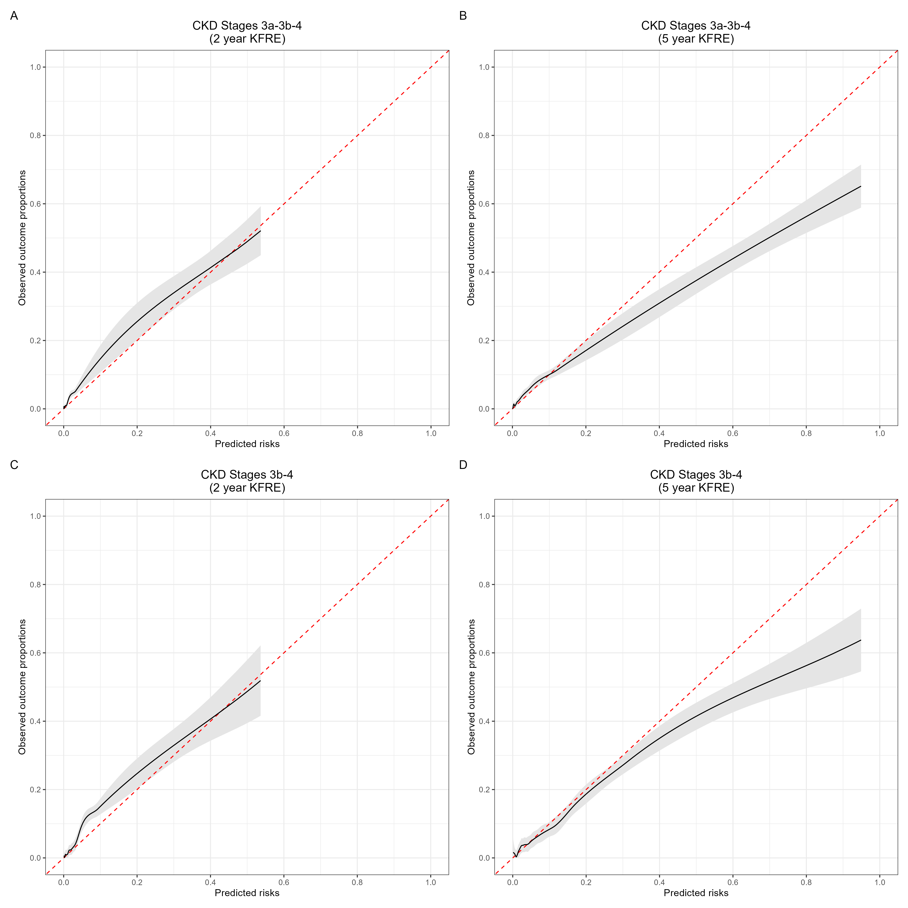
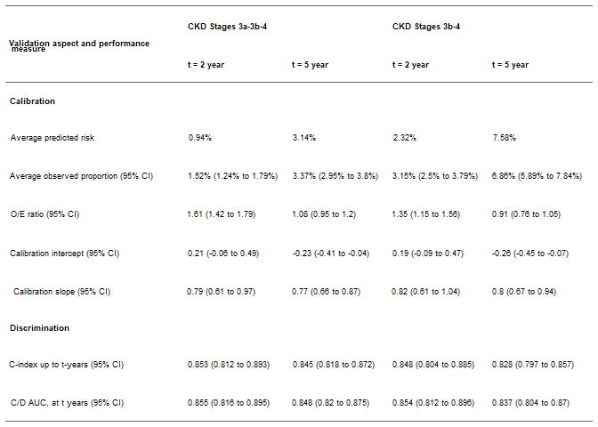

2 - Sensitivy Analysis: Analysis ignoring extreme values using winzoring
================
Percy Soto-Becerra
5/7/23

- <a
  href="#code-to-reproduce-results-of-the-manuscript-kidney-failure-prediction-multicenter-external-validation-of-the-kfre-model-in-patients-with-ckd-stages-3-4-in-peru"
  id="toc-code-to-reproduce-results-of-the-manuscript-kidney-failure-prediction-multicenter-external-validation-of-the-kfre-model-in-patients-with-ckd-stages-3-4-in-peru"><span
  class="toc-section-number">1</span> Code to reproduce results of the
  manuscript ‘Kidney Failure Prediction: Multicenter External Validation
  of the KFRE Model in Patients with CKD Stages 3-4 in Peru’</a>
  - <a href="#introduction" id="toc-introduction"><span
    class="toc-section-number">1.1</span> Introduction</a>
  - <a href="#setup" id="toc-setup"><span
    class="toc-section-number">1.2</span> Setup</a>
  - <a href="#identifying-outliers" id="toc-identifying-outliers"><span
    class="toc-section-number">1.3</span> Identifying outliers</a>
    - <a href="#fig-s3" id="toc-fig-s3"><span
      class="toc-section-number">1.3.1</span> Fig S3</a>
  - <a href="#calculate-scores-with-acr-winzorized"
    id="toc-calculate-scores-with-acr-winzorized"><span
    class="toc-section-number">1.4</span> Calculate scores with ACR
    winzorized</a>
    - <a href="#fig-s4" id="toc-fig-s4"><span
      class="toc-section-number">1.4.1</span> Fig S4</a>
  - <a href="#predictive-performance" id="toc-predictive-performance"><span
    class="toc-section-number">1.5</span> Predictive Performance</a>
    - <a href="#calibration" id="toc-calibration"><span
      class="toc-section-number">1.5.1</span> Calibration</a>
      - <a href="#mean-calibration-oe-ratio"
        id="toc-mean-calibration-oe-ratio"><span
        class="toc-section-number">1.5.1.1</span> Mean calibration: OE ratio</a>
      - <a href="#weak-calibration-calibration-intercept-and-calibration-slope"
        id="toc-weak-calibration-calibration-intercept-and-calibration-slope"><span
        class="toc-section-number">1.5.1.2</span> Weak calibration: Calibration
        intercept and Calibration slope</a>
      - <a
        href="#moderate-calibration-calibration-curves-lowess-based-on-pseudovalues"
        id="toc-moderate-calibration-calibration-curves-lowess-based-on-pseudovalues"><span
        class="toc-section-number">1.5.1.3</span> Moderate calibration:
        Calibration curves lowess based on pseudovalues</a>
    - <a href="#figure-s5" id="toc-figure-s5"><span
      class="toc-section-number">1.5.2</span> Figure S5</a>
    - <a href="#discrimination" id="toc-discrimination"><span
      class="toc-section-number">1.5.3</span> Discrimination</a>
      - <a href="#c-index-and-time-dependent-cd-auc"
        id="toc-c-index-and-time-dependent-cd-auc"><span
        class="toc-section-number">1.5.3.1</span> C-index and time-dependent C/D
        AUC</a>
    - <a href="#table-s11" id="toc-table-s11"><span
      class="toc-section-number">1.5.4</span> Table S11</a>
  - <a href="#ticket-de-reprocubilidad"
    id="toc-ticket-de-reprocubilidad"><span
    class="toc-section-number">1.6</span> Ticket de Reprocubilidad</a>

# Code to reproduce results of the manuscript ‘Kidney Failure Prediction: Multicenter External Validation of the KFRE Model in Patients with CKD Stages 3-4 in Peru’

## Introduction

This document presents the code and results of the sensitivity analysis
described in the article, which consisted of replacing the extreme
values of the ACR variable by the values corresponding to the 1st and
99th percentiles of the data of this variable with the aim of reducing
the potential influence of these outliers.

## Setup

``` r
rm(list = ls())

# Use pacman to check whether packages are installed, if not load
if (!require("pacman")) install.packages("pacman")
library(pacman)

# Unload all package to begin in a session with only base packages
pacman::p_unload("all")

# Install packages
pacman::p_load(
  here, 
  skimr, 
  survival,
  rms,
  cmprsk,
  riskRegression,
  mstate,
  pseudo,
  pec,
  riskRegression,
  plotrix,
  knitr,
  splines,
  kableExtra,
  flextable,
  gtsummary,
  boot,
  tidyverse,
  rsample,
  gridExtra,
  webshot, 
  patchwork,
  survival, 
  cmprsk, 
  survminer, 
  ggsci, 
  cowplot, 
  scales, 
  patchwork, 
  labelled, 
  glue, 
  dcurves, 
  broom, 
  downlit, 
  xml2, 
  gghalves, 
  devtools, 
  htmltools, 
  gghalves, 
  ggtext, 
  DescTools
)
```

    package 'rootSolve' successfully unpacked and MD5 sums checked
    package 'lmom' successfully unpacked and MD5 sums checked
    package 'expm' successfully unpacked and MD5 sums checked
    package 'Exact' successfully unpacked and MD5 sums checked
    package 'gld' successfully unpacked and MD5 sums checked
    package 'BH' successfully unpacked and MD5 sums checked
    package 'DescTools' successfully unpacked and MD5 sums checked

    The downloaded binary packages are in
    	C:\Users\Lenovo\AppData\Local\Temp\Rtmp4IIMwn\downloaded_packages

``` r
if (!require("smplot2")) devtools::install_github('smin95/smplot2', force = TRUE)

library(smplot2)

# Import data
data <- readRDS(here::here("Data/Derived/data_derived.rds")) 

# Subset patients with CKD Stages 3a-3b-4

data %>%
  filter(ckd_stage == "Stages 3-4") %>% 
  mutate(evento = "CKD 3-4") %>% 
  mutate(
    evento2y = case_when(
      eventd2ylab %in% c("Alive w/o Kidney Failure", 
                         "Death w/o Kidney Failure") ~ "No", 
      eventd2ylab == "Kidney Failure" ~ "Yes", 
      TRUE ~ as.character(NA)), 
    evento5y = case_when(
      eventd5ylab %in% c("Alive w/o Kidney Failure", 
                         "Death w/o Kidney Failure") ~ "No", 
      eventd5ylab == "Kidney Failure" ~ "Yes", 
      TRUE ~ as.character(NA))
    ) -> dataA

# Subset patients with CKD Stages 3b-4

data %>%
  filter(ckd_stage2 == "Stages 3b-4") %>% 
  mutate(evento = "CKD 3b-4") %>% 
  mutate(
    evento2y = case_when(
      eventd2ylab %in% c("Alive w/o Kidney Failure", 
                         "Death w/o Kidney Failure") ~ "No", 
      eventd2ylab == "Kidney Failure" ~ "Yes", 
      TRUE ~ as.character(NA)), 
    evento5y = case_when(
      eventd5ylab %in% c("Alive w/o Kidney Failure", 
                         "Death w/o Kidney Failure") ~ "No", 
      eventd5ylab == "Kidney Failure" ~ "Yes", 
      TRUE ~ as.character(NA))
    ) -> dataB  
```

## Identifying outliers

``` r
rang_dataA <- range(Winsorize(dataA$acr, probs = c(0.01, 0.99)))
rang_dataB <- range(Winsorize(dataB$acr, probs = c(0.01, 0.99)))

dataA_exclud <- dataA %>% 
  filter(acr > rang_dataA[2] | acr < rang_dataA[1])

dataB_exclud <- dataB %>% 
  filter(acr > rang_dataB[2] | acr < rang_dataB[1])
```

### Fig S3

``` r
dataA <- dataA %>% 
  mutate(acr_w = Winsorize(acr, probs = c(0.01, 0.99)))

dataB <- dataB %>% 
  mutate(acr_w = Winsorize(acr, probs = c(0.01, 0.99)))

dataA %>% 
  bind_rows(dataB) -> data2
  
data2 %>%
  ggplot(aes(x = evento, y = acr, fill = evento)) + 
  sm_raincloud() + 
  labs(x = "", 
       y = "ACR, mg/g", 
       title = "Original data") -> p1 

data2 %>%
  ggplot(aes(x = evento, y = acr, fill = evento)) + 
  sm_raincloud() + 
  scale_y_continuous(trans = "log10", labels = label_log()) +
  labs(x = "", 
       y = "ACR, mg/g (log scale)") -> p2

data2 %>%
  ggplot(aes(x = evento, y = acr_w, fill = evento)) + 
  sm_raincloud() + 
  labs(x = "", 
       y = "ACR, mg/g", 
       title = "*Winzorized outliers in ACR") -> p3 

data2 %>%
  ggplot(aes(x = evento, y = acr_w, fill = evento)) + 
  sm_raincloud() + 
  scale_y_continuous(trans = "log10", labels = label_log()) +
  labs(x = "", 
       y = "ACR, mg/g (log scale)") -> p4

((p1 / p2 ) | (p3 / p4 )) + plot_annotation(tag_levels = "A") -> plot_dist_vars

ggsave(filename = "plot_dist_vars_sens_outlier.png", 
       plot = plot_dist_vars, 
       device = "png",
       path = here("Figures/"), 
       scale = 2, 
       width = 18, 
       height = 18, 
       units = "cm",
       dpi = 900
       )
```

``` r
knitr::include_graphics(here("Figures/plot_dist_vars_sens_outlier.png"))
```

<figure>

<figcaption aria-hidden="true">Figure 1: Distribution of ACR in original
data versus winzorized data. Winzoring was applied to extreme values in
1 and 99 percentiles</figcaption>
</figure>

## Calculate scores with ACR winzorized

``` r
dataA %>%
  mutate(
    risk2y_w = 1 - 0.9832 ^ exp(-0.2201 * (age / 10 - 7.036) + 0.2467 * (male - 0.5642) - 0.5567 * (eGFR_ckdepi / 5 - 7.222) + 0.4510 * (log(acr_w) - 5.137)), 
    risk5y_w = 1 - 0.9365 ^ exp(-0.2201 * (age / 10 - 7.036) + 0.2467 * (male - 0.5642) - 0.5567 * (eGFR_ckdepi / 5 - 7.222) + 0.4510 * (log(acr_w) - 5.137))
    ) %>% 
  set_variable_labels(
    acr = "Albumin-to-creatinine ratio", 
    acr_w = "Albumin-to-creatinine ratio", 
    risk2y_w = "Predicted risk of kidney failure to 2 years", 
    risk5y_w = "Predicted risk of kidney failure to 5 years"
  ) -> dataA

dataB %>%
  mutate(
    risk2y_w = 1 - 0.9832 ^ exp(-0.2201 * (age / 10 - 7.036) + 0.2467 * (male - 0.5642) - 0.5567 * (eGFR_ckdepi / 5 - 7.222) + 0.4510 * (log(acr_w) - 5.137)), 
    risk5y_w = 1 - 0.9365 ^ exp(-0.2201 * (age / 10 - 7.036) + 0.2467 * (male - 0.5642) - 0.5567 * (eGFR_ckdepi / 5 - 7.222) + 0.4510 * (log(acr_w) - 5.137))
    ) %>% 
  set_variable_labels(
    acr = "Albumin-to-creatinine ratio", 
    acr_w = "Albumin-to-creatinine ratio", 
    risk2y_w = "Predicted risk of kidney failure to 2 years (%)", 
    risk5y_w = "Predicted risk of kidney failure to 5 years (%)"
  ) -> dataB  
```

``` r
dataA %>% 
  select(acr, risk2y, risk5y) %>% 
  mutate(risk2y = 100 * risk2y, 
         risk5y = 100 * risk5y) %>% 
  tbl_summary(
    type = all_continuous() ~ "continuous2", 
    statistic = all_continuous2() ~ c("{mean} ± {sd}", 
                                      "{median} ({p25}, {p75})", 
                                      "{min}, {max}"),
    digits = all_continuous2() ~ c(3, 3, 3, 3, 3, 3, 3)
  ) -> tabA1

dataA %>% 
  mutate(acr = acr_w, 
         risk2y = risk2y_w, 
         risk5y = risk5y_w) %>% 
  select(acr, risk2y, risk5y) %>% 
  mutate(risk2y = 100 * risk2y, 
         risk5y = 100 * risk5y) %>% 
  tbl_summary(
    type = all_continuous() ~ "continuous2", 
    statistic = all_continuous2() ~ c("{mean} ± {sd}", 
                                      "{median} ({p25}, {p75})", 
                                      "{min}, {max}"),
    digits = all_continuous2() ~ c(3, 3, 3, 3, 3, 3, 3)
  ) -> tabA2
  
tbl_merge(list(tabA1, tabA2), 
          tab_spanner = c("**Original data**", "**Winzorized outliers in ACR**")) -> tableS10

tableS10 %>% 
  as_flex_table() %>% 
  save_as_docx(path = here("Tables/TableS10.docx"))

tableS10
```

<div id="dibqkknhxh" style="padding-left:0px;padding-right:0px;padding-top:10px;padding-bottom:10px;overflow-x:auto;overflow-y:auto;width:auto;height:auto;">
<style>#dibqkknhxh table {
  font-family: system-ui, 'Segoe UI', Roboto, Helvetica, Arial, sans-serif, 'Apple Color Emoji', 'Segoe UI Emoji', 'Segoe UI Symbol', 'Noto Color Emoji';
  -webkit-font-smoothing: antialiased;
  -moz-osx-font-smoothing: grayscale;
}

#dibqkknhxh thead, #dibqkknhxh tbody, #dibqkknhxh tfoot, #dibqkknhxh tr, #dibqkknhxh td, #dibqkknhxh th {
  border-style: none;
}

#dibqkknhxh p {
  margin: 0;
  padding: 0;
}

#dibqkknhxh .gt_table {
  display: table;
  border-collapse: collapse;
  line-height: normal;
  margin-left: auto;
  margin-right: auto;
  color: #333333;
  font-size: 16px;
  font-weight: normal;
  font-style: normal;
  background-color: #FFFFFF;
  width: auto;
  border-top-style: solid;
  border-top-width: 2px;
  border-top-color: #A8A8A8;
  border-right-style: none;
  border-right-width: 2px;
  border-right-color: #D3D3D3;
  border-bottom-style: solid;
  border-bottom-width: 2px;
  border-bottom-color: #A8A8A8;
  border-left-style: none;
  border-left-width: 2px;
  border-left-color: #D3D3D3;
}

#dibqkknhxh .gt_caption {
  padding-top: 4px;
  padding-bottom: 4px;
}

#dibqkknhxh .gt_title {
  color: #333333;
  font-size: 125%;
  font-weight: initial;
  padding-top: 4px;
  padding-bottom: 4px;
  padding-left: 5px;
  padding-right: 5px;
  border-bottom-color: #FFFFFF;
  border-bottom-width: 0;
}

#dibqkknhxh .gt_subtitle {
  color: #333333;
  font-size: 85%;
  font-weight: initial;
  padding-top: 3px;
  padding-bottom: 5px;
  padding-left: 5px;
  padding-right: 5px;
  border-top-color: #FFFFFF;
  border-top-width: 0;
}

#dibqkknhxh .gt_heading {
  background-color: #FFFFFF;
  text-align: center;
  border-bottom-color: #FFFFFF;
  border-left-style: none;
  border-left-width: 1px;
  border-left-color: #D3D3D3;
  border-right-style: none;
  border-right-width: 1px;
  border-right-color: #D3D3D3;
}

#dibqkknhxh .gt_bottom_border {
  border-bottom-style: solid;
  border-bottom-width: 2px;
  border-bottom-color: #D3D3D3;
}

#dibqkknhxh .gt_col_headings {
  border-top-style: solid;
  border-top-width: 2px;
  border-top-color: #D3D3D3;
  border-bottom-style: solid;
  border-bottom-width: 2px;
  border-bottom-color: #D3D3D3;
  border-left-style: none;
  border-left-width: 1px;
  border-left-color: #D3D3D3;
  border-right-style: none;
  border-right-width: 1px;
  border-right-color: #D3D3D3;
}

#dibqkknhxh .gt_col_heading {
  color: #333333;
  background-color: #FFFFFF;
  font-size: 100%;
  font-weight: normal;
  text-transform: inherit;
  border-left-style: none;
  border-left-width: 1px;
  border-left-color: #D3D3D3;
  border-right-style: none;
  border-right-width: 1px;
  border-right-color: #D3D3D3;
  vertical-align: bottom;
  padding-top: 5px;
  padding-bottom: 6px;
  padding-left: 5px;
  padding-right: 5px;
  overflow-x: hidden;
}

#dibqkknhxh .gt_column_spanner_outer {
  color: #333333;
  background-color: #FFFFFF;
  font-size: 100%;
  font-weight: normal;
  text-transform: inherit;
  padding-top: 0;
  padding-bottom: 0;
  padding-left: 4px;
  padding-right: 4px;
}

#dibqkknhxh .gt_column_spanner_outer:first-child {
  padding-left: 0;
}

#dibqkknhxh .gt_column_spanner_outer:last-child {
  padding-right: 0;
}

#dibqkknhxh .gt_column_spanner {
  border-bottom-style: solid;
  border-bottom-width: 2px;
  border-bottom-color: #D3D3D3;
  vertical-align: bottom;
  padding-top: 5px;
  padding-bottom: 5px;
  overflow-x: hidden;
  display: inline-block;
  width: 100%;
}

#dibqkknhxh .gt_spanner_row {
  border-bottom-style: hidden;
}

#dibqkknhxh .gt_group_heading {
  padding-top: 8px;
  padding-bottom: 8px;
  padding-left: 5px;
  padding-right: 5px;
  color: #333333;
  background-color: #FFFFFF;
  font-size: 100%;
  font-weight: initial;
  text-transform: inherit;
  border-top-style: solid;
  border-top-width: 2px;
  border-top-color: #D3D3D3;
  border-bottom-style: solid;
  border-bottom-width: 2px;
  border-bottom-color: #D3D3D3;
  border-left-style: none;
  border-left-width: 1px;
  border-left-color: #D3D3D3;
  border-right-style: none;
  border-right-width: 1px;
  border-right-color: #D3D3D3;
  vertical-align: middle;
  text-align: left;
}

#dibqkknhxh .gt_empty_group_heading {
  padding: 0.5px;
  color: #333333;
  background-color: #FFFFFF;
  font-size: 100%;
  font-weight: initial;
  border-top-style: solid;
  border-top-width: 2px;
  border-top-color: #D3D3D3;
  border-bottom-style: solid;
  border-bottom-width: 2px;
  border-bottom-color: #D3D3D3;
  vertical-align: middle;
}

#dibqkknhxh .gt_from_md > :first-child {
  margin-top: 0;
}

#dibqkknhxh .gt_from_md > :last-child {
  margin-bottom: 0;
}

#dibqkknhxh .gt_row {
  padding-top: 8px;
  padding-bottom: 8px;
  padding-left: 5px;
  padding-right: 5px;
  margin: 10px;
  border-top-style: solid;
  border-top-width: 1px;
  border-top-color: #D3D3D3;
  border-left-style: none;
  border-left-width: 1px;
  border-left-color: #D3D3D3;
  border-right-style: none;
  border-right-width: 1px;
  border-right-color: #D3D3D3;
  vertical-align: middle;
  overflow-x: hidden;
}

#dibqkknhxh .gt_stub {
  color: #333333;
  background-color: #FFFFFF;
  font-size: 100%;
  font-weight: initial;
  text-transform: inherit;
  border-right-style: solid;
  border-right-width: 2px;
  border-right-color: #D3D3D3;
  padding-left: 5px;
  padding-right: 5px;
}

#dibqkknhxh .gt_stub_row_group {
  color: #333333;
  background-color: #FFFFFF;
  font-size: 100%;
  font-weight: initial;
  text-transform: inherit;
  border-right-style: solid;
  border-right-width: 2px;
  border-right-color: #D3D3D3;
  padding-left: 5px;
  padding-right: 5px;
  vertical-align: top;
}

#dibqkknhxh .gt_row_group_first td {
  border-top-width: 2px;
}

#dibqkknhxh .gt_row_group_first th {
  border-top-width: 2px;
}

#dibqkknhxh .gt_summary_row {
  color: #333333;
  background-color: #FFFFFF;
  text-transform: inherit;
  padding-top: 8px;
  padding-bottom: 8px;
  padding-left: 5px;
  padding-right: 5px;
}

#dibqkknhxh .gt_first_summary_row {
  border-top-style: solid;
  border-top-color: #D3D3D3;
}

#dibqkknhxh .gt_first_summary_row.thick {
  border-top-width: 2px;
}

#dibqkknhxh .gt_last_summary_row {
  padding-top: 8px;
  padding-bottom: 8px;
  padding-left: 5px;
  padding-right: 5px;
  border-bottom-style: solid;
  border-bottom-width: 2px;
  border-bottom-color: #D3D3D3;
}

#dibqkknhxh .gt_grand_summary_row {
  color: #333333;
  background-color: #FFFFFF;
  text-transform: inherit;
  padding-top: 8px;
  padding-bottom: 8px;
  padding-left: 5px;
  padding-right: 5px;
}

#dibqkknhxh .gt_first_grand_summary_row {
  padding-top: 8px;
  padding-bottom: 8px;
  padding-left: 5px;
  padding-right: 5px;
  border-top-style: double;
  border-top-width: 6px;
  border-top-color: #D3D3D3;
}

#dibqkknhxh .gt_last_grand_summary_row_top {
  padding-top: 8px;
  padding-bottom: 8px;
  padding-left: 5px;
  padding-right: 5px;
  border-bottom-style: double;
  border-bottom-width: 6px;
  border-bottom-color: #D3D3D3;
}

#dibqkknhxh .gt_striped {
  background-color: rgba(128, 128, 128, 0.05);
}

#dibqkknhxh .gt_table_body {
  border-top-style: solid;
  border-top-width: 2px;
  border-top-color: #D3D3D3;
  border-bottom-style: solid;
  border-bottom-width: 2px;
  border-bottom-color: #D3D3D3;
}

#dibqkknhxh .gt_footnotes {
  color: #333333;
  background-color: #FFFFFF;
  border-bottom-style: none;
  border-bottom-width: 2px;
  border-bottom-color: #D3D3D3;
  border-left-style: none;
  border-left-width: 2px;
  border-left-color: #D3D3D3;
  border-right-style: none;
  border-right-width: 2px;
  border-right-color: #D3D3D3;
}

#dibqkknhxh .gt_footnote {
  margin: 0px;
  font-size: 90%;
  padding-top: 4px;
  padding-bottom: 4px;
  padding-left: 5px;
  padding-right: 5px;
}

#dibqkknhxh .gt_sourcenotes {
  color: #333333;
  background-color: #FFFFFF;
  border-bottom-style: none;
  border-bottom-width: 2px;
  border-bottom-color: #D3D3D3;
  border-left-style: none;
  border-left-width: 2px;
  border-left-color: #D3D3D3;
  border-right-style: none;
  border-right-width: 2px;
  border-right-color: #D3D3D3;
}

#dibqkknhxh .gt_sourcenote {
  font-size: 90%;
  padding-top: 4px;
  padding-bottom: 4px;
  padding-left: 5px;
  padding-right: 5px;
}

#dibqkknhxh .gt_left {
  text-align: left;
}

#dibqkknhxh .gt_center {
  text-align: center;
}

#dibqkknhxh .gt_right {
  text-align: right;
  font-variant-numeric: tabular-nums;
}

#dibqkknhxh .gt_font_normal {
  font-weight: normal;
}

#dibqkknhxh .gt_font_bold {
  font-weight: bold;
}

#dibqkknhxh .gt_font_italic {
  font-style: italic;
}

#dibqkknhxh .gt_super {
  font-size: 65%;
}

#dibqkknhxh .gt_footnote_marks {
  font-size: 75%;
  vertical-align: 0.4em;
  position: initial;
}

#dibqkknhxh .gt_asterisk {
  font-size: 100%;
  vertical-align: 0;
}

#dibqkknhxh .gt_indent_1 {
  text-indent: 5px;
}

#dibqkknhxh .gt_indent_2 {
  text-indent: 10px;
}

#dibqkknhxh .gt_indent_3 {
  text-indent: 15px;
}

#dibqkknhxh .gt_indent_4 {
  text-indent: 20px;
}

#dibqkknhxh .gt_indent_5 {
  text-indent: 25px;
}
</style>
<table class="gt_table" data-quarto-disable-processing="false" data-quarto-bootstrap="false">
  <thead>
    
    <tr class="gt_col_headings gt_spanner_row">
      <th class="gt_col_heading gt_columns_bottom_border gt_left" rowspan="2" colspan="1" scope="col" id="&lt;strong&gt;Characteristic&lt;/strong&gt;"><strong>Characteristic</strong></th>
      <th class="gt_center gt_columns_top_border gt_column_spanner_outer" rowspan="1" colspan="1" scope="col" id="&lt;strong&gt;Original data&lt;/strong&gt;">
        <span class="gt_column_spanner"><strong>Original data</strong></span>
      </th>
      <th class="gt_center gt_columns_top_border gt_column_spanner_outer" rowspan="1" colspan="1" scope="col" id="&lt;strong&gt;Winzorized outliers in ACR&lt;/strong&gt;">
        <span class="gt_column_spanner"><strong>Winzorized outliers in ACR</strong></span>
      </th>
    </tr>
    <tr class="gt_col_headings">
      <th class="gt_col_heading gt_columns_bottom_border gt_center" rowspan="1" colspan="1" scope="col" id="&lt;strong&gt;N = 7,519&lt;/strong&gt;"><strong>N = 7,519</strong></th>
      <th class="gt_col_heading gt_columns_bottom_border gt_center" rowspan="1" colspan="1" scope="col" id="&lt;strong&gt;N = 7,519&lt;/strong&gt;"><strong>N = 7,519</strong></th>
    </tr>
  </thead>
  <tbody class="gt_table_body">
    <tr><td headers="label" class="gt_row gt_left">Albumin-to-creatinine ratio</td>
<td headers="stat_0_1" class="gt_row gt_center"></td>
<td headers="stat_0_2" class="gt_row gt_center"></td></tr>
    <tr><td headers="label" class="gt_row gt_left">    Mean ± SD</td>
<td headers="stat_0_1" class="gt_row gt_center">248.620 ± 3,044.427</td>
<td headers="stat_0_2" class="gt_row gt_center">144.053 ± 437.405</td></tr>
    <tr><td headers="label" class="gt_row gt_left">    Median (IQR)</td>
<td headers="stat_0_1" class="gt_row gt_center">14.634 (4.484, 66.114)</td>
<td headers="stat_0_2" class="gt_row gt_center">14.634 (4.484, 66.114)</td></tr>
    <tr><td headers="label" class="gt_row gt_left">    Range</td>
<td headers="stat_0_1" class="gt_row gt_center">0.002, 144,870.588</td>
<td headers="stat_0_2" class="gt_row gt_center">0.236, 3,195.727</td></tr>
    <tr><td headers="label" class="gt_row gt_left">Predicted risk of kidney failure to 2 years</td>
<td headers="stat_0_1" class="gt_row gt_center"></td>
<td headers="stat_0_2" class="gt_row gt_center"></td></tr>
    <tr><td headers="label" class="gt_row gt_left">    Mean ± SD</td>
<td headers="stat_0_1" class="gt_row gt_center">0.963 ± 3.263</td>
<td headers="stat_0_2" class="gt_row gt_center">0.944 ± 3.155</td></tr>
    <tr><td headers="label" class="gt_row gt_left">    Median (IQR)</td>
<td headers="stat_0_1" class="gt_row gt_center">0.131 (0.057, 0.429)</td>
<td headers="stat_0_2" class="gt_row gt_center">0.131 (0.057, 0.429)</td></tr>
    <tr><td headers="label" class="gt_row gt_left">    Range</td>
<td headers="stat_0_1" class="gt_row gt_center">0.001, 53.657</td>
<td headers="stat_0_2" class="gt_row gt_center">0.006, 53.657</td></tr>
    <tr><td headers="label" class="gt_row gt_left">Predicted risk of kidney failure to 5 years</td>
<td headers="stat_0_1" class="gt_row gt_center"></td>
<td headers="stat_0_2" class="gt_row gt_center"></td></tr>
    <tr><td headers="label" class="gt_row gt_left">    Mean ± SD</td>
<td headers="stat_0_1" class="gt_row gt_center">3.182 ± 8.913</td>
<td headers="stat_0_2" class="gt_row gt_center">3.138 ± 8.760</td></tr>
    <tr><td headers="label" class="gt_row gt_left">    Median (IQR)</td>
<td headers="stat_0_1" class="gt_row gt_center">0.507 (0.220, 1.650)</td>
<td headers="stat_0_2" class="gt_row gt_center">0.508 (0.221, 1.649)</td></tr>
    <tr><td headers="label" class="gt_row gt_left">    Range</td>
<td headers="stat_0_1" class="gt_row gt_center">0.004, 94.911</td>
<td headers="stat_0_2" class="gt_row gt_center">0.024, 94.911</td></tr>
  </tbody>
  
  
</table>
</div>

### Fig S4

``` r
# Original data----
dataA %>%
  ggplot(aes(x = risk2y, color = evento2y, fill = evento2y)) + 
  geom_histogram(alpha = 0.4) + 
  labs(x = "2-years predicted risk by KFRE", 
       y = "Frequency count", 
       color = "Kidney failure", 
       fill = "Kidney failure", 
       title = "Original data", 
       subtitle = "CKD stages 3-4") + 
  theme_classic() + 
  theme(plot.title = element_text(hjust = 0.5, 
                                  face = "bold")) + 
  coord_cartesian(xlim = c(0, 1)) -> p1

dataA %>%
  ggplot(aes(x = risk5y, color = evento5y, fill = evento2y)) + 
  geom_histogram(alpha = 0.4) + 
  labs(x = "5-years predicted risk by KFRE", 
       y = "Frequency count", 
       color = "Kidney failure", 
       fill = "Kidney failure", 
       subtitle = "CKD stages 3-4") + 
  theme_classic() + 
  coord_cartesian(xlim = c(0, 1)) -> p2

dataB %>%
  ggplot(aes(x = risk2y, color = evento2y, fill = evento2y)) + 
  geom_histogram(alpha = 0.4) + 
  labs(x = "2-years predicted risk by KFRE", 
       y = "Frequency count", 
       color = "Kidney failure", 
       fill = "Kidney failure", 
       subtitle = "CKD stages 3b-4") + 
  theme_classic() + 
  theme(plot.title = element_text(hjust = 0.5, 
                                  face = "bold")) + 
  coord_cartesian(xlim = c(0, 1)) -> p3

dataB %>%
  ggplot(aes(x = risk5y, color = evento5y, fill = evento2y)) + 
  geom_histogram(alpha = 0.4) + 
  labs(x = "5-years predicted risk by KFRE", 
       y = "Frequency count", 
       color = "Kidney failure", 
       fill = "Kidney failure", 
       subtitle = "CKD stages 3b-4") + 
  theme_classic() + 
  coord_cartesian(xlim = c(0, 1)) -> p4

# Winzorized variable----
dataA %>%
  ggplot(aes(x = risk2y_w, color = evento2y, fill = evento2y)) + 
  geom_histogram(alpha = 0.4) + 
  labs(x = "2-years predicted risk by KFRE", 
       y = "Frequency count", 
       color = "Kidney failure", 
       fill = "Kidney failure", 
       title = "Winzorized outliers in ACR", 
       subtitle = "CKD stages 3-4") + 
  theme_classic() + 
  theme(plot.title = element_text(hjust = 0.5, 
                                  face = "bold")) + 
  coord_cartesian(xlim = c(0, 1)) -> p1_w

dataA %>%
  ggplot(aes(x = risk5y_w, color = evento5y, fill = evento2y)) + 
  geom_histogram(alpha = 0.4) + 
  labs(x = "5-years predicted risk by KFRE", 
       y = "Frequency count", 
       color = "Kidney failure", 
       fill = "Kidney failure", 
       subtitle = "CKD stages 3-4") + 
  theme_classic() + 
  coord_cartesian(xlim = c(0, 1)) -> p2_w

dataB %>%
  ggplot(aes(x = risk2y_w, color = evento2y, fill = evento2y)) + 
  geom_histogram(alpha = 0.4) + 
  labs(x = "2-years predicted risk by KFRE", 
       y = "Frequency count", 
       color = "Kidney failure", 
       fill = "Kidney failure", 
       subtitle = "CKD stages 3b-4") + 
  theme_classic() + 
  theme(plot.title = element_text(hjust = 0.5, 
                                  face = "bold")) + 
  coord_cartesian(xlim = c(0, 1)) -> p3_w

dataB %>%
  ggplot(aes(x = risk5y_w, color = evento5y, fill = evento2y)) + 
  geom_histogram(alpha = 0.4) + 
  labs(x = "5-years predicted risk by KFRE", 
       y = "Frequency count", 
       color = "Kidney failure", 
       fill = "Kidney failure", 
       subtitle = "CKD stages 3b-4") + 
  theme_classic() + 
  coord_cartesian(xlim = c(0, 1)) -> p4_w


((p1 / p2 / p3 / p4) | (p1_w / p2_w / p3_w / p4_w)) + 
  plot_layout(guides = "collect") + 
  plot_annotation(tag_levels = "A")  -> plot_dist_risks

ggsave(filename = "plot_dist_risks_sens_outlier.png", 
       plot = plot_dist_risks, 
       device = "png",
       path = here("Figures/"), 
       scale = 2, 
       width = 18, 
       height = 24, 
       units = "cm",
       dpi = 900
       )
```


## Predictive Performance

### Calibration

#### Mean calibration: OE ratio

``` r
# Calibration (O/E) -------------------------------------------------------

# Seleccion del grupo: Stages 3-4----
vdata <- dataA %>% 
  mutate(risk2y = risk2y_w, 
         risk5y = risk5y_w) %>% 
  select(id, risk2y, risk5y, time5y, eventd5y, time, eventd) %>%  
  drop_na() %>%  
  mutate(status = factor(eventd5y, 
                         levels = c(0, 1, 2), 
                         labels = c("Alive w/o Kidney Failure", 
                                    "Kidney Failure", 
                                    "Death w/o Kidney Failure")))
primary_event <- 1

# A 2 años----
horizon <- 2

vdata$pred <- vdata$risk2y

# First calculate Aalen-Johansen estimate (as 'observed')
obj <- summary(survfit(Surv(time5y, status) ~ 1, 
                        data = vdata), 
                times = horizon)

aj <- list(
  "obs" = obj$pstate[, primary_event + 1],
  "se" = obj$std.err[, primary_event + 1]
)


# Calculate O/E
OE <- aj$obs / mean(vdata$pred)

# For the confidence interval we use method proposed in Debray et al. (2017) doi:10.1136/bmj.i6460
k <- 2
alpha <- 0.05
OE_summary <- cbind(
  "OE" = OE,
  "Lower .95" = exp(log(OE - qnorm(1 - alpha / 2) * aj$se / aj$obs)),
  "Upper .95" = exp(log(OE + qnorm(1 - alpha / 2) * aj$se / aj$obs))
)

OE_summary2a <- round(OE_summary, k)

avg_obs <- cbind(
  "avg_obs" = aj$obs * 100,
  "Lower .95" = 100 * (aj$obs - qnorm(1 - alpha / 2) * aj$se),
  "Upper .95" = 100 * (aj$obs + qnorm(1 - alpha / 2) * aj$se)
)

avg_pred <- cbind(
  "avg_pred" = mean(vdata$pred) * 100
)

avg_obs2a <- round(avg_obs, k)
avg_pred2a <- round(avg_pred, k)

# Seleccion del grupo: Stages 3-4----
vdata <- dataA %>% 
  mutate(risk2y = risk2y_w, 
         risk5y = risk5y_w) %>% 
  select(id, risk2y, risk5y, time5y, eventd5y, eventd, time) %>%  
  drop_na() %>%  
  mutate(status = factor(eventd5y, 
                         levels = c(0, 1, 2), 
                         labels = c("Alive w/o Kidney Failure", 
                                    "Kidney Failure", 
                                    "Death w/o Kidney Failure")))
primary_event <- 1

# A 5 años----
horizon <- 5

# Add estimated risk and complementary log-log of it to dataset
vdata$pred <- vdata$risk5y


# First calculate Aalen-Johansen estimate (as 'observed')
obj <- summary(survfit(Surv(time5y, status) ~ 1, 
                        data = vdata), 
                times = horizon)

aj <- list(
  "obs" = obj$pstate[, primary_event + 1],
  "se" = obj$std.err[, primary_event + 1]
)


# Calculate O/E
OE <- aj$obs / mean(vdata$pred)

# For the confidence interval we use method proposed in Debray et al. (2017) doi:10.1136/bmj.i6460
k <- 2
alpha <- 0.05
OE_summary <- cbind(
  "OE" = OE,
  "Lower .95" = exp(log(OE - qnorm(1 - alpha / 2) * aj$se / aj$obs)),
  "Upper .95" = exp(log(OE + qnorm(1 - alpha / 2) * aj$se / aj$obs))
)

OE_summary5a <- round(OE_summary, k)

avg_obs <- cbind(
  "avg_obs" = aj$obs * 100,
  "Lower .95" = 100 * (aj$obs - qnorm(1 - alpha / 2) * aj$se),
  "Upper .95" = 100 * (aj$obs + qnorm(1 - alpha / 2) * aj$se)
)

avg_pred <- cbind(
  "avg_pred" = mean(vdata$pred) * 100
)

avg_obs5a <- round(avg_obs, k)
avg_pred5a <- round(avg_pred, k)

# Seleccion del grupo: Stages 3b-4----

vdata <- dataB %>% 
  mutate(risk2y = risk2y_w, 
         risk5y = risk5y_w) %>% 
  select(id, risk2y, risk5y, time5y, eventd5y, eventd, time) %>%  
  drop_na() %>%  
  mutate(status = factor(eventd5y, 
                         levels = c(0, 1, 2), 
                         labels = c("Alive w/o Kidney Failure", 
                                    "Kidney Failure", 
                                    "Death w/o Kidney Failure")))
primary_event <- 1

# A 2 años----
horizon <- 2

# Add estimated risk and complementary log-log of it to dataset
vdata$pred <- vdata$risk2y


# First calculate Aalen-Johansen estimate (as 'observed')
obj <- summary(survfit(Surv(time5y, status) ~ 1, 
                        data = vdata), 
                times = horizon)

aj <- list(
  "obs" = obj$pstate[, primary_event + 1],
  "se" = obj$std.err[, primary_event + 1]
)

# Calculate O/E
OE <- aj$obs / mean(vdata$pred)

# For the confidence interval we use method proposed in Debray et al. (2017) doi:10.1136/bmj.i6460
k <- 2
alpha <- 0.05
OE_summary <- cbind(
  "OE" = OE,
  "Lower .95" = exp(log(OE - qnorm(1 - alpha / 2) * aj$se / aj$obs)),
  "Upper .95" = exp(log(OE + qnorm(1 - alpha / 2) * aj$se / aj$obs))
)

OE_summary2b <- round(OE_summary, k)

avg_obs <- cbind(
  "avg_obs" = aj$obs * 100,
  "Lower .95" = 100 * (aj$obs - qnorm(1 - alpha / 2) * aj$se),
  "Upper .95" = 100 * (aj$obs + qnorm(1 - alpha / 2) * aj$se)
)

avg_pred <- cbind(
  "avg_pred" = mean(vdata$pred) * 100
)

avg_obs2b <- round(avg_obs, k)
avg_pred2b <- round(avg_pred, k)

# Seleccion del grupo: Stages 3b-4----
vdata <- dataB %>% 
  mutate(risk2y = risk2y_w, 
         risk5y = risk5y_w) %>% 
  select(id, risk2y, risk5y, time5y, eventd5y) %>%  
  drop_na() %>%  
  mutate(status = factor(eventd5y, 
                         levels = c(0, 1, 2), 
                         labels = c("Alive w/o Kidney Failure", 
                                    "Kidney Failure", 
                                    "Death w/o Kidney Failure")))
primary_event <- 1

# A 5 años----
horizon <- 5

# Add estimated risk and complementary log-log of it to dataset
vdata$pred <- vdata$risk5y


# First calculate Aalen-Johansen estimate (as 'observed')
obj <- summary(survfit(Surv(time5y, status) ~ 1, 
                        data = vdata), 
                times = horizon)

aj <- list(
  "obs" = obj$pstate[, primary_event + 1],
  "se" = obj$std.err[, primary_event + 1]
)


# Calculate O/E
OE <- aj$obs / mean(vdata$pred)

# For the confidence interval we use method proposed in Debray et al. (2017) doi:10.1136/bmj.i6460
k <- 2
alpha <- 0.05
OE_summary <- cbind(
  "OE" = OE,
  "Lower .95" = exp(log(OE - qnorm(1 - alpha / 2) * aj$se / aj$obs)),
  "Upper .95" = exp(log(OE + qnorm(1 - alpha / 2) * aj$se / aj$obs))
)

OE_summary5b <- round(OE_summary, k)

avg_obs <- cbind(
  "avg_obs" = aj$obs * 100,
  "Lower .95" = 100 * (aj$obs - qnorm(1 - alpha / 2) * aj$se),
  "Upper .95" = 100 * (aj$obs + qnorm(1 - alpha / 2) * aj$se)
)

avg_pred <- cbind(
  "avg_pred" = mean(vdata$pred) * 100
)

avg_obs5b <- round(avg_obs, k)
avg_pred5b <- round(avg_pred, k)
```

#### Weak calibration: Calibration intercept and Calibration slope

``` r
# Seleccion del grupo: Stages 3-4----
vdata <- dataA %>% 
  mutate(risk2y = risk2y_w, 
         risk5y = risk5y_w) %>% 
  select(id, risk2y, risk5y, time5y, eventd5y, eventd, time) %>%  
  drop_na() %>%  
  mutate(status = factor(eventd5y, 
                         levels = c(0, 1, 2), 
                         labels = c("Alive w/o Kidney Failure", 
                                    "Kidney Failure", 
                                    "Death w/o Kidney Failure")))
primary_event <- 1

# A 2 años----
horizon <- 2

# Add estimated risk and complementary log-log of it to dataset
vdata$pred <- vdata$risk2y

# First compute riskRegression::Score()
score_vdata <- Score(
  list("csh_validation" = vdata$pred),
  formula = Hist(time, eventd) ~ 1,
  cens.model = "km",
  data = vdata,
  conf.int = TRUE,
  times = horizon,
  #  metrics = c("auc", "brier"),
  summary = c("ipa"),
  cause = primary_event,
  plots = "calibration"
)

# Use pseudo-observations calculated by Score() (can alternatively use pseudo::pseudoci)
pseudos <- data.frame(score_vdata$Calibration$plotframe)

# Note:
# - 'pseudos' is the data.frame with ACTUAL pseudo-observations, not the smoothed ones
# - Column ID is not the id in vdata; it is just a number assigned to each row of
# the original validation data sorted by time and event indicator
pseudos$cll_pred <- log(-log(1 - pseudos$risk)) # add the cloglog risk ests

# Fit model for calibration intercept
fit_cal_int <- geese(
  pseudovalue ~ offset(cll_pred),
  data = pseudos,
  id = ID,
  scale.fix = TRUE,
  family = gaussian,
  mean.link = "cloglog",
  corstr = "independence",
  jack = TRUE
)

# Fit model for calibration slope
fit_cal_slope <- geese(
  pseudovalue ~ offset(cll_pred) + cll_pred,
  data = pseudos,
  id = ID,
  scale.fix = TRUE,
  family = gaussian,
  mean.link = "cloglog",
  corstr = "independence",
  jack = TRUE
)

# Perform joint test on intercept and slope
betas <- fit_cal_slope$beta
vcov_mat <- fit_cal_slope$vbeta
wald <- drop(betas %*% solve(vcov_mat) %*% betas)
# pchisq(wald, df = 2, lower.tail = FALSE)

k <- 2
res_cal <- rbind(

  # Value, confidence interval and test for calibration intercept
  "Intercept, Stages 3-4, 2 year" = with(
    summary(fit_cal_int)$mean,
    c(
      "estimate" = estimate,
      `2.5 %` = estimate - qnorm(0.975) * san.se,
      `97.5 %` = estimate + qnorm(0.975) * san.se
    )
  ),

  # Value, confidence interval and test for calibration slope
  "Slope, Stages 3-4, 2 year" = with(
    summary(fit_cal_slope)$mean["cll_pred", ],
    c(
      "estimate" = 1 + estimate,
      `2.5 %` = 1 + (estimate - qnorm(0.975) * san.se),
      `97.5 %` = 1 + (estimate + qnorm(0.975) * san.se)
    )
  )
)

res_cal2a <- round(res_cal, k)

# A 5 años----
horizon <- 5

# Add estimated risk and complementary log-log of it to dataset
vdata$pred <- vdata$risk5y

# First compute riskRegression::Score()
score_vdata <- Score(
  list("csh_validation" = vdata$pred),
  formula = Hist(time, eventd) ~ 1,
  cens.model = "km",
  data = vdata,
  conf.int = TRUE,
  times = horizon,
  #  metrics = c("auc", "brier"),
  summary = c("ipa"),
  cause = primary_event,
  plots = "calibration"
)

# Use pseudo-observations calculated by Score() (can alternatively use pseudo::pseudoci)
pseudos <- data.frame(score_vdata$Calibration$plotframe)

# Note:
# - 'pseudos' is the data.frame with ACTUAL pseudo-observations, not the smoothed ones
# - Column ID is not the id in vdata; it is just a number assigned to each row of
# the original validation data sorted by time and event indicator
pseudos$cll_pred <- log(-log(1 - pseudos$risk)) # add the cloglog risk ests

# Fit model for calibration intercept
fit_cal_int <- geese(
  pseudovalue ~ offset(cll_pred),
  data = pseudos,
  id = ID,
  scale.fix = TRUE,
  family = gaussian,
  mean.link = "cloglog",
  corstr = "independence",
  jack = TRUE
)

# Fit model for calibration slope
fit_cal_slope <- geese(
  pseudovalue ~ offset(cll_pred) + cll_pred,
  data = pseudos,
  id = ID,
  scale.fix = TRUE,
  family = gaussian,
  mean.link = "cloglog",
  corstr = "independence",
  jack = TRUE
)

# Perform joint test on intercept and slope
betas <- fit_cal_slope$beta
vcov_mat <- fit_cal_slope$vbeta
wald <- drop(betas %*% solve(vcov_mat) %*% betas)
# pchisq(wald, df = 2, lower.tail = FALSE)

k <- 2
res_cal <- rbind(

  # Value, confidence interval and test for calibration intercept
  "Intercept, Stages 3-4, 5 year" = with(
    summary(fit_cal_int)$mean,
    c(
      "estimate" = estimate,
      `2.5 %` = estimate - qnorm(0.975) * san.se,
      `97.5 %` = estimate + qnorm(0.975) * san.se
    )
  ),

  # Value, confidence interval and test for calibration slope
  "Slope, Stages 3-4, 5 year" = with(
    summary(fit_cal_slope)$mean["cll_pred", ],
    c(
      "estimate" = 1 + estimate,
      `2.5 %` = 1 + (estimate - qnorm(0.975) * san.se),
      `97.5 %` = 1 + (estimate + qnorm(0.975) * san.se)
    )
  )
)

res_cal5a <- round(res_cal, k)

# Seleccion del grupo: Stages 3b-4----

vdata <- dataB %>% 
  mutate(risk2y = risk2y_w, 
         risk5y = risk5y_w) %>% 
  select(id, risk2y, risk5y, time5y, eventd5y, time, eventd) %>%  
  drop_na() %>%  
  mutate(status = factor(eventd5y, 
                         levels = c(0, 1, 2), 
                         labels = c("Alive w/o Kidney Failure", 
                                    "Kidney Failure", 
                                    "Death w/o Kidney Failure")))
primary_event <- 1

# A 2 años----
horizon <- 2

# Add estimated risk and complementary log-log of it to dataset
vdata$pred <- vdata$risk2y

# First compute riskRegression::Score()
score_vdata <- Score(
  list("csh_validation" = vdata$pred),
  formula = Hist(time, eventd) ~ 1,
  cens.model = "km",
  data = vdata,
  conf.int = TRUE,
  times = horizon,
  #  metrics = c("auc", "brier"),
  summary = c("ipa"),
  cause = primary_event,
  plots = "calibration"
)

# Use pseudo-observations calculated by Score() (can alternatively use pseudo::pseudoci)
pseudos <- data.frame(score_vdata$Calibration$plotframe)

# Note:
# - 'pseudos' is the data.frame with ACTUAL pseudo-observations, not the smoothed ones
# - Column ID is not the id in vdata; it is just a number assigned to each row of
# the original validation data sorted by time and event indicator
pseudos$cll_pred <- log(-log(1 - pseudos$risk)) # add the cloglog risk ests

# Fit model for calibration intercept
fit_cal_int <- geese(
  pseudovalue ~ offset(cll_pred),
  data = pseudos,
  id = ID,
  scale.fix = TRUE,
  family = gaussian,
  mean.link = "cloglog",
  corstr = "independence",
  jack = TRUE
)

# Fit model for calibration slope
fit_cal_slope <- geese(
  pseudovalue ~ offset(cll_pred) + cll_pred,
  data = pseudos,
  id = ID,
  scale.fix = TRUE,
  family = gaussian,
  mean.link = "cloglog",
  corstr = "independence",
  jack = TRUE
)

# Perform joint test on intercept and slope
betas <- fit_cal_slope$beta
vcov_mat <- fit_cal_slope$vbeta
wald <- drop(betas %*% solve(vcov_mat) %*% betas)
# pchisq(wald, df = 2, lower.tail = FALSE)

k <- 2
res_cal <- rbind(

  # Value, confidence interval and test for calibration intercept
  "Intercept, Stages 3b-4, 2 year" = with(
    summary(fit_cal_int)$mean,
    c(
      "estimate" = estimate,
      `2.5 %` = estimate - qnorm(0.975) * san.se,
      `97.5 %` = estimate + qnorm(0.975) * san.se
    )
  ),

  # Value, confidence interval and test for calibration slope
  "Slope, Stages 3b-4, 2 year" = with(
    summary(fit_cal_slope)$mean["cll_pred", ],
    c(
      "estimate" = 1 + estimate,
      `2.5 %` = 1 + (estimate - qnorm(0.975) * san.se),
      `97.5 %` = 1 + (estimate + qnorm(0.975) * san.se)
    )
  )
)

res_cal2b <- round(res_cal, k)

# A 5 años----
horizon <- 5
vdata$pred <- vdata$risk5y

# First compute riskRegression::Score()
score_vdata <- Score(
  list("csh_validation" = vdata$pred),
  formula = Hist(time, eventd) ~ 1,
  cens.model = "km",
  data = vdata,
  conf.int = TRUE,
  times = horizon,
  #  metrics = c("auc", "brier"),
  summary = c("ipa"),
  cause = primary_event,
  plots = "calibration"
)

# Use pseudo-observations calculated by Score() (can alternatively use pseudo::pseudoci)
pseudos <- data.frame(score_vdata$Calibration$plotframe)

# Note:
# - 'pseudos' is the data.frame with ACTUAL pseudo-observations, not the smoothed ones
# - Column ID is not the id in vdata; it is just a number assigned to each row of
# the original validation data sorted by time and event indicator
pseudos$cll_pred <- log(-log(1 - pseudos$risk)) # add the cloglog risk ests

# Fit model for calibration intercept
fit_cal_int <- geese(
  pseudovalue ~ offset(cll_pred),
  data = pseudos,
  id = ID,
  scale.fix = TRUE,
  family = gaussian,
  mean.link = "cloglog",
  corstr = "independence",
  jack = TRUE
)

# Fit model for calibration slope
fit_cal_slope <- geese(
  pseudovalue ~ offset(cll_pred) + cll_pred,
  data = pseudos,
  id = ID,
  scale.fix = TRUE,
  family = gaussian,
  mean.link = "cloglog",
  corstr = "independence",
  jack = TRUE
)

# Perform joint test on intercept and slope
betas <- fit_cal_slope$beta
vcov_mat <- fit_cal_slope$vbeta
wald <- drop(betas %*% solve(vcov_mat) %*% betas)
# pchisq(wald, df = 2, lower.tail = FALSE)

k <- 2
res_cal <- rbind(

  # Value, confidence interval and test for calibration intercept
  "Intercept, Stages 3b-4, 5 year" = with(
    summary(fit_cal_int)$mean,
    c(
      "estimate" = estimate,
      `2.5 %` = estimate - qnorm(0.975) * san.se,
      `97.5 %` = estimate + qnorm(0.975) * san.se
    )
  ),

  # Value, confidence interval and test for calibration slope
  "Slope, Stages 3b-4, 5 year" = with(
    summary(fit_cal_slope)$mean["cll_pred", ],
    c(
      "estimate" = 1 + estimate,
      `2.5 %` = 1 + (estimate - qnorm(0.975) * san.se),
      `97.5 %` = 1 + (estimate + qnorm(0.975) * san.se)
    )
  )
)

res_cal5b <- round(res_cal, k)
```

#### Moderate calibration: Calibration curves lowess based on pseudovalues

``` r
# Seleccion del grupo: Stages 3-4----
vdata <- dataA %>% 
  mutate(risk2y = risk2y_w, 
         risk5y = risk5y_w) %>% 
  select(id, risk2y, risk5y, time5y, eventd5y, time, eventd) %>%  
  drop_na()

primary_event <- 1

# A 2 años----
horizon <- 2

# Add estimated risk and complementary log-log of it to dataset
vdata$pred <- vdata$risk2y
pred <- as.matrix(vdata$pred)

# Calibration plot (pseudo-obs approach) ----------------------------------
# First compute riskRegression::Score()
score_vdata <- Score(
  list("csh_validation" = pred),
  formula = Hist(time, eventd) ~ 1,
  cens.model = "km",
  data = vdata,
  conf.int = TRUE,
  times = horizon,
  #  metrics = c("auc", "brier"),
  summary = c("ipa"),
  cause = primary_event,
  plots = "calibration"
)

# Use pseudo-observations calculated by Score() (can alternatively use pseudo::pseudoci)
pseudos <- data.frame(score_vdata$Calibration$plotframe)
pseudos <- pseudos[order(pseudos$risk), ]

# Use linear loess (weighted local regression with polynomial degree = 1) smoothing
smooth_pseudos <- predict(
  stats::loess(pseudovalue ~ risk, data = pseudos, degree = 1, span = 0.33), 
  se = TRUE
)

pseudo_vals <- data.frame(
  obs = smooth_pseudos$fit, 
  risk = pseudos$risk, 
  se = smooth_pseudos$se, 
  df = smooth_pseudos$df
  ) %>% 
  mutate(
    ll = pmax(obs - qt(0.975, df) * se, 0), 
    ul = obs + qt(0.975, df) * se
  )

pseudo_vals %>% 
  ggplot(aes(x = risk, y = obs)) +
  geom_ribbon(aes(ymin = ll, ymax = ul), fill = "grey90") + 
  geom_abline(intercept = 0, slope = 1, colour = "red", linetype = 2) + 
  geom_line() + 
  scale_y_continuous(breaks = seq(0, 1, 0.2), limits = c(0, 1)) + 
  scale_x_continuous(breaks = seq(0, 1, 0.2), limits = c(0, 1)) + 
  theme_bw() + 
  xlab("Predicted risks") + 
  ylab("Observed outcome proportions") -> p1

# Seleccion del grupo: Stages 3-4----
vdata <- dataA %>% 
  mutate(risk2y = risk2y_w, 
         risk5y = risk5y_w) %>% 
  select(id, risk2y, risk5y, time5y, eventd5y, time, eventd) %>%  
  drop_na()

primary_event <- 1

# A 5 años----
horizon <- 5

# Add estimated risk and complementary log-log of it to dataset
vdata$pred <- vdata$risk5y
pred <- as.matrix(vdata$pred)

# Calibration plot (pseudo-obs approach) ----------------------------------
# First compute riskRegression::Score()
score_vdata <- Score(
  list("csh_validation" = pred),
  formula = Hist(time, eventd) ~ 1,
  cens.model = "km",
  data = vdata,
  conf.int = TRUE,
  times = horizon,
  #  metrics = c("auc", "brier"),
  summary = c("ipa"),
  cause = primary_event,
  plots = "calibration"
)

# Use pseudo-observations calculated by Score() (can alternatively use pseudo::pseudoci)
pseudos <- data.frame(score_vdata$Calibration$plotframe)
pseudos <- pseudos[order(pseudos$risk), ]

# Use linear loess (weighted local regression with polynomial degree = 1) smoothing
smooth_pseudos <- predict(
  stats::loess(pseudovalue ~ risk, data = pseudos, degree = 1, span = 0.33), 
  se = TRUE
)

pseudo_vals <- data.frame(
  obs = smooth_pseudos$fit, 
  risk = pseudos$risk, 
  se = smooth_pseudos$se, 
  df = smooth_pseudos$df
  ) %>% 
  mutate(
    ll = pmax(obs - qt(0.975, df) * se, 0), 
    ul = obs + qt(0.975, df) * se
  )

pseudo_vals %>% 
  ggplot(aes(x = risk, y = obs)) +
  geom_ribbon(aes(ymin = ll, ymax = ul), fill = "grey90") + 
  geom_abline(intercept = 0, slope = 1, colour = "red", linetype = 2) + 
  geom_line() + 
  scale_y_continuous(breaks = seq(0, 1, 0.2), limits = c(0, 1)) + 
  scale_x_continuous(breaks = seq(0, 1, 0.2), limits = c(0, 1)) +   
  xlab("Predicted risks") + 
  ylab("Observed outcome proportions") + 
  theme_bw() -> p2

# Seleccion del grupo: Stages 3b-4----
vdata <- dataB %>% 
  mutate(risk2y = risk2y_w, 
         risk5y = risk5y_w) %>% 
  select(id, risk2y, risk5y, time5y, eventd5y, time, eventd) %>%  
  drop_na()

primary_event <- 1

# A 2 años----
horizon <- 2

# Add estimated risk and complementary log-log of it to dataset
vdata$pred <- vdata$risk2y
pred <- as.matrix(vdata$pred)

# Calibration plot (pseudo-obs approach) ----------------------------------
# First compute riskRegression::Score()
score_vdata <- Score(
  list("csh_validation" = pred),
  formula = Hist(time, eventd) ~ 1,
  cens.model = "km",
  data = vdata,
  conf.int = TRUE,
  times = horizon,
  #  metrics = c("auc", "brier"),
  summary = c("ipa"),
  cause = primary_event,
  plots = "calibration"
)

# Use pseudo-observations calculated by Score() (can alternatively use pseudo::pseudoci)
pseudos <- data.frame(score_vdata$Calibration$plotframe)
pseudos <- pseudos[order(pseudos$risk), ]

# Use linear loess (weighted local regression with polynomial degree = 1) smoothing
smooth_pseudos <- predict(
  stats::loess(pseudovalue ~ risk, data = pseudos, degree = 1, span = 0.33), 
  se = TRUE
)

pseudo_vals <- data.frame(
  obs = smooth_pseudos$fit, 
  risk = pseudos$risk, 
  se = smooth_pseudos$se, 
  df = smooth_pseudos$df
  ) %>% 
  mutate(
    ll = pmax(obs - qt(0.975, df) * se, 0), 
    ul = obs + qt(0.975, df) * se
  )

pseudo_vals %>% 
  ggplot(aes(x = risk, y = obs)) +
  geom_ribbon(aes(ymin = ll, ymax = ul), fill = "grey90") + 
  geom_abline(intercept = 0, slope = 1, colour = "red", linetype = 2) + 
  geom_line() + 
  scale_y_continuous(breaks = seq(0, 1, 0.2), limits = c(0, 1)) + 
  scale_x_continuous(breaks = seq(0, 1, 0.2), limits = c(0, 1)) + 
  theme_bw() + 
  xlab("Predicted risks") + 
  ylab("Observed outcome proportions") -> p3

# Seleccion del grupo: Stages 3b-4----

vdata <- dataB %>% 
  mutate(risk2y = risk2y_w, 
         risk5y = risk5y_w) %>% 
  select(id, risk2y, risk5y, time5y, eventd5y, time, eventd) %>%  
  drop_na()

primary_event <- 1

# A 5 años----
horizon <- 5

# Add estimated risk and complementary log-log of it to dataset
vdata$pred <- vdata$risk5y
pred <- as.matrix(vdata$pred)

# Calibration plot (pseudo-obs approach) ----------------------------------
# First compute riskRegression::Score()
score_vdata <- Score(
  list("csh_validation" = pred),
  formula = Hist(time, eventd) ~ 1,
  cens.model = "km",
  data = vdata,
  conf.int = TRUE,
  times = horizon,
  #  metrics = c("auc", "brier"),
  summary = c("ipa"),
  cause = primary_event,
  plots = "calibration"
)

# Use pseudo-observations calculated by Score() (can alternatively use pseudo::pseudoci)
pseudos <- data.frame(score_vdata$Calibration$plotframe)
pseudos <- pseudos[order(pseudos$risk), ]

# Use linear loess (weighted local regression with polynomial degree = 1) smoothing
smooth_pseudos <- predict(
  stats::loess(pseudovalue ~ risk, data = pseudos, degree = 1, span = 0.33), 
  se = TRUE
)

pseudo_vals <- data.frame(
  obs = smooth_pseudos$fit, 
  risk = pseudos$risk, 
  se = smooth_pseudos$se, 
  df = smooth_pseudos$df
  ) %>% 
  mutate(
    ll = pmax(obs - qt(0.975, df) * se, 0), 
    ul = obs + qt(0.975, df) * se
  )

pseudo_vals %>% 
  ggplot(aes(x = risk, y = obs)) +
  geom_ribbon(aes(ymin = ll, ymax = ul), fill = "grey90") + 
  geom_abline(intercept = 0, slope = 1, colour = "red", linetype = 2) + 
  geom_line() + 
  scale_y_continuous(breaks = seq(0, 1, 0.2), limits = c(0, 1)) + 
  scale_x_continuous(breaks = seq(0, 1, 0.2), limits = c(0, 1)) +   
  xlab("Predicted risks") + 
  ylab("Observed outcome proportions") + 
  theme_bw() -> p4

p1a <- p1 + 
  labs(title = "CKD Stages 3a-3b-4\n(2 year KFRE)") + 
  theme(plot.title = element_text(hjust = 0.5))
p2a <- p2 + labs(title = "CKD Stages 3a-3b-4\n(5 year KFRE)") + 
  theme(plot.title = element_text(hjust = 0.5))
p3a <- p3 + labs(title = "CKD Stages 3b-4\n(2 year KFRE)") + 
  theme(plot.title = element_text(hjust = 0.5))
p4a <- p4 + labs(title = "CKD Stages 3b-4\n(5 year KFRE)") + 
  theme(plot.title = element_text(hjust = 0.5))

(p1a | p2a) / (p3a | p4a) + plot_annotation(tag_levels = 'A') -> plot_calibration

ggsave(filename = "Plot_Calibration_sens_outlier.png", 
       device = "png", 
       plot = plot_calibration, 
       path = here("Figures"), 
       scale = 2, 
       width = 2100, 
       height = 2100, 
       units = "px", 
       dpi = 300)
```

### Figure S5

``` r
knitr::include_graphics(here("Figures", "Plot_Calibration_sens_outlier.png"))
```

<figure>

<figcaption aria-hidden="true">Figure 2: Calibration plots for each
group and prediction horizon. The predicted probability is shown on the
x asis, and the observed kindey failure rate is given on the y
axis</figcaption>
</figure>

### Discrimination

#### C-index and time-dependent C/D AUC

``` r
B <- 1000

# Seleccion del grupo: Stages 3b-4----
vdata <- dataB %>% 
  mutate(risk2y = risk2y_w, 
         risk5y = risk5y_w) %>% 
  select(id, risk2y, risk5y, time5y, eventd5y, time, eventd) %>%  
  drop_na() %>%  
  mutate(status = factor(eventd5y, 
                         levels = c(0, 1, 2), 
                         labels = c("Alive w/o Kidney Failure", 
                                    "Kidney Failure", 
                                    "Death w/o Kidney Failure")), 
         status_num = eventd5y)

primary_event <- 1

# A 2 años----
vdata$pred <- vdata$risk2y
horizon <- 2 
pred <- as.matrix(vdata$pred)

# Validation set
C_vdata <- pec::cindex(
  object = list("CauseSpecificCox" = pred),
  formula = Hist(time, eventd) ~ 1,
  cause = primary_event,
  eval.times = horizon,
  data = vdata
)$AppCindex$CauseSpecificCox

# Bootstraping C-index to calculate the bootstrap percentile confidence intervals
set.seed(777)

C_boot <- function(B, data) {
  cstat <- c()
  n <- nrow(data)
  for (i in 1:B) {
    ids <- sample(1:n, n, TRUE)
    data_boot <- data[ids, ]
    
    pec::cindex(
    object = list("CauseSpecificCox" = as.matrix(data_boot$pred)),
    formula = Hist(time, eventd) ~ 1,
    cause = primary_event,
    eval.times = horizon,
    data = data_boot
    )$AppCindex$CauseSpecificCox -> cstat[i]
  }
  return(cstat)
}
set.seed(777)
C_vdata_boot <- C_boot(B = B, data = vdata)

# Time-dependent AUC ---------

# Validation data
score_vdata <- Score(
  list("csh_validation" = pred),
  formula = Hist(time, eventd) ~ 1,
  cens.model = "km",
  data = vdata,
  conf.int = TRUE,
  times = horizon,
  metrics = c("auc"),
  cause = primary_event,
  plots = "calibration"
)

alpha <- .05
k <- 3
res_discr_csh <- matrix(c(
  ## C-index
  # Validation CSH1
  C_vdata,
  quantile(C_vdata_boot, probs = alpha / 2),
  quantile(C_vdata_boot, probs = 1 - alpha / 2),

  ## Time-dependent AUC
  # Validation CSH1
  score_vdata$AUC$score$AUC,
  score_vdata$AUC$score$AUC - qnorm(1 - alpha / 2) * score_vdata$AUC$score$se,
  score_vdata$AUC$score$AUC + qnorm(1 - alpha / 2) * score_vdata$AUC$score$se
  ),
  nrow = 2, ncol = 3, byrow = T,
  dimnames = list(
  c("C-index, Stages 3b-4, 2 year", "Time dependent AUC, Stages 3b-4, 2 year"),
  c("Estimate", "Lower .95", "Upper .95")
  )
  )

res_discr_csh2b <- round(res_discr_csh, k)

# A 5 años----
vdata$pred <- vdata$risk5y
horizon <- 5 
pred <- as.matrix(vdata$pred)

# Validation set
C_vdata <- pec::cindex(
  object = list("CauseSpecificCox" = pred),
  formula = Hist(time, eventd) ~ 1,
  cause = primary_event,
  eval.times = horizon,
  data = vdata
)$AppCindex$CauseSpecificCox

# Bootstraping C-index to calculate the bootstrap percentile confidence intervals
set.seed(777)

C_boot <- function(B, data) {
  cstat <- c()
  n <- nrow(data)
  for (i in 1:B) {
    ids <- sample(1:n, n, TRUE)
    data_boot <- data[ids, ]
    
    pec::cindex(
    object = list("CauseSpecificCox" = as.matrix(data_boot$pred)),
    formula = Hist(time, eventd) ~ 1,
    cause = primary_event,
    eval.times = horizon,
    data = data_boot
    )$AppCindex$CauseSpecificCox -> cstat[i]
  }
  return(cstat)
}
set.seed(777)
C_vdata_boot <- C_boot(B = B, data = vdata)

# Time-dependent AUC ---------

# Validation data
score_vdata <- Score(
  list("csh_validation" = pred),
  formula = Hist(time, eventd) ~ 1,
  cens.model = "km",
  data = vdata,
  conf.int = TRUE,
  times = horizon,
  metrics = c("auc"),
  cause = primary_event,
  plots = "calibration"
)

alpha <- .05
k <- 3
res_discr_csh <- matrix(c(
  ## C-index
  # Validation CSH1
  C_vdata,
  quantile(C_vdata_boot, probs = alpha / 2),
  quantile(C_vdata_boot, probs = 1 - alpha / 2),

  ## Time-dependent AUC
  # Validation CSH1
  score_vdata$AUC$score$AUC,
  score_vdata$AUC$score$AUC - qnorm(1 - alpha / 2) * score_vdata$AUC$score$se,
  score_vdata$AUC$score$AUC + qnorm(1 - alpha / 2) * score_vdata$AUC$score$se
  ),
  nrow = 2, ncol = 3, byrow = T,
  dimnames = list(
  c("C-index, Stages 3b-4, 5 year", "Time dependent AUC, Stages 3b-4, 5 year"),
  c("Estimate", "Lower .95", "Upper .95")
  )
  )

res_discr_csh5b <- round(res_discr_csh, k)
```

``` r
# Seleccion del grupo: Stages 3a-3b-4----
vdata <- dataA %>%
  mutate(risk2y = risk2y_w, 
         risk5y = risk5y_w) %>% 
  select(id, risk2y, risk5y, time5y, eventd5y, time, eventd) %>%  
  drop_na() %>%  
  mutate(status = factor(eventd5y, 
                         levels = c(0, 1, 2), 
                         labels = c("Alive w/o Kidney Failure", 
                                    "Kidney Failure", 
                                    "Death w/o Kidney Failure")), 
         status_num = eventd5y)

primary_event <- 1

# A 2 años----
vdata$pred <- vdata$risk2y
horizon <- 2 
pred <- as.matrix(vdata$pred)

# Validation set
C_vdata <- pec::cindex(
  object = list("CauseSpecificCox" = pred),
  formula = Hist(time, eventd) ~ 1,
  cause = primary_event,
  eval.times = horizon,
  data = vdata
)$AppCindex$CauseSpecificCox

# Bootstraping C-index to calculate the bootstrap percentile confidence intervals
set.seed(777)

C_boot <- function(B, data) {
  cstat <- c()
  n <- nrow(data)
  for (i in 1:B) {
    ids <- sample(1:n, n, TRUE)
    data_boot <- data[ids, ]
    
    pec::cindex(
    object = list("CauseSpecificCox" = as.matrix(data_boot$pred)),
    formula = Hist(time, eventd) ~ 1,
    cause = primary_event,
    eval.times = horizon,
    data = data_boot
    )$AppCindex$CauseSpecificCox -> cstat[i]
  }
  return(cstat)
}

set.seed(777)
C_vdata_boot <- C_boot(B = B, data = vdata)

# Time-dependent AUC ---------

# Validation data
score_vdata <- Score(
  list("csh_validation" = pred),
  formula = Hist(time, eventd) ~ 1,
  cens.model = "km",
  data = vdata,
  conf.int = TRUE,
  times = horizon,
  metrics = c("auc"),
  cause = primary_event,
  plots = "calibration"
)

alpha <- .05
k <- 3
res_discr_csh <- matrix(c(
  ## C-index
  # Validation CSH1
  C_vdata,
  quantile(C_vdata_boot, probs = alpha / 2),
  quantile(C_vdata_boot, probs = 1 - alpha / 2),

  ## Time-dependent AUC
  # Validation CSH1
  score_vdata$AUC$score$AUC,
  score_vdata$AUC$score$AUC - qnorm(1 - alpha / 2) * score_vdata$AUC$score$se,
  score_vdata$AUC$score$AUC + qnorm(1 - alpha / 2) * score_vdata$AUC$score$se
  ),
  nrow = 2, ncol = 3, byrow = T,
  dimnames = list(
  c("C-index, Stages 3-4, 2 year", "Time dependent AUC, Stages 3-4, 2 year"),
  c("Estimate", "Lower .95", "Upper .95")
  )
  )

res_discr_csh2a <- round(res_discr_csh, k)

# A 5 años----
vdata$pred <- vdata$risk5y
horizon <- 5 
pred <- as.matrix(vdata$pred)

# Validation set
C_vdata <- pec::cindex(
  object = list("CauseSpecificCox" = pred),
  formula = Hist(time, eventd) ~ 1,
  cause = primary_event,
  eval.times = horizon,
  data = vdata
)$AppCindex$CauseSpecificCox

# Bootstraping C-index to calculate the bootstrap percentile confidence intervals

set.seed(777)

C_boot <- function(B, data) {
  cstat <- c()
  n <- nrow(data)
  for (i in 1:B) {
    ids <- sample(1:n, n, TRUE)
    data_boot <- data[ids, ]
    
    pec::cindex(
    object = list("CauseSpecificCox" = as.matrix(data_boot$pred)),
    formula = Hist(time, eventd) ~ 1,
    cause = primary_event,
    eval.times = horizon,
    data = data_boot
    )$AppCindex$CauseSpecificCox -> cstat[i]
  }
  return(cstat)
}

set.seed(777)
C_vdata_boot <- C_boot(B = B, data = vdata)

# Time-dependent AUC ---------

# Validation data
score_vdata <- Score(
  list("csh_validation" = pred),
  formula = Hist(time, eventd) ~ 1,
  cens.model = "km",
  data = vdata,
  conf.int = TRUE,
  times = horizon,
  metrics = c("auc"),
  cause = primary_event,
  plots = "calibration"
)

alpha <- .05
k <- 3
res_discr_csh <- matrix(c(
  ## C-index
  # Validation CSH1
  C_vdata,
  quantile(C_vdata_boot, probs = alpha / 2),
  quantile(C_vdata_boot, probs = 1 - alpha / 2),

  ## Time-dependent AUC
  # Validation CSH1
  score_vdata$AUC$score$AUC,
  score_vdata$AUC$score$AUC - qnorm(1 - alpha / 2) * score_vdata$AUC$score$se,
  score_vdata$AUC$score$AUC + qnorm(1 - alpha / 2) * score_vdata$AUC$score$se
  ),
  nrow = 2, ncol = 3, byrow = T,
  dimnames = list(
  c("C-index, Stages 3-4, 5 year", "Time dependent AUC, Stages 3-4, 5 year"),
  c("Estimate", "Lower .95", "Upper .95")
  )
  )

res_discr_csh5a <- round(res_discr_csh, k)
```

``` r
# Average predicted risk
avg_pred <- cbind("metrica" = "Average predicted risk", 
                 avg_pred2a, 
                 avg_pred5a, 
                 avg_pred2b, 
                 avg_pred5b)

colnames(avg_pred) <- c("metrica", "est2ya", "est5ya", "est2yb", "est5yb")

avg_pred %>% 
  as_tibble() %>% 
  mutate(
    est2ya = as.character(glue("{est2ya}%")), 
    est5ya = as.character(glue("{est5ya}%")),
    est2yb = as.character(glue("{est2yb}%")),
    est5yb = as.character(glue("{est5yb}%"))   
  ) -> avg_pred; avg_pred

# Average observed proportion
avg_obs <- cbind("metrica" = "Average observed proportion (95% CI)", 
                 avg_obs2a, 
                 avg_obs5a, 
                 avg_obs2b, 
                 avg_obs5b)

colnames(avg_obs) <- c("metrica", "OE2a", "ll2a", "ul2a", 
                          "OE5a", "ll5a", "ul5a", 
                          "OE2b", "ll2b", "ul2b", 
                          "OE5b", "ll5b", "ul5b")
avg_obs %>% 
  as_tibble() %>% 
  mutate(
    est2ya = as.character(glue("{OE2a}% ({ll2a}% to {ul2a}%)")), 
    est5ya = as.character(glue("{OE5a}% ({ll5a}% to {ul5a}%)")),
    est2yb = as.character(glue("{OE2b}% ({ll2b}% to {ul2b}%)")),
    est5yb = as.character(glue("{OE5b}% ({ll5b}% to {ul5b}%)"))   
  ) %>% 
  select(metrica, starts_with("est")) -> avg_obs; avg_obs

# OE summary
OE_summary <- cbind("metrica" = "O/E ratio (95% CI)", 
                    OE_summary2a, 
                    OE_summary5a, 
                    OE_summary2b, 
                    OE_summary5b); OE_summary

colnames(OE_summary) <- c("metrica", "OE2a", "ll2a", "ul2a", 
                         "OE5a", "ll5a", "ul5a", 
                         "OE2b", "ll2b", "ul2b", 
                         "OE5b", "ll5b", "ul5b")

OE_summary %>% 
  as_tibble() %>% 
  mutate(
    est2ya = as.character(glue("{OE2a} ({ll2a} to {ul2a})")), 
    est5ya = as.character(glue("{OE5a} ({ll5a} to {ul5a})")),
    est2yb = as.character(glue("{OE2b} ({ll2b} to {ul2b})")),
    est5yb = as.character(glue("{OE5b} ({ll5b} to {ul5b})"))   
    ) %>% 
  select(metrica, starts_with("est")) -> OE_summary; OE_summary

# Calibration slope e intercept
res_cal <- cbind("metrica" = c("Calibration intercept (95% CI)", " Calibration slope (95% CI)"), 
                 res_cal2a, 
                 res_cal5a, 
                 res_cal2b, 
                 res_cal5b); res_cal

colnames(res_cal) <- c("metrica", "OE2a", "ll2a", "ul2a", 
                       "OE5a", "ll5a", "ul5a", 
                       "OE2b", "ll2b", "ul2b", 
                       "OE5b", "ll5b", "ul5b")
res_cal <- 
  res_cal %>% 
  as_tibble() %>% 
  mutate(
    est2ya = as.character(glue("{OE2a} ({ll2a} to {ul2a})")), 
    est5ya = as.character(glue("{OE5a} ({ll5a} to {ul5a})")),
    est2yb = as.character(glue("{OE2b} ({ll2b} to {ul2b})")),
    est5yb = as.character(glue("{OE5b} ({ll5b} to {ul5b})"))   
  ) %>% 
  select(metrica, starts_with("est")) 

rbind(avg_pred, avg_obs, OE_summary, res_cal) -> table_performance; table_performance

# C-index y C/D AUC
res_discr_csh <- cbind("metrica" = c("C-index up to t-years (95% CI)", " C/D AUC, at t years (95% CI)"), 
                 res_discr_csh2a, 
                 res_discr_csh5a, 
                 res_discr_csh2b, 
                 res_discr_csh5b); res_discr_csh

colnames(res_discr_csh) <- c("metrica", "OE2a", "ll2a", "ul2a", 
                       "OE5a", "ll5a", "ul5a", 
                       "OE2b", "ll2b", "ul2b", 
                       "OE5b", "ll5b", "ul5b")
res_discr_csh <- 
  res_discr_csh %>% 
  as_tibble() %>% 
  mutate(
    est2ya = as.character(glue("{OE2a} ({ll2a} to {ul2a})")), 
    est5ya = as.character(glue("{OE5a} ({ll5a} to {ul5a})")),
    est2yb = as.character(glue("{OE2b} ({ll2b} to {ul2b})")),
    est5yb = as.character(glue("{OE5b} ({ll5b} to {ul5b})"))   
  ) %>% 
  select(metrica, starts_with("est")) 

rbind(avg_pred, avg_obs, OE_summary, res_cal, res_discr_csh) -> table_performance; table_performance
```

``` r
table_performance %>% 
  mutate(grupo = c(rep("Calibration", 5), rep("Discrimination", 2))) %>% 
  relocate(grupo, .before = "metrica") %>%
  bind_rows() %>% 
  as_grouped_data(groups = "grupo") %>% 
  flextable::as_flextable(hide_grouplabel = TRUE)  %>%
  set_header_labels(
    metrica = "Validation aspect and performance measure", 
    est2ya = "t = 2 year", 
    est5ya = "t = 5 year", 
    est2yb = "t = 2 year", 
    est5yb = "t = 5 year" 
  ) %>% 
  add_header_row(
    values = c("Validation aspect and performance measure", "CKD Stages 3a-3b-4", "CKD Stages 3b-4"), 
    colwidths = c(1, 2, 2)
  ) %>% 
  merge_v(j = 1, part = "header") %>% 
  bold(i = c(1, 7)) %>% 
  autofit()  %>% 
  set_caption("Table S11. Performance measures of KFRE in the external dataset of patients with CKD Stages 3a-4 and 3b-4") %>% 
  theme_booktabs() %>%  
  bold(bold = TRUE, part = "header")  -> table_perf_final

table_perf_final %>% 
  flextable::save_as_docx(path = here("Tables/TableS11.docx"))
```

### Table S11

``` r
plot(table_perf_final)
```



## Ticket de Reprocubilidad

``` r
sessionInfo()
```

    R version 4.3.0 (2023-04-21 ucrt)
    Platform: x86_64-w64-mingw32/x64 (64-bit)
    Running under: Windows 11 x64 (build 22621)

    Matrix products: default


    locale:
    [1] LC_COLLATE=Spanish_Peru.utf8  LC_CTYPE=Spanish_Peru.utf8   
    [3] LC_MONETARY=Spanish_Peru.utf8 LC_NUMERIC=C                 
    [5] LC_TIME=Spanish_Peru.utf8    

    time zone: America/Lima
    tzcode source: internal

    attached base packages:
    [1] splines   stats     graphics  grDevices utils     datasets  methods  
    [8] base     

    other attached packages:
     [1] smplot2_0.1.0             DescTools_0.99.48        
     [3] ggtext_0.1.2              htmltools_0.5.5          
     [5] devtools_2.4.5            usethis_2.1.6            
     [7] gghalves_0.1.4            xml2_1.3.4               
     [9] downlit_0.4.2             broom_1.0.4              
    [11] dcurves_0.4.0             glue_1.6.2               
    [13] labelled_2.11.0           scales_1.2.1             
    [15] cowplot_1.1.1             ggsci_3.0.0              
    [17] survminer_0.4.9           ggpubr_0.6.0             
    [19] patchwork_1.1.2           webshot_0.5.4            
    [21] gridExtra_2.3             rsample_1.1.1            
    [23] lubridate_1.9.2           forcats_1.0.0            
    [25] stringr_1.5.0             dplyr_1.1.2              
    [27] purrr_1.0.1               readr_2.1.4              
    [29] tidyr_1.3.0               tibble_3.2.1             
    [31] ggplot2_3.4.2             tidyverse_2.0.0          
    [33] boot_1.3-28.1             gtsummary_1.7.1          
    [35] flextable_0.9.1           kableExtra_1.3.4         
    [37] knitr_1.42                plotrix_3.8-2            
    [39] pec_2023.04.12            prodlim_2023.03.31       
    [41] pseudo_1.4.3              geepack_1.3.9            
    [43] KMsurv_0.1-5              mstate_0.3.2             
    [45] riskRegression_2023.03.22 cmprsk_2.2-11            
    [47] rms_6.6-0                 Hmisc_5.0-1              
    [49] survival_3.5-5            skimr_2.1.5              
    [51] here_1.0.1               

    loaded via a namespace (and not attached):
      [1] fs_1.6.2                httr_1.4.5              repr_1.1.6             
      [4] numDeriv_2016.8-1.1     profvis_0.3.8           tools_4.3.0            
      [7] backports_1.4.1         utf8_1.2.3              R6_2.5.1               
     [10] urlchecker_1.0.1        withr_2.5.0             prettyunits_1.1.1      
     [13] quantreg_5.95           cli_3.6.1               textshaping_0.3.6      
     [16] gt_0.9.0                pacman_0.5.1            officer_0.6.2          
     [19] sandwich_3.0-2          sass_0.4.5              labeling_0.4.2         
     [22] mvtnorm_1.1-3           survMisc_0.5.6          polspline_1.1.22       
     [25] proxy_0.4-27            askpass_1.1             commonmark_1.9.0       
     [28] systemfonts_1.0.4       foreign_0.8-84          gfonts_0.2.0           
     [31] svglite_2.1.1           parallelly_1.35.0       sessioninfo_1.2.2      
     [34] readxl_1.4.2            pwr_1.3-0               rstudioapi_0.14        
     [37] httpcode_0.3.0          generics_0.1.3          car_3.1-2              
     [40] zip_2.3.0               Matrix_1.5-4            fansi_1.0.4            
     [43] abind_1.4-5             lifecycle_1.0.3         multcomp_1.4-23        
     [46] yaml_2.3.7              carData_3.0-5           grid_4.3.0             
     [49] promises_1.2.0.1        crayon_1.5.2            miniUI_0.1.1.1         
     [52] lattice_0.21-8          haven_2.5.2             pillar_1.9.0           
     [55] gld_2.6.6               future.apply_1.10.0     codetools_0.2-19       
     [58] fontLiberation_0.1.0    data.table_1.14.8       broom.helpers_1.13.0   
     [61] remotes_2.4.2           png_0.1-8               vctrs_0.6.2            
     [64] cellranger_1.1.0        gtable_0.3.3            cachem_1.0.8           
     [67] xfun_0.39               mime_0.12               iterators_1.0.14       
     [70] lava_1.7.2.1            ellipsis_0.3.2          TH.data_1.1-2          
     [73] nlme_3.1-162            fontquiver_0.2.1        rprojroot_2.0.3        
     [76] rpart_4.1.19            colorspace_2.1-0        nnet_7.3-18            
     [79] Exact_3.2               tidyselect_1.2.0        processx_3.8.1         
     [82] compiler_4.3.0          curl_5.0.0              sdamr_0.2.0            
     [85] rvest_1.0.3             htmlTable_2.4.1         SparseM_1.81           
     [88] expm_0.999-7            fontBitstreamVera_0.1.1 checkmate_2.2.0        
     [91] callr_3.7.3             digest_0.6.31           rmarkdown_2.21         
     [94] pkgconfig_2.0.3         base64enc_0.1-3         fastmap_1.1.1          
     [97] rlang_1.1.1             htmlwidgets_1.6.2       shiny_1.7.4            
    [100] farver_2.1.1            zoo_1.8-12              jsonlite_1.8.4         
    [103] magrittr_2.0.3          Formula_1.2-5           munsell_0.5.0          
    [106] Rcpp_1.0.10             gdtools_0.3.3           furrr_0.3.1            
    [109] stringi_1.7.12          rootSolve_1.8.2.3       MASS_7.3-59            
    [112] pkgbuild_1.4.0          parallel_4.3.0          listenv_0.9.0          
    [115] mets_1.3.2              lmom_2.9                gridtext_0.1.5         
    [118] hms_1.1.3               ps_1.7.5                timereg_2.0.5          
    [121] uuid_1.1-0              markdown_1.6            ggsignif_0.6.4         
    [124] pkgload_1.3.2           crul_1.3                evaluate_0.20          
    [127] tzdb_0.3.0              foreach_1.5.2           httpuv_1.6.9           
    [130] MatrixModels_0.5-1      openssl_2.0.6           future_1.32.0          
    [133] km.ci_0.5-6             xtable_1.8-4            e1071_1.7-13           
    [136] rstatix_0.7.2           later_1.3.1             viridisLite_0.4.2      
    [139] class_7.3-21            ragg_1.2.5              memoise_2.0.1          
    [142] cluster_2.1.4           timechange_0.2.0        globals_0.16.2         
