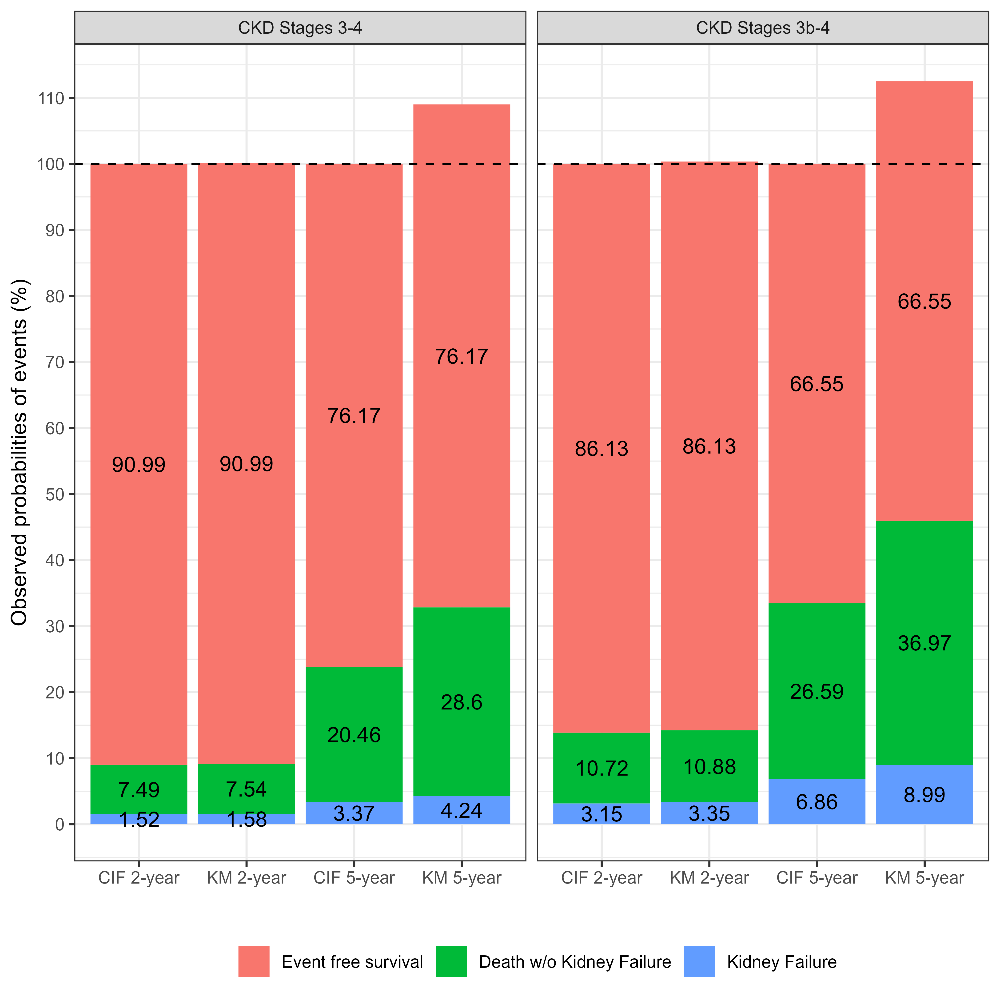

3 - Sensitivy Analysis: Analysis ignoring competing risk
================
Percy Soto-Becerra
3/29/23

- <a
  href="#code-to-reproduce-results-of-the-manuscript-kidney-failure-prediction-multicenter-external-validation-of-the-kfre-model-in-patients-with-ckd-stages-3-4-in-peru"
  id="toc-code-to-reproduce-results-of-the-manuscript-kidney-failure-prediction-multicenter-external-validation-of-the-kfre-model-in-patients-with-ckd-stages-3-4-in-peru"><span
  class="toc-section-number">1</span> Code to reproduce results of the
  manuscript ‘Kidney Failure Prediction: Multicenter External Validation
  of the KFRE Model in Patients with CKD Stages 3-4 in Peru’</a>
  - <a href="#introduction" id="toc-introduction"><span
    class="toc-section-number">1.1</span> Introduction</a>
  - <a href="#setup" id="toc-setup"><span
    class="toc-section-number">1.2</span> Setup</a>
  - <a href="#cumulative-incidence-function-for-competing-risks-data"
    id="toc-cumulative-incidence-function-for-competing-risks-data"><span
    class="toc-section-number">1.3</span> Cumulative incidence function for
    competing risks data</a>
    - <a href="#sec-tableS8" id="toc-sec-tableS8"><span
      class="toc-section-number">1.3.1</span> Fig S6</a>
  - <a href="#predictive-performance" id="toc-predictive-performance"><span
    class="toc-section-number">1.4</span> Predictive Performance</a>
    - <a href="#calibration" id="toc-calibration"><span
      class="toc-section-number">1.4.1</span> Calibration</a>
      - <a href="#mean-calibration-oe-ratio"
        id="toc-mean-calibration-oe-ratio"><span
        class="toc-section-number">1.4.1.1</span> Mean calibration: OE ratio</a>
      - <a href="#weak-calibration-calibration-intercept-and-calibration-slope"
        id="toc-weak-calibration-calibration-intercept-and-calibration-slope"><span
        class="toc-section-number">1.4.1.2</span> Weak calibration: Calibration
        intercept and Calibration slope</a>
      - <a href="#moderate-calibration-calibration-curves"
        id="toc-moderate-calibration-calibration-curves"><span
        class="toc-section-number">1.4.1.3</span> Moderate calibration:
        Calibration curves</a>
    - <a href="#fig-s7" id="toc-fig-s7"><span
      class="toc-section-number">1.4.2</span> Fig S7</a>
    - <a href="#discrimination" id="toc-discrimination"><span
      class="toc-section-number">1.4.3</span> Discrimination</a>
      - <a href="#harrells-and-unos-c" id="toc-harrells-and-unos-c"><span
        class="toc-section-number">1.4.3.1</span> Harrell’s and Uno’s C</a>
      - <a href="#time-dependent-cd-auc" id="toc-time-dependent-cd-auc"><span
        class="toc-section-number">1.4.3.2</span> Time-dependent C/D AUC</a>
    - <a href="#table-s12" id="toc-table-s12"><span
      class="toc-section-number">1.4.4</span> Table S12</a>
  - <a href="#ticket-de-reprocubilidad"
    id="toc-ticket-de-reprocubilidad"><span
    class="toc-section-number">1.5</span> Ticket de Reprocubilidad</a>

# Code to reproduce results of the manuscript ‘Kidney Failure Prediction: Multicenter External Validation of the KFRE Model in Patients with CKD Stages 3-4 in Peru’

## Introduction

This document presents the code and results of the sensitivity analysis
described in the article, which consisted of evaluating the predictive
performance of KFRE ignoring the presence of death without renal failure
as a competitive event.

## Setup

``` r
rm(list = ls())

# Use pacman to check whether packages are installed, if not load
if (!require("pacman")) install.packages("pacman")
library(pacman)

# Unload all package to begin in a session with only base packages
pacman::p_unload("all")

# Install packages
pacman::p_load(tidyverse,
               rio, 
               here, 
               survival,
               Hmisc,
               pec,
               timeROC,
               riskRegression,
               rms,
               knitr,
               kableExtra,
               tidyverse, 
               cmprsk, 
               mstate, 
               gt,
               gtsummary,
               flextable, 
               pec, 
               patchwork, 
               glue)

if (!require("smplot2")) devtools::install_github('smin95/smplot2', force = TRUE)

options(show.signif.stars = FALSE)  # display statistical intelligence


# Import data
data <- readRDS(here::here("Data/Derived/data_derived.rds")) 

# Subset patients with CKD Stages 3a-3b-4
data %>%  
  filter(ckd_stage == "Stages 3-4") -> dataA

# Subset patients with CKD Stages 3b-4
data %>%  
  filter(ckd_stage2 == "Stages 3b-4") -> dataB
```

## Cumulative incidence function for competing risks data

### Fig S6

``` r
# Selection of group of patients 3a-4----
vdata.w <- crprep(
  Tstop = "time",
  status = "eventd",
  trans = c(1, 2),
  id = "id",
  keep = c("age", "male", "eGFR_mdrd", "acr", "risk2y", "risk5y"),
  data = dataA
)

vdata.w1 <- vdata.w %>% filter(failcode == 1)
vdata.w2 <- vdata.w %>% filter(failcode == 2)

# For kidney failure
mfit_vdata1 <- survfit(
  Surv(Tstart, Tstop, status == 1) ~ 1,
  data = vdata.w1, 
  weights = weight.cens
)

smfit_vdata1 <- summary(mfit_vdata1, times = c(1, 2, 3, 4, 5))

res_ci_stg1 <- cbind(
  100 * (1 - smfit_vdata1$surv),
  100 * (1 - smfit_vdata1$upper),
  100 * (1 - smfit_vdata1$lower)
)

res_ci_stg1 <- round(res_ci_stg1, 2)

rownames(res_ci_stg1) <- c(
  "1-year", "2-year",
  "3-year", "4-year",
  "5-year"
)

colnames(res_ci_stg1) <- c(
  "Estimate", "Lower .95",
  "Upper .95"
)


# For death without kidney failure 
mfit_vdata2 <- survfit(
  Surv(Tstart, Tstop, status == 2) ~ 1,
  data = vdata.w2, 
  weights = weight.cens
)

smfit_vdata2 <- summary(mfit_vdata2, times = c(1, 2, 3, 4, 5))

res_ci_stg2 <- cbind(
  100 * (1 - smfit_vdata2$surv),
  100 * (1 - smfit_vdata2$upper),
  100 * (1 - smfit_vdata2$lower)
)

res_ci_stg2 <- round(res_ci_stg2, 2)

rownames(res_ci_stg2) <- c(
  "1-year", "2-year",
  "3-year", "4-year",
  "5-year"
)

colnames(res_ci_stg2) <- c(
  "Estimate", "Lower .95",
  "Upper .95"
)

# Selection of group of patients 3b-4----
vdata.w <- crprep(
  Tstop = "time5y",
  status = "eventd5y",
  trans = c(1, 2),
  id = "id",
  keep = c("age", "male", "eGFR_mdrd", "acr", "risk2y", "risk5y"),
  data = dataB
)

vdata.w1 <- vdata.w %>% filter(failcode == 1)
vdata.w2 <- vdata.w %>% filter(failcode == 2)


# For kidney failure------------
mfit_vdata3 <- survfit(
  Surv(Tstart, Tstop, status == 1) ~ 1,
  data = vdata.w1, 
  weights = weight.cens
)

smfit_vdata3 <- summary(mfit_vdata3, times = c(1, 2, 3, 4, 5))

res_ci_stg3 <- cbind(
  100 * (1 - smfit_vdata3$surv),
  100 * (1 - smfit_vdata3$upper),
  100 * (1 - smfit_vdata3$lower)
)

res_ci_stg3 <- round(res_ci_stg3, 2)

rownames(res_ci_stg3) <- c(
  "1-year", "2-year",
  "3-year", "4-year",
  "5-year"
)

colnames(res_ci_stg3) <- c(
  "Estimate", "Lower .95",
  "Upper .95"
)


# For death without kidney failure-----------
mfit_vdata4 <- survfit(
  Surv(Tstart, Tstop, status == 2) ~ 1,
  data = vdata.w2, 
  weights = weight.cens
)

smfit_vdata4 <- summary(mfit_vdata4, times = c(1, 2, 3, 4, 5))

res_ci_stg4 <- cbind(
  100 * (1 - smfit_vdata4$surv),
  100 * (1 - smfit_vdata4$upper),
  100 * (1 - smfit_vdata4$lower)
)

res_ci_stg4 <- round(res_ci_stg4, 2)

rownames(res_ci_stg4) <- c(
  "1-year", "2-year",
  "3-year", "4-year",
  "5-year"
)

colnames(res_ci_stg4) <- c(
  "Estimate", "Lower .95",
  "Upper .95"
)

res_ci_stg1 %>% 
  as_tibble(rownames = "Year")  %>% 
  select(Year, Estimate) %>% 
  mutate(outcome = "Kidney Failure", 
         group = "CKD Stages 3-4") -> df1A

res_ci_stg2 %>% 
  as_tibble(rownames = "Year")  %>% 
  select(Year, Estimate) %>% 
  mutate(outcome = "Death w/o Kidney Failure", 
         group = "CKD Stages 3-4") -> df2A

res_ci_stg3 %>% 
  as_tibble(rownames = "Year")  %>% 
  select(Year, Estimate) %>% 
  mutate(outcome = "Kidney Failure", 
         group = "CKD Stages 3b-4") -> df1B

res_ci_stg4 %>% 
  as_tibble(rownames = "Year")  %>% 
  select(Year, Estimate) %>% 
  mutate(outcome = "Death w/o Kidney Failure", 
         group = "CKD Stages 3b-4") -> df2B

res_censA <- df1A %>% 
  left_join(df2A, by = "Year") %>% 
  mutate(Estimate = 100 - (Estimate.x + Estimate.y), 
         outcome = "Event free survival") %>% 
  rename(group = group.x) %>% 
  select(Year, Estimate, group, outcome) 

res_censB <- df1B %>% 
  left_join(df2B, by = "Year") %>% 
  mutate(Estimate = 100 - (Estimate.x + Estimate.y), 
         outcome = "Event free survival") %>% 
  rename(group = group.x) %>% 
  select(Year, Estimate, group, outcome) 

tab_outcomes_compet <- bind_rows(df1A, df2A, res_censA, df1B, df2B, res_censB) %>% 
  mutate(compet = "CIF")
```

``` r
# Not accounting for competing risk

# 3-4------------
## Kidney Failure-----
suv_fit1 <- survfit(
  Surv(time5y, status_num == 1) ~ 1,
  data = dataA
)

## Death w/o KF-----
suv_fit2 <- survfit(
  Surv(time5y, status_num == 2) ~ 1,
  data = dataA
)

surv_est1 <- summary(suv_fit1, times = c(1, 2, 3, 4, 5))
surv_est2 <- summary(suv_fit2, times = c(1, 2, 3, 4, 5))

dfA <- data.frame(
  Year = rep(paste0(1:5, "-year"), 2), 
  Estimate = c(100 - 100*surv_est1$surv, 
               100 - 100*surv_est2$surv), 
  outcome = rep(c("Kidney Failure", 
                  "Death w/o Kidney Failure"), each = 5), 
  group = "CKD Stages 3-4", 
  compet = "KM"
)

# 3b-4------------
## Kidney Failure-----
suv_fit1 <- survfit(
  Surv(time5y, status_num == 1) ~ 1,
  data = dataB
)

## Death w/o KF-----
suv_fit2 <- survfit(
  Surv(time5y, status_num == 2) ~ 1,
  data = dataB
)

surv_est1 <- summary(suv_fit1, times = c(1, 2, 3, 4, 5))
surv_est2 <- summary(suv_fit2, times = c(1, 2, 3, 4, 5))

dfB <- data.frame(
  Year = rep(paste0(1:5, "-year"), 2), 
  Estimate = c(100 - 100*surv_est1$surv, 
               100 - 100*surv_est2$surv), 
  outcome = rep(c("Kidney Failure", 
                  "Death w/o Kidney Failure"), each = 5), 
  group = "CKD Stages 3b-4", 
  compet = "KM"
)

df_free <- tab_outcomes_compet %>% 
  filter(outcome == "Event free survival") %>% 
  mutate(compet = "KM")

tab_outcomes <- dfA %>% 
  bind_rows(dfB, df_free, tab_outcomes_compet)

tab_outcomes %>% 
  filter(Year %in% c("2-year", "5-year")) %>% 
  mutate(outcome = factor(outcome, 
                          levels = c("Event free survival", 
                                     "Death w/o Kidney Failure", 
                                     "Kidney Failure")), 
         strata = paste0(compet, " ", Year), 
         strata = factor(strata, levels = c("CIF 2-year", "KM 2-year", 
                                            "CIF 5-year", "KM 5-year"))) %>% 
  ggplot(aes(x = strata, y = Estimate, fill = outcome)) + 
  geom_col(stat = "identity", position = "stack") + 
  facet_grid(. ~ group) + 
  geom_text(aes(label = round(Estimate, 2)), 
            position = position_stack(vjust = 0.5)) + 
  scale_y_continuous(breaks = seq(0, 140, 10)) + 
  geom_hline(yintercept = 100, linetype = 2) + 
  labs(x = "", y = "Observed probabilities of events (%)", fill = "") + 
  theme_bw() + 
  theme(legend.position = "bottom") -> plot_km_compet

ggsave(filename = "plot_km_compet.png", 
       plot = plot_km_compet, 
       device = "png", 
       path = here("Figures/"), 
       scale = 1.5, 
       width = 12, 
       height = 12, 
       units = "cm", 
       dpi = 600)
```



## Predictive Performance

### Calibration

#### Mean calibration: OE ratio

``` r
# Calibration (O/E) -------------------------------------------------------

# Seleccion del grupo: Stages 3-4----
vdata <- dataA %>% 
  select(id, risk2y, risk5y, time5y, eventd5y, time, eventd) %>%  
  drop_na() %>%  
  mutate(status = factor(eventd, 
                         levels = c(0, 1, 2), 
                         labels = c("Alive w/o Kidney Failure", 
                                    "Kidney Failure", 
                                    "Death w/o Kidney Failure")))

# First calculate KM estimate at time t = 2 años---------------------
# A 2 años----
horizon <- 2

vdata$pred <- vdata$risk2y

obj <- summary(survfit(Surv(time, status == "Kidney Failure") ~ 1, 
                        data = vdata), 
                times = horizon)

OE <- (1 - obj$surv) / mean(vdata$pred)

avg_pred2a <- mean(vdata$pred)
avg_obs2a <- (1 - obj$surv) 

alpha <- 0.05
res_OE2a <- matrix(c(OE,
                   OE * exp(-qnorm(1 - alpha / 2) * sqrt(1 / obj$n.event)),
                   OE * exp(qnorm(1 - alpha / 2) * sqrt(1 / obj$n.event))
                   ),
                 nrow = 1,
                 ncol = 3,
                 byrow = T,
                 dimnames = list(
                   c("OE ratio"),
                   rep(c("Estimate", "Lower .95", "Upper .95"), 1))
                 )

avg_pred2a <- round(100 * avg_pred2a, 2)
avg_obs2a <- round(100 * avg_obs2a, 2)
res_OE2a <- round(res_OE2a, 2)  
  
# First calculate KM estimate at time t = 5 años---------------------

# A 5 años----
horizon <- 5

vdata$pred <- vdata$risk5y

obj <- summary(survfit(Surv(time, status == "Kidney Failure") ~ 1, 
                        data = vdata), 
                times = horizon)

OE <- (1 - obj$surv) / mean(vdata$pred)

avg_pred5a <- mean(vdata$pred)
avg_obs5a <- (1 - obj$surv) 

alpha <- 0.05
res_OE5a <- matrix(c(OE,
                   OE * exp(-qnorm(1 - alpha / 2) * sqrt(1 / obj$n.event)),
                   OE * exp(qnorm(1 - alpha / 2) * sqrt(1 / obj$n.event))
                   ),
                 nrow = 1,
                 ncol = 3,
                 byrow = T,
                 dimnames = list(
                   c("OE ratio"),
                   rep(c("Estimate", "Lower .95", "Upper .95"), 1))
                 )

avg_pred5a <- round(100 * avg_pred5a, 2)
avg_obs5a <- round(100 * avg_obs5a, 2)
res_OE5a <- round(res_OE5a, 2)  

# Seleccion del grupo: Stages 3b-4----

vdata <- dataB %>% 
  select(id, risk2y, risk5y, time5y, eventd5y, time, eventd) %>%  
  drop_na() %>%  
  mutate(status = factor(eventd, 
                         levels = c(0, 1, 2), 
                         labels = c("Alive w/o Kidney Failure", 
                                    "Kidney Failure", 
                                    "Death w/o Kidney Failure")))

# First calculate KM estimate at time t = 2 años---------------------
# A 2 años----
horizon <- 2

vdata$pred <- vdata$risk2y

obj <- summary(survfit(Surv(time, status == "Kidney Failure") ~ 1, 
                        data = vdata), 
                times = horizon)

OE <- (1 - obj$surv) / mean(vdata$pred)

avg_pred2b <- mean(vdata$pred)
avg_obs2b <- (1 - obj$surv) 

alpha <- 0.05
res_OE2b <- matrix(c(OE,
                   OE * exp(-qnorm(1 - alpha / 2) * sqrt(1 / obj$n.event)),
                   OE * exp(qnorm(1 - alpha / 2) * sqrt(1 / obj$n.event))
                   ),
                 nrow = 1,
                 ncol = 3,
                 byrow = T,
                 dimnames = list(
                   c("OE ratio"),
                   rep(c("Estimate", "Lower .95", "Upper .95"), 1))
                 )

avg_pred2b <- round(100 * avg_pred2b, 2)
avg_obs2b <- round(100 * avg_obs2b, 2)
res_OE2b <- round(res_OE2b, 2)  

# First calculate KM estimate at time t = 5 años---------------------

# A 5 años----
horizon <- 5

vdata$pred <- vdata$risk5y

obj <- summary(survfit(Surv(time, status == "Kidney Failure") ~ 1, 
                        data = vdata), 
                times = horizon)

OE <- (1 - obj$surv) / mean(vdata$pred)

avg_pred5b <- mean(vdata$pred)
avg_obs5b <- (1 - obj$surv) 

alpha <- 0.05
res_OE5b <- matrix(c(OE,
                   OE * exp(-qnorm(1 - alpha / 2) * sqrt(1 / obj$n.event)),
                   OE * exp(qnorm(1 - alpha / 2) * sqrt(1 / obj$n.event))
                   ),
                 nrow = 1,
                 ncol = 3,
                 byrow = T,
                 dimnames = list(
                   c("OE ratio"),
                   rep(c("Estimate", "Lower .95", "Upper .95"), 1))
                 )

avg_pred5b <- round(100 * avg_pred5b, 2)
avg_obs5b <- round(100 * avg_obs5b, 2)
res_OE5b <- round(res_OE5b, 2)  
```

#### Weak calibration: Calibration intercept and Calibration slope

``` r
# Seleccion del grupo: Stages 3-4----
vdata <- dataA %>% 
  select(id, risk2y, risk5y, time5y, eventd5y, time, eventd) %>%  
  drop_na() %>%  
  mutate(status = factor(eventd, 
                         levels = c(0, 1, 2), 
                         labels = c("Alive w/o Kidney Failure", 
                                    "Kidney Failure", 
                                    "Death w/o Kidney Failure")))
primary_event <- 1

# A 2 años----
horizon <- 2

# Add estimated risk and complementary log-log of it to dataset
vdata$pred <- vdata$risk2y

# cloglog and center for the basic and extended model
lp.val <- log(-log(1 - vdata$pred))   # lp = cloglog
center <- mean(lp.val)  # center

### Model with a slope and an intercept
f.val <- coxph(Surv(vdata$time, vdata$status == "Kidney Failure") ~ lp.val)  
slope <- f.val$coefficients[1]
slope.se <- sqrt(vcov(f.val)[[1, 1]])

alpha <- 0.05
res_cal2a <- matrix(c(
                slope,
                slope - qnorm(1 - alpha / 2) * slope.se,
                slope + qnorm(1 - alpha / 2) * slope.se
                   ),
                 
                 nrow = 1,
                 ncol = 3,
                 byrow = T,
                 dimnames = list(
                   c("Calibration slope"),
                   rep(c("Estimate", "Lower .95", "Upper .95"), 1))
)

res_cal2a <- round(res_cal2a, 2)

# A 5 años----
horizon <- 5

# Add estimated risk and complementary log-log of it to dataset
vdata$pred <- vdata$risk5y

# cloglog and center for the basic and extended model
lp.val <- log(-log(1 - vdata$pred))   # lp = cloglog
center <- mean(lp.val)  # center

### Model with a slope and an intercept
f.val <- coxph(Surv(vdata$time, vdata$status == "Kidney Failure") ~ lp.val)  
slope <- f.val$coefficients[1]
slope.se <- sqrt(vcov(f.val)[[1, 1]])

alpha <- 0.05
res_cal5a <- matrix(c(
                slope,
                slope - qnorm(1 - alpha / 2) * slope.se,
                slope + qnorm(1 - alpha / 2) * slope.se
                   ),
                 
                 nrow = 1,
                 ncol = 3,
                 byrow = T,
                 dimnames = list(
                   c("Calibration slope"),
                   rep(c("Estimate", "Lower .95", "Upper .95"), 1))
)

res_cal5a <- round(res_cal5a, 2)

# Seleccion del grupo: Stages 3b-4----
vdata <- dataB %>% 
  select(id, risk2y, risk5y, time5y, eventd5y, time, eventd) %>%  
  drop_na() %>%  
  mutate(status = factor(eventd, 
                         levels = c(0, 1, 2), 
                         labels = c("Alive w/o Kidney Failure", 
                                    "Kidney Failure", 
                                    "Death w/o Kidney Failure")))
primary_event <- 1

# A 2 años----
horizon <- 2

# Add estimated risk and complementary log-log of it to dataset
vdata$pred <- vdata$risk2y

# cloglog and center for the basic and extended model
lp.val <- log(-log(1 - vdata$pred))   # lp = cloglog
center <- mean(lp.val)  # center

### Model with a slope and an intercept
f.val <- coxph(Surv(vdata$time, vdata$status == "Kidney Failure") ~ lp.val)  
slope <- f.val$coefficients[1]
slope.se <- sqrt(vcov(f.val)[[1, 1]])

alpha <- 0.05
res_cal2b <- matrix(c(
                slope,
                slope - qnorm(1 - alpha / 2) * slope.se,
                slope + qnorm(1 - alpha / 2) * slope.se
                   ),
                 
                 nrow = 1,
                 ncol = 3,
                 byrow = T,
                 dimnames = list(
                   c("Calibration slope"),
                   rep(c("Estimate", "Lower .95", "Upper .95"), 1))
)

res_cal2b <- round(res_cal2b, 2)

# A 5 años----
horizon <- 5

# Add estimated risk and complementary log-log of it to dataset
vdata$pred <- vdata$risk5y

# cloglog and center for the basic and extended model
lp.val <- log(-log(1 - vdata$pred))   # lp = cloglog
center <- mean(lp.val)  # center

### Model with a slope and an intercept
f.val <- coxph(Surv(vdata$time, vdata$status == "Kidney Failure") ~ lp.val)  
slope <- f.val$coefficients[1]
slope.se <- sqrt(vcov(f.val)[[1, 1]])

alpha <- 0.05
res_cal5b <- matrix(c(
                slope,
                slope - qnorm(1 - alpha / 2) * slope.se,
                slope + qnorm(1 - alpha / 2) * slope.se
                   ),
                 
                 nrow = 1,
                 ncol = 3,
                 byrow = T,
                 dimnames = list(
                   c("Calibration slope"),
                   rep(c("Estimate", "Lower .95", "Upper .95"), 1))
)

res_cal5b <- round(res_cal5b, 2)
```

#### Moderate calibration: Calibration curves

``` r
# Seleccion del grupo: Stages 3-4----

vdata <- dataA %>% 
  select(id, risk2y, risk5y, time5y, eventd5y, time, eventd) %>%  
  drop_na()

primary_event <- 1

# A 2 años----
horizon <- 2

# Add estimated risk and complementary log-log of it to dataset
vdata$pred <- vdata$risk2y

# Basic model
vdata <- data.frame(vdata)
vdata$pred.cll <- log(-log(1 - vdata$pred))

# Estimate actual risk - basic model
vcal <- rms::cph(Surv(time, eventd == 1) ~ rcs(pred.cll, 3),
                 x = T,
                 y = T,
                 surv = T,
                 data = vdata
) 

mod_surv <- rms::survest(vcal, times = 2, newdata = vdata)

dat_cal2a <- cbind.data.frame(
  "obs" = 1 - mod_surv$surv,
  
  "lower" = 1 - mod_surv$upper,
  
  "upper" = 1 - mod_surv$lower,
  
  "pred" = as.vector(vdata$pred)
)

# A 5 años----
horizon <- 5

# Add estimated risk and complementary log-log of it to dataset
vdata$pred <- vdata$risk5y

# Basic model
vdata <- data.frame(vdata)
vdata$pred.cll <- log(-log(1 - vdata$pred))

# Estimate actual risk - basic model
vcal <- rms::cph(Surv(time, eventd == 1) ~ rcs(pred.cll, 3),
                 x = T,
                 y = T,
                 surv = T,
                 data = vdata
) 

mod_surv <- rms::survest(vcal, times = 5, newdata = vdata)

dat_cal5a <- cbind.data.frame(
  "obs" = 1 - mod_surv$surv,
  
  "lower" = 1 - mod_surv$upper,
  
  "upper" = 1 - mod_surv$lower,
  
  "pred" = as.vector(vdata$pred)
)

# Seleccion del grupo: Stages 3b-4----

vdata <- dataB %>% 
  select(id, risk2y, risk5y, time5y, eventd5y, time, eventd) %>%  
  drop_na()

primary_event <- 1

# A 2 años----
horizon <- 2

# Add estimated risk and complementary log-log of it to dataset
vdata$pred <- vdata$risk2y

# Basic model
vdata <- data.frame(vdata)
vdata$pred.cll <- log(-log(1 - vdata$pred))

# Estimate actual risk - basic model
vcal <- rms::cph(Surv(time, eventd == 1) ~ rcs(pred.cll, 3),
                 x = T,
                 y = T,
                 surv = T,
                 data = vdata
) 

mod_surv <- rms::survest(vcal, times = 2, newdata = vdata)

dat_cal2b <- cbind.data.frame(
  "obs" = 1 - mod_surv$surv,
  
  "lower" = 1 - mod_surv$upper,
  
  "upper" = 1 - mod_surv$lower,
  
  "pred" = as.vector(vdata$pred)
)

# A 5 años----
horizon <- 5

# Add estimated risk and complementary log-log of it to dataset
vdata$pred <- vdata$risk5y

# Basic model
vdata <- data.frame(vdata)
vdata$pred.cll <- log(-log(1 - vdata$pred))

# Estimate actual risk - basic model
vcal <- rms::cph(Surv(time, eventd == 1) ~ rcs(pred.cll, 3),
                 x = T,
                 y = T,
                 surv = T,
                 data = vdata
) 

mod_surv <- rms::survest(vcal, times = 5, newdata = vdata)

dat_cal5b <- cbind.data.frame(
  "obs" = 1 - mod_surv$surv,
  
  "lower" = 1 - mod_surv$upper,
  
  "upper" = 1 - mod_surv$lower,
  
  "pred" = as.vector(vdata$pred)
)


dat_cal2a %>% 
  ggplot(aes(x = pred, y = obs)) + 
  geom_ribbon(aes(ymin = lower, ymax = upper), fill = "grey90") + 
  geom_abline(intercept = 0, slope = 1, colour = "red", linetype = 2) + 
  geom_line() + 
  scale_y_continuous(breaks = seq(0, 1, 0.2), limits = c(0, 1)) + 
  scale_x_continuous(breaks = seq(0, 1, 0.2), limits = c(0, 1)) +   
  xlab("Predicted risks") + 
  ylab("Observed outcome proportions estimated \n w/o accounting competing event") + 
  theme_bw() + 
  labs(title = "CKD Stages 3a-3b-4\n(2 year KFRE)") + 
  theme(plot.title = element_text(hjust = 0.5)) -> p2a

dat_cal5a %>% 
  ggplot(aes(x = pred, y = obs)) + 
  geom_ribbon(aes(ymin = lower, ymax = upper), fill = "grey90") + 
  geom_abline(intercept = 0, slope = 1, colour = "red", linetype = 2) + 
  geom_line() + 
  scale_y_continuous(breaks = seq(0, 1, 0.2), limits = c(0, 1)) + 
  scale_x_continuous(breaks = seq(0, 1, 0.2), limits = c(0, 1)) +   
  xlab("Predicted risks") + 
  ylab("Observed outcome proportions estimated \n w/o accounting competing event") + 
  theme_bw() + 
  labs(title = "CKD Stages 3a-3b-4\n(5 year KFRE)") + 
  theme(plot.title = element_text(hjust = 0.5)) -> p5a

dat_cal2b %>% 
  ggplot(aes(x = pred, y = obs)) + 
  geom_ribbon(aes(ymin = lower, ymax = upper), fill = "grey90") + 
  geom_abline(intercept = 0, slope = 1, colour = "red", linetype = 2) + 
  geom_line() + 
  scale_y_continuous(breaks = seq(0, 1, 0.2), limits = c(0, 1)) + 
  scale_x_continuous(breaks = seq(0, 1, 0.2), limits = c(0, 1)) +   
  xlab("Predicted risks") + 
  ylab("Observed outcome proportions estimated \n w/o accounting competing event") + 
  theme_bw() + 
  labs(title = "CKD Stages 3b-4\n(2 year KFRE)") + 
  theme(plot.title = element_text(hjust = 0.5)) -> p2b

dat_cal5b %>% 
  ggplot(aes(x = pred, y = obs)) + 
  geom_ribbon(aes(ymin = lower, ymax = upper), fill = "grey90") + 
  geom_abline(intercept = 0, slope = 1, colour = "red", linetype = 2) + 
  geom_line() + 
  scale_y_continuous(breaks = seq(0, 1, 0.2), limits = c(0, 1)) + 
  scale_x_continuous(breaks = seq(0, 1, 0.2), limits = c(0, 1)) +   
  xlab("Predicted risks") + 
  ylab("Observed outcome proportions estimated \n w/o accounting competing event") + 
  theme_bw() + 
  labs(title = "CKD Stages 3b-4\n(5 year KFRE)") + 
  theme(plot.title = element_text(hjust = 0.5)) -> p5b

(p2a | p5a) / (p2b | p5b) + plot_annotation(tag_levels = 'A') -> plot_calibration

ggsave(filename = "Plot_Calibration_cox.png", 
       device = "png", 
       plot = plot_calibration, 
       path = here("Figures"), 
       scale = 2, 
       width = 2100, 
       height = 2100,
       units = "px", 
       dpi = 300)
```

### Fig S7

``` r
plot_calibration
```


### Discrimination

#### Harrell’s and Uno’s C

``` r
# Seleccion del grupo: Stages 3-4----
# 5 años----
vdata <- dataA %>% 
  select(id, risk2y, risk5y, pi5y, time5y, eventd5y, time, eventd) %>%  
  drop_na() %>%  
  mutate(status = factor(eventd, 
                         levels = c(0, 1, 2), 
                         labels = c("Alive w/o Kidney Failure", 
                                    "Kidney Failure", 
                                    "Death w/o Kidney Failure")))


harrell_C_vdata <- concordance(Surv(time5y, eventd5y == 1) ~ pi5y, 
                               vdata, 
                               reverse = TRUE)

Uno_C_vdata <- concordance(Surv(time5y, eventd5y == 1) ~ pi5y, 
                           vdata, 
                           reverse = TRUE,
                           timewt = "n/G2")

alpha <- 0.05
temp <- c(
  harrell_C_vdata$concordance,
  harrell_C_vdata$concordance - qnorm(1 - alpha/2) * sqrt(harrell_C_vdata$var),
  harrell_C_vdata$concordance + qnorm(1 - alpha/2) * sqrt(harrell_C_vdata$var),

  Uno_C_vdata$concordance,
  Uno_C_vdata$concordance - qnorm(1 - alpha/2) * sqrt(Uno_C_vdata$var),
  Uno_C_vdata$concordance + qnorm(1 - alpha/2) * sqrt(Uno_C_vdata$var)
)

res_C5a  <- matrix(temp, 
                nrow = 2, 
                ncol = 3, 
                byrow = TRUE,
                dimnames = list(
  c("Harrell C - Validation data ", 
    "Uno C - Validation data"),
  
  c(rep(c("Estimate", "Lower .95", "Upper .95"), 1)))
)

res_C5a <- round(res_C5a, 3)

# 2 años----
vdata <- dataA %>% 
  select(id, risk2y, risk5y, pi2y, time2y, eventd2y, time, eventd) %>%  
  drop_na() %>%  
  mutate(status = factor(eventd, 
                         levels = c(0, 1, 2), 
                         labels = c("Alive w/o Kidney Failure", 
                                    "Kidney Failure", 
                                    "Death w/o Kidney Failure")))


harrell_C_vdata <- concordance(Surv(time2y, eventd2y == 1) ~ pi2y, 
                               vdata, 
                               reverse = TRUE)

Uno_C_vdata <- concordance(Surv(time2y, eventd2y == 1) ~ pi2y, 
                           vdata, 
                           reverse = TRUE,
                           timewt = "n/G2")

alpha <- 0.05
temp <- c(
  harrell_C_vdata$concordance,
  harrell_C_vdata$concordance - qnorm(1 - alpha/2) * sqrt(harrell_C_vdata$var),
  harrell_C_vdata$concordance + qnorm(1 - alpha/2) * sqrt(harrell_C_vdata$var),

  Uno_C_vdata$concordance,
  Uno_C_vdata$concordance - qnorm(1 - alpha/2) * sqrt(Uno_C_vdata$var),
  Uno_C_vdata$concordance + qnorm(1 - alpha/2) * sqrt(Uno_C_vdata$var)
)

res_C2a  <- matrix(temp, 
                nrow = 2, 
                ncol = 3, 
                byrow = TRUE,
                dimnames = list(
  c("Harrell C - Validation data ", 
    "Uno C - Validation data"),
  
  c(rep(c("Estimate", "Lower .95", "Upper .95"), 1)))
)

res_C2a <- round(res_C2a, 3)

# Seleccion del grupo: Stages 3b-4----
# 5 años----
vdata <- dataB %>% 
  select(id, risk2y, risk5y, pi5y, time5y, eventd5y, time, eventd) %>%  
  drop_na() %>%  
  mutate(status = factor(eventd, 
                         levels = c(0, 1, 2), 
                         labels = c("Alive w/o Kidney Failure", 
                                    "Kidney Failure", 
                                    "Death w/o Kidney Failure")))


harrell_C_vdata <- concordance(Surv(time5y, eventd5y == 1) ~ pi5y, 
                               vdata, 
                               reverse = TRUE)

Uno_C_vdata <- concordance(Surv(time5y, eventd5y == 1) ~ pi5y, 
                           vdata, 
                           reverse = TRUE,
                           timewt = "n/G2")

alpha <- 0.05
temp <- c(
  harrell_C_vdata$concordance,
  harrell_C_vdata$concordance - qnorm(1 - alpha/2) * sqrt(harrell_C_vdata$var),
  harrell_C_vdata$concordance + qnorm(1 - alpha/2) * sqrt(harrell_C_vdata$var),

  Uno_C_vdata$concordance,
  Uno_C_vdata$concordance - qnorm(1 - alpha/2) * sqrt(Uno_C_vdata$var),
  Uno_C_vdata$concordance + qnorm(1 - alpha/2) * sqrt(Uno_C_vdata$var)
)

res_C5b  <- matrix(temp, 
                nrow = 2, 
                ncol = 3, 
                byrow = TRUE,
                dimnames = list(
  c("Harrell C - Validation data ", 
    "Uno C - Validation data"),
  
  c(rep(c("Estimate", "Lower .95", "Upper .95"), 1)))
)

res_C5b <- round(res_C5b, 3)

# 2 años----
vdata <- dataB %>% 
  select(id, risk2y, risk5y, pi2y, time2y, eventd2y, time, eventd) %>%  
  drop_na() %>%  
  mutate(status = factor(eventd, 
                         levels = c(0, 1, 2), 
                         labels = c("Alive w/o Kidney Failure", 
                                    "Kidney Failure", 
                                    "Death w/o Kidney Failure")))


harrell_C_vdata <- concordance(Surv(time2y, eventd2y == 1) ~ pi2y, 
                               vdata, 
                               reverse = TRUE)

Uno_C_vdata <- concordance(Surv(time2y, eventd2y == 1) ~ pi2y, 
                           vdata, 
                           reverse = TRUE,
                           timewt = "n/G2")

alpha <- 0.05
temp <- c(
  harrell_C_vdata$concordance,
  harrell_C_vdata$concordance - qnorm(1 - alpha/2) * sqrt(harrell_C_vdata$var),
  harrell_C_vdata$concordance + qnorm(1 - alpha/2) * sqrt(harrell_C_vdata$var),

  Uno_C_vdata$concordance,
  Uno_C_vdata$concordance - qnorm(1 - alpha/2) * sqrt(Uno_C_vdata$var),
  Uno_C_vdata$concordance + qnorm(1 - alpha/2) * sqrt(Uno_C_vdata$var)
)

res_C2b  <- matrix(temp, 
                nrow = 2, 
                ncol = 3, 
                byrow = TRUE,
                dimnames = list(
  c("Harrell C - Validation data ", 
    "Uno C - Validation data"),
  
  c(rep(c("Estimate", "Lower .95", "Upper .95"), 1)))
)

res_C2b <- round(res_C2b, 3)
```

#### Time-dependent C/D AUC

``` r
# Seleccion del grupo: Stages 3-4----
vdata <- dataA %>% 
  select(id, risk2y, risk5y, pi5y, time5y, eventd5y, time, eventd) %>%  
  drop_na() %>%  
  mutate(status_num = if_else(eventd == 1, 1, 0))

Uno_vdataA <-
  timeROC::timeROC(
    T = vdata$time, 
    delta = vdata$status_num,
    marker = vdata$pi5y,
    cause = 1, 
    weighting = "marginal", 
    times = c(2, 5),
    iid = TRUE
  )

# Seleccion del grupo: Stages 3b-4----
vdata <- dataB %>% 
  select(id, risk2y, risk5y, pi5y, time5y, eventd5y, time, eventd) %>%  
  drop_na() %>%  
  mutate(status_num = if_else(eventd == 1, 1, 0))

Uno_vdataB <-
  timeROC::timeROC(
    T = vdata$time, 
    delta = vdata$status_num,
    marker = vdata$pi5y,
    cause = 1, 
    weighting = "marginal", 
    times = c(2, 5),
    iid = TRUE
  )

# Creating tables----
alpha <- .05
k <- 2

res_discr2a <- matrix(c(
  Uno_vdataA$AUC["t=2"],
  Uno_vdataA$AUC["t=2"] - qnorm(1 - alpha / 2) * Uno_vdataA$inference$vect_sd_1["t=2"],
  Uno_vdataA$AUC["t=2"] + qnorm(1 - alpha / 2) * Uno_vdataA$inference$vect_sd_1["t=2"]
),
nrow = 1, ncol = 3, byrow = T,
dimnames =
  list(
    c("Uno AUC"),
    rep(c("Estimate", "Lower .95 ", "Upper .95"), 1)
  )
)

res_discr2a <- round(res_discr2a, 3)

res_discr5a <- matrix(c(
  Uno_vdataA$AUC["t=5"],
  Uno_vdataA$AUC["t=5"] - qnorm(1 - alpha / 2) * Uno_vdataA$inference$vect_sd_1["t=5"],
  Uno_vdataA$AUC["t=5"] + qnorm(1 - alpha / 2) * Uno_vdataA$inference$vect_sd_1["t=5"]
),
nrow = 1, ncol = 3, byrow = T,
dimnames =
  list(
    c("Uno AUC"),
    rep(c("Estimate", "Lower .95 ", "Upper .95"), 1)
  )
)

res_discr5a <- round(res_discr5a, 3)

res_discr2b <- matrix(c(
  Uno_vdataB$AUC["t=2"],
  Uno_vdataB$AUC["t=2"] - qnorm(1 - alpha / 2) * Uno_vdataB$inference$vect_sd_1["t=2"],
  Uno_vdataB$AUC["t=2"] + qnorm(1 - alpha / 2) * Uno_vdataB$inference$vect_sd_1["t=2"]
),
nrow = 1, ncol = 3, byrow = T,
dimnames =
  list(
    c("Uno AUC"),
    rep(c("Estimate", "Lower .95 ", "Upper .95"), 1)
  )
)

res_discr2b <- round(res_discr2b, 3)

res_discr5b <- matrix(c(
  Uno_vdataB$AUC["t=5"],
  Uno_vdataB$AUC["t=5"] - qnorm(1 - alpha / 2) * Uno_vdataB$inference$vect_sd_1["t=5"],
  Uno_vdataB$AUC["t=5"] + qnorm(1 - alpha / 2) * Uno_vdataB$inference$vect_sd_1["t=5"]
),
nrow = 1, ncol = 3, byrow = T,
dimnames =
  list(
    c("Uno AUC"),
    rep(c("Estimate", "Lower .95 ", "Upper .95"), 1)
  )
)

res_discr5b <- round(res_discr5b, 3)
```

### Table S12

``` r
# Average predicted risk
avg_pred <- cbind("metrica" = "Average predicted risk", 
                 avg_pred2a, 
                 avg_pred5a, 
                 avg_pred2b, 
                 avg_pred5b)

colnames(avg_pred) <- c("metrica", "est2ya", "est5ya", "est2yb", "est5yb")

avg_pred %>% 
  as_tibble() %>% 
  mutate(
    est2ya = as.character(glue("{est2ya}%")), 
    est5ya = as.character(glue("{est5ya}%")),
    est2yb = as.character(glue("{est2yb}%")),
    est5yb = as.character(glue("{est5yb}%"))   
  ) -> avg_pred

# Average observed proportion
avg_obs <- cbind("metrica" = "Average observed proportion", 
                 avg_obs2a, 
                 avg_obs5a, 
                 avg_obs2b, 
                 avg_obs5b)

colnames(avg_obs) <- c("metrica", "OE2a", "OE5a", "OE2b", "OE5b")

avg_obs %>% 
  as_tibble() %>% 
  mutate(
    est2ya = as.character(glue("{OE2a}%")), 
    est5ya = as.character(glue("{OE5a}%")),
    est2yb = as.character(glue("{OE2b}%")),
    est5yb = as.character(glue("{OE5b}%"))   
  ) %>% 
  select(metrica, starts_with("est")) -> avg_obs

# OE summary
OE_summary <- cbind("metrica" = "O/E ratio (95% CI)", 
                    res_OE2a, 
                    res_OE5a, 
                    res_OE2b, 
                    res_OE5b)

colnames(OE_summary) <- c("metrica", "OE2a", "ll2a", "ul2a", 
                         "OE5a", "ll5a", "ul5a", 
                         "OE2b", "ll2b", "ul2b", 
                         "OE5b", "ll5b", "ul5b")

OE_summary %>% 
  as_tibble() %>% 
  mutate(
    est2ya = as.character(glue("{OE2a} ({ll2a} to {ul2a})")), 
    est5ya = as.character(glue("{OE5a} ({ll5a} to {ul5a})")),
    est2yb = as.character(glue("{OE2b} ({ll2b} to {ul2b})")),
    est5yb = as.character(glue("{OE5b} ({ll5b} to {ul5b})"))   
    ) %>% 
  select(metrica, starts_with("est")) -> OE_summary

# Calibration slope e intercept
res_cal <- cbind("metrica" = c("Calibration slope (95% CI)"), 
                 res_cal2a, 
                 res_cal5a, 
                 res_cal2b, 
                 res_cal5b); res_cal
```

                      metrica                      Estimate Lower .95 Upper .95
    Calibration slope "Calibration slope (95% CI)" "0.79"   "0.72"    "0.85"   
                      Estimate Lower .95 Upper .95 Estimate Lower .95 Upper .95
    Calibration slope "0.79"   "0.72"    "0.85"    "0.83"   "0.74"    "0.93"   
                      Estimate Lower .95 Upper .95
    Calibration slope "0.83"   "0.74"    "0.93"   

``` r
colnames(res_cal) <- c("metrica", "OE2a", "ll2a", "ul2a", 
                       "OE5a", "ll5a", "ul5a", 
                       "OE2b", "ll2b", "ul2b", 
                       "OE5b", "ll5b", "ul5b")
res_cal <- 
  res_cal %>% 
  as_tibble() %>% 
  mutate(
    est2ya = as.character(glue("{OE2a} ({ll2a} to {ul2a})")), 
    est5ya = as.character(glue("{OE5a} ({ll5a} to {ul5a})")),
    est2yb = as.character(glue("{OE2b} ({ll2b} to {ul2b})")),
    est5yb = as.character(glue("{OE5b} ({ll5b} to {ul5b})"))   
  ) %>% 
  select(metrica, starts_with("est")) 

# Harrell's and Uno's C
res_discr_C <- cbind("metrica" = c("Harrell C (95% CI)", "Uno C (95% CI)"), 
                 res_C2a, 
                 res_C5a, 
                 res_C2b, 
                 res_C5b); res_discr_C
```

                                 metrica              Estimate Lower .95 Upper .95
    Harrell C - Validation data  "Harrell C (95% CI)" "0.856"  "0.817"   "0.895"  
    Uno C - Validation data      "Uno C (95% CI)"     "0.856"  "0.817"   "0.895"  
                                 Estimate Lower .95 Upper .95 Estimate Lower .95
    Harrell C - Validation data  "0.856"  "0.83"    "0.883"   "0.85"   "0.809"  
    Uno C - Validation data      "0.851"  "0.825"   "0.878"   "0.851"  "0.81"   
                                 Upper .95 Estimate Lower .95 Upper .95
    Harrell C - Validation data  "0.891"   "0.839"  "0.809"   "0.869"  
    Uno C - Validation data      "0.892"   "0.832"  "0.801"   "0.864"  

``` r
colnames(res_discr_C) <- c("metrica", "OE2a", "ll2a", "ul2a", 
                       "OE5a", "ll5a", "ul5a", 
                       "OE2b", "ll2b", "ul2b", 
                       "OE5b", "ll5b", "ul5b")
res_discr_C <- 
  res_discr_C %>% 
  as_tibble() %>% 
  mutate(
    est2ya = as.character(glue("{OE2a} ({ll2a} to {ul2a})")), 
    est5ya = as.character(glue("{OE5a} ({ll5a} to {ul5a})")),
    est2yb = as.character(glue("{OE2b} ({ll2b} to {ul2b})")),
    est5yb = as.character(glue("{OE5b} ({ll5b} to {ul5b})"))   
  ) %>% 
  select(metrica, starts_with("est")) 

# time-dependent C/D AUC
res_discr_discr <- cbind("metrica" = " C/D AUC, at t years (95% CI)", 
                 res_discr2a, 
                 res_discr5a, 
                 res_discr2b, 
                 res_discr5b); res_discr_discr
```

            metrica                         Estimate Lower .95  Upper .95 Estimate
    Uno AUC " C/D AUC, at t years (95% CI)" "0.861"  "0.822"    "0.9"     "0.86"  
            Lower .95  Upper .95 Estimate Lower .95  Upper .95 Estimate Lower .95 
    Uno AUC "0.832"    "0.887"   "0.86"   "0.818"    "0.901"   "0.846"  "0.812"   
            Upper .95
    Uno AUC "0.879"  

``` r
colnames(res_discr_discr) <- c("metrica", "OE2a", "ll2a", "ul2a", 
                       "OE5a", "ll5a", "ul5a", 
                       "OE2b", "ll2b", "ul2b", 
                       "OE5b", "ll5b", "ul5b")
res_discr_discr <- 
  res_discr_discr %>% 
  as_tibble() %>% 
  mutate(
    est2ya = as.character(glue("{OE2a} ({ll2a} to {ul2a})")), 
    est5ya = as.character(glue("{OE5a} ({ll5a} to {ul5a})")),
    est2yb = as.character(glue("{OE2b} ({ll2b} to {ul2b})")),
    est5yb = as.character(glue("{OE5b} ({ll5b} to {ul5b})"))   
  ) %>% 
  select(metrica, starts_with("est")) 

rbind(avg_pred, avg_obs, OE_summary, res_cal, res_discr_C, res_discr_discr) -> table_performance; table_performance
```

    # A tibble: 7 × 5
      metrica                         est2ya                 est5ya    est2yb est5yb
      <chr>                           <chr>                  <chr>     <chr>  <chr> 
    1 "Average predicted risk"        0.96%                  3.18%     2.36%  7.66% 
    2 "Average observed proportion"   1.58%                  3.72%     3.35%  7.88% 
    3 "O/E ratio (95% CI)"            1.64 (1.37 to 1.97)    1.17 (1.… 1.42 … 1.03 …
    4 "Calibration slope (95% CI)"    0.79 (0.72 to 0.85)    0.79 (0.… 0.83 … 0.83 …
    5 "Harrell C (95% CI)"            0.856 (0.817 to 0.895) 0.856 (0… 0.85 … 0.839…
    6 "Uno C (95% CI)"                0.856 (0.817 to 0.895) 0.851 (0… 0.851… 0.832…
    7 " C/D AUC, at t years (95% CI)" 0.861 (0.822 to 0.9)   0.86 (0.… 0.86 … 0.846…

``` r
table_performance %>% 
  mutate(grupo = c(rep("Calibration", 4), rep("Discrimination", 3))) %>% 
  relocate(grupo, .before = "metrica") %>%
  bind_rows() %>% 
  as_grouped_data(groups = "grupo") %>% 
  flextable::as_flextable(hide_grouplabel = TRUE)  %>%
  set_header_labels(
    metrica = "Validation aspect and performance measure", 
    est2ya = "t = 2 year", 
    est5ya = "t = 5 year", 
    est2yb = "t = 2 year", 
    est5yb = "t = 5 year" 
  ) %>% 
  add_header_row(
    values = c("Validation aspect and performance measure", "CKD Stages 3a-3b-4", "CKD Stages 3b-4"), 
    colwidths = c(1, 2, 2)
  ) %>% 
  merge_v(j = 1, part = "header") %>% 
  bold(i = c(1, 6)) %>% 
  autofit()  %>% 
  set_caption("Table S12. Performance measures of KFRE in the external dataset of patients with CKD Stages 3a-4 and 3b-4 estimated without accounting for competing events") %>% 
  theme_booktabs() %>%  
  bold(bold = TRUE, part = "header")  -> table_perf_final

table_perf_final %>% 
  flextable::save_as_docx(path = here("Tables/TableS12.docx"))

table_perf_final
```


## Ticket de Reprocubilidad

``` r
sessionInfo()
```

    R version 4.2.3 (2023-03-15 ucrt)
    Platform: x86_64-w64-mingw32/x64 (64-bit)
    Running under: Windows 10 x64 (build 22621)

    Matrix products: default

    locale:
    [1] LC_COLLATE=Spanish_Peru.utf8  LC_CTYPE=Spanish_Peru.utf8   
    [3] LC_MONETARY=Spanish_Peru.utf8 LC_NUMERIC=C                 
    [5] LC_TIME=Spanish_Peru.utf8    

    attached base packages:
    [1] stats     graphics  grDevices utils     datasets  methods   base     

    other attached packages:
     [1] smplot2_0.1.0             glue_1.6.2               
     [3] patchwork_1.1.2           flextable_0.8.6          
     [5] gtsummary_1.7.0           gt_0.8.0                 
     [7] mstate_0.3.2              cmprsk_2.2-11            
     [9] kableExtra_1.3.4          knitr_1.42               
    [11] rms_6.5-0                 SparseM_1.81             
    [13] riskRegression_2022.11.28 timeROC_0.4              
    [15] pec_2022.05.04            prodlim_2019.11.13       
    [17] Hmisc_4.8-0               Formula_1.2-5            
    [19] lattice_0.20-45           survival_3.5-3           
    [21] here_1.0.1                rio_0.5.29               
    [23] lubridate_1.9.2           forcats_1.0.0            
    [25] stringr_1.5.0             dplyr_1.1.0              
    [27] purrr_1.0.1               readr_2.1.4              
    [29] tidyr_1.3.0               tibble_3.1.8             
    [31] ggplot2_3.4.1             tidyverse_2.0.0          

    loaded via a namespace (and not attached):
      [1] uuid_1.1-0              readxl_1.4.2            backports_1.4.1        
      [4] systemfonts_1.0.4       splines_4.2.3           listenv_0.9.0          
      [7] TH.data_1.1-1           digest_0.6.31           foreach_1.5.2          
     [10] htmltools_0.5.4         fansi_1.0.4             memoise_2.0.1          
     [13] magrittr_2.0.3          checkmate_2.1.0         cluster_2.1.4          
     [16] tzdb_0.3.0              openxlsx_4.2.5.2        globals_0.16.2         
     [19] mets_1.3.2              officer_0.6.0           sandwich_3.0-2         
     [22] svglite_2.1.1           askpass_1.1             timechange_0.2.0       
     [25] gfonts_0.2.0            sdamr_0.2.0             jpeg_0.1-10            
     [28] colorspace_2.1-0        rvest_1.0.3             textshaping_0.3.6      
     [31] haven_2.5.2             xfun_0.37               crayon_1.5.2           
     [34] jsonlite_1.8.4          zoo_1.8-11              iterators_1.0.14       
     [37] gtable_0.3.1            webshot_0.5.4           MatrixModels_0.5-1     
     [40] car_3.1-1               future.apply_1.10.0     abind_1.4-5            
     [43] scales_1.2.1            fontquiver_0.2.1        mvtnorm_1.1-3          
     [46] rstatix_0.7.2           Rcpp_1.0.10             viridisLite_0.4.1      
     [49] xtable_1.8-4            htmlTable_2.4.1         foreign_0.8-84         
     [52] lava_1.7.2.1            fontLiberation_0.1.0    htmlwidgets_1.6.1      
     [55] httr_1.4.5              RColorBrewer_1.1-3      ellipsis_0.3.2         
     [58] farver_2.1.1            pkgconfig_2.0.3         nnet_7.3-18            
     [61] deldir_1.0-6            utf8_1.2.3              crul_1.3               
     [64] tidyselect_1.2.0        rlang_1.0.6             later_1.3.0            
     [67] cachem_1.0.7            munsell_0.5.0           cellranger_1.1.0       
     [70] tools_4.2.3             cli_3.6.0               generics_0.1.3         
     [73] pacman_0.5.1            broom_1.0.3             evaluate_0.20          
     [76] fastmap_1.1.1           ragg_1.2.5              yaml_2.3.7             
     [79] timereg_2.0.5           zip_2.2.2               future_1.31.0          
     [82] nlme_3.1-162            mime_0.12               quantreg_5.94          
     [85] xml2_1.3.3              compiler_4.2.3          rstudioapi_0.14        
     [88] curl_5.0.0              png_0.1-8               ggsignif_0.6.4         
     [91] broom.helpers_1.12.0    stringi_1.7.12          gdtools_0.3.1          
     [94] Matrix_1.5-3            fontBitstreamVera_0.1.1 vctrs_0.5.2            
     [97] pillar_1.8.1            lifecycle_1.0.3         pwr_1.3-0              
    [100] cowplot_1.1.1           data.table_1.14.8       httpuv_1.6.9           
    [103] R6_2.5.1                latticeExtra_0.6-30     promises_1.2.0.1       
    [106] gridExtra_2.3           parallelly_1.34.0       codetools_0.2-19       
    [109] polspline_1.1.22        MASS_7.3-58.2           openssl_2.0.5          
    [112] rprojroot_2.0.3         withr_2.5.0             httpcode_0.3.0         
    [115] multcomp_1.4-22         parallel_4.2.3          hms_1.1.2              
    [118] gghalves_0.1.4          grid_4.2.3              rpart_4.1.19           
    [121] rmarkdown_2.20          carData_3.0-5           ggpubr_0.6.0           
    [124] numDeriv_2016.8-1.1     shiny_1.7.4             base64enc_0.1-3        
    [127] interp_1.1-3           
